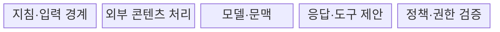
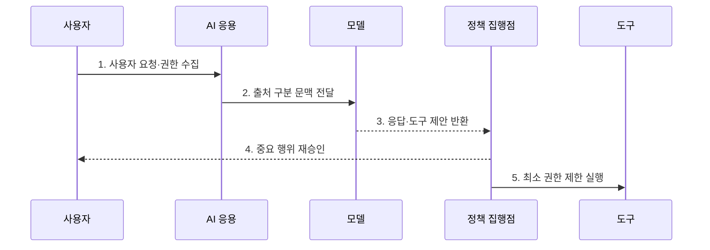

---
sidebar:
  order: 79
  label: "079. 프롬프트 인젝션 (Prompt Injection)"
  badge:
    text: "기출 · 85%"
    variant: note
title: "프롬프트 인젝션 (Prompt Injection)"
date: "2026-07-27T23:59:59+09:00"
tags:
  - "notes-security"
weight: 79
extra:
  question_no: "079"
  source_status: "기출"
  source_history: "135회, 137회, 138회"
  priority: 85
  priority_note: "135·137·138회 반복된 생성형 AI 핵심 공격임"
---

## 미리 알고가기

- **프롬프트 인젝션(Prompt Injection)**: 비신뢰 입력이 모델의 지침 해석을 교란해 출력이나 행동을 바꾸는 공격이다.
- **시스템 프롬프트(System Prompt)**: 서비스가 모델의 역할·규칙·출력 조건을 정하기 위해 제공하는 상위 지침이다.
- **사용자 프롬프트(User Prompt)**: 사용자가 모델에 전달하는 질문·요청·추가 문맥이다.
- **직접 프롬프트 인젝션(Direct Prompt Injection)**: 사용자가 공격 지시를 모델 입력에 직접 넣는 공격이다.
- **간접 프롬프트 인젝션(Indirect Prompt Injection)**: 문서·웹·메일의 공격 지시가 모델 문맥에 유입되는 공격이다.
- **탈옥(Jailbreak)**: 모델의 안전 거부 정책을 우회해 금지된 응답을 얻으려는 공격이다.
- **검색 증강 생성(Retrieval-Augmented Generation, RAG)**: 외부 문서를 검색해 모델 입력 문맥에 결합하는 생성 방식이다.
- **도구 호출(Tool Call)**: 모델이 검색·메일·코드 실행·데이터 변경 같은 외부 기능의 실행을 요청하는 구조이다.
- **정책 집행점(Policy Enforcement Point, PEP)**: 모델의 제안을 별도 규칙과 권한으로 검증·집행하는 경계이다.
- **샌드박스(Sandbox)**: 실행 권한과 파일·네트워크 접근을 제한한 격리 환경이다.
- **단명 자격 증명(Ephemeral Credential)**: 한 작업이나 짧은 시간만 유효한 인증 정보이다.
- **신뢰 경계(Trust Boundary)**: 서로 다른 신뢰 수준의 데이터와 권한이 만나는 지점이다.
- **출처(Provenance)**: 콘텐츠가 어디서 생성·수집·변경되었는지를 나타내는 정보이다.
- **OWASP LLM01:2025 Prompt Injection**: 프롬프트 인젝션을 LLM 응용의 최우선 위험으로 분류한 공식 항목이다.
- **MITRE ATLAS AML.T0051**: LLM 프롬프트 인젝션의 공격 기법과 직접·간접 하위 기법을 식별한다.

## Ⅰ. 개요

- 정의: 비신뢰 입력의 **모델 지침 교란 공격**
- 기존 한계: 자연어의 **지침·데이터 강제 분리 곤란**

### 쉽게 이해하기 (학습)

- 모델이 읽은 비신뢰 문장을 데이터가 아니라 새 명령으로 받아들여 원래 규칙과 다른 답이나 행동을 만드는 문제이다.

## Ⅱ. 특징

- 직접·간접 경로의 **비신뢰 지시 유입**
- 프롬프트 은닉의 **근본 방어 한계**
- 독립 정책·최소 권한의 **피해 범위 제한**

### 쉽게 이해하기 (학습)

- 공격 문장을 모두 찾아내기 어려우므로 모델이 속아도 민감정보를 읽거나 중요한 도구를 바로 실행하지 못하게 해야 한다.

## Ⅲ. 구조 및 구성요소

| 설계 요소 | 설명 |
|:---|:---|
| 지침·입력 경계 | 시스템·사용자·자료 구분 |
| 외부 콘텐츠 처리 | RAG·웹·파일 신뢰 제한 |
| 모델·문맥 | 응답·도구 호출 생성 |
| 응답·도구 제안 | 실행 전 구조화 결과 제공 |
| 정책·권한 검증 | 목적·자원·사용자 재검증 |

### 쉽게 이해하기 (학습)

- 모델은 답과 행동을 제안할 뿐이며 별도 정책 경계가 실제 사용자 권한과 대상 자원을 확인한 뒤 실행한다.

## Ⅳ. 흐름도

| 절차 | 설명 |
|:---|:---|
| 사용자 요청·권한 수집 | 입력·사용자 권한 확인 |
| 출처 구분 문맥 전달 | 지침·외부 자료 분리 표시 |
| 응답·도구 제안 반환 | 모델은 실행 없이 제안 |
| 중요 행위 재승인 | 대상·내용·영향 재확인 |
| 최소 권한 제한 실행 | 샌드박스·단명 자격 집행 |

> 요약: 모델 제안과 실제 실행 권한을 분리한다.

### 쉽게 이해하기 (학습)

- 모델이 악성 지시를 따르더라도 실행기가 사용자 권한과 작업 목적을 다시 확인해 허용된 작은 행동만 수행한다.

## Ⅴ. 종류 및 비교

| 프롬프트 공격 유형 | 직접 인젝션 | 간접 인젝션 | 탈옥 |
|:---|:---|:---|:---|
| 적용 기준 | 대화 입력 공격 | RAG·웹·메일 공격 | 금지 응답 유도 |
| 핵심 특징 | **사용자 지시 유입** | **외부 자료 지시 유입** | **안전 거부 정책 우회** |
| 한계 | 입력 변형 우회 | 출처 확장·지연 발동 | 정책 일관성 저하 |

### 쉽게 이해하기 (학습)

- 직접형은 사용자가 공격하고 간접형은 모델이 읽는 자료가 공격하며 탈옥은 주로 금지 응답의 거부 규칙을 우회한다.

## Ⅵ. 실무 고려사항 및 대책

| 고려사항 | 대책 | 효과 |
|:---|:---|:---|
| 인젝션 위협 분류 | **OWASP LLM01:2025 적용** | 직접·간접 공격 시나리오 확보 |
| 모델의 권한 오판 | **PEP·최소 권한·단명 자격** | 유출·변경 피해 범위 제한 |
| 고위험 외부 행동 | **대상·내용 결속·사용자 승인** | 대리인 혼동·무단 실행 방지 |

### 쉽게 이해하기 (학습)

- 고객 챗봇이 이전 지시를 무시하라는 요청을 받아도 정책 집행점은 비밀 설정 출력과 허가되지 않은 도구 실행을 거부한다.

## Ⅶ. 결론

- **출처·민감도·도구영향**으로 모델 제안을 통제한다.

### 쉽게 이해하기 (학습)

- 프롬프트 인젝션은 완전 제거하기 어려우므로 비신뢰 입력을 격리하고 모델 실패가 실제 권한 오용으로 번지지 않게 설계해야 한다.
