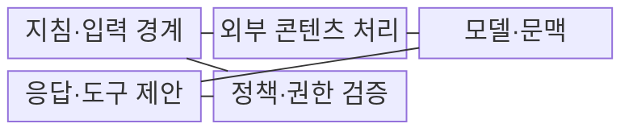
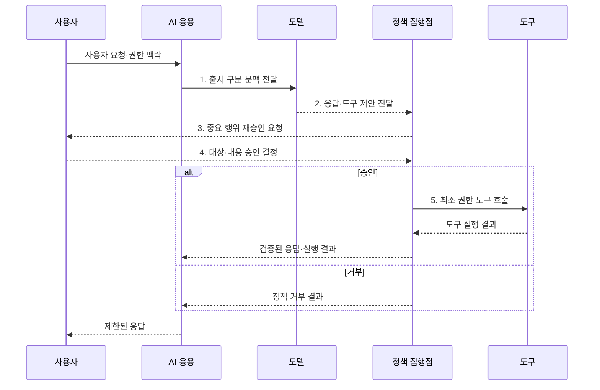

---
sidebar:
  order: 79
  label: "079. 프롬프트 인젝션 (Prompt Injection)"
  badge:
    text: "기출 · 85%"
    variant: note
title: "프롬프트 인젝션 (Prompt Injection)"
date: "2026-08-02T12:36:00+09:00"
tags:
  - "notes-security"
weight: 79
extra:
  question_no: "079"
  source_status: "기출"
  source_history: "135회, 137회, 138회"
  priority: 85
  priority_note: "135·137·138회 반복된 생성형 AI 핵심 공격임"
---

## Ⅰ. 개요

핵심 용어

- **프롬프트 인젝션**: 비신뢰 입력이 모델의 지침 해석을 교란하여 원래 규칙과 다른 출력이나 행동을 만들게 하는 공격이다.
- **LLM 지침·데이터 혼동**: 자연어로 함께 전달된 상위 지시와 비신뢰 자료를 모델이 강제적으로 구분하지 못하는 근본 한계이다.

- 정의/개념: **프롬프트 인젝션**은 비신뢰 입력을 모델 지침처럼 해석하게 해 원래 규칙과 다른 출력이나 도구 행동을 유도하는 **LLM 입력 공격**
- 배경/필요성: 자연어의 **지침·데이터 강제 분리 곤란**

#### 한줄 요약

- 모델이 읽은 비신뢰 문장을 데이터가 아니라 새 명령으로 받아들여 원래 규칙과 다른 답이나 행동을 만드는 문제이다.

## Ⅱ. 특징

핵심 용어

- **직접·간접 인젝션**: 공격 지시가 사용자 입력에 직접 들어오거나 RAG·웹·메일 같은 외부 자료를 통해 간접 유입되는 공격 경로이다.
- **피해 범위 제한**: 공격 문장 탐지에만 의존하지 않고 독립 정책·최소 권한으로 모델 실패가 실제 실행으로 이어지는 범위를 줄이는 원칙이다.

- **비신뢰 지시 유입**: 사용자·RAG 자료의 직접·간접 경로
- **근본 방어 한계**: 프롬프트 은닉만으로 완전 차단 불가
- **피해 범위 제한**: 독립 정책·최소 권한으로 실행 통제

#### 한줄 요약

- 공격 문장을 모두 찾아내기 어려우므로 모델이 속아도 민감정보를 읽거나 중요한 도구를 바로 실행하지 못하게 해야 한다.

## Ⅲ. 구조 및 구성요소

핵심 용어

- **시스템·사용자 프롬프트·출처**: 서비스 지침, 사용자 요청, 외부 자료의 생성·수집 경로를 구분해 각 신뢰 수준을 보존한다.
- **PEP(Policy Enforcement Point, 정책 집행점)**: 모델의 응답과 도구 제안을 사용자 권한과 별도 규칙으로 다시 검증하고 실제 실행 여부를 결정하는 경계이다.

| 구성요소 | 책임 |
|:---|:---|
| 지침·입력 경계 | **시스템·사용자 프롬프트**와 자료 구분 |
| 외부 콘텐츠 처리 | **RAG·출처 정보**로 신뢰 수준 표시 |
| 모델·문맥 | **응답·도구 호출** 제안 생성 |
| 응답·도구 제안 | **구조화 출력·대상 정보** 제공 |
| 정책·권한 검증 | **PEP·사용자 승인**으로 실행 재검증 |

#### 한줄 요약

- 모델은 답과 행동을 제안할 뿐이며 별도 정책 경계가 실제 사용자 권한과 대상 자원을 확인한 뒤 실행한다.

## Ⅳ. 흐름도

핵심 용어

- **사용자 재승인·거래 결속**: 고위험 행동의 대상·내용·영향을 보여 주고 사용자가 승인한 매개변수를 실제 실행 요청과 묶는 통제이다.
- **샌드박스·단명 자격**: 도구의 파일·네트워크·실행 권한을 격리하고 한 작업에만 유효한 최소 권한 인증 정보를 사용한다.

**동작 원리**

1. **출처 구분 문맥 전달**: 지침·외부 자료 분리 표시
2. **응답·도구 제안 전달**: 모델은 실행 없이 제안
3. **중요 행위 재승인 요청**: 대상·내용·영향 제시
4. **대상·내용 승인 결정**: 사용자가 실제 행위 재확인
5. **최소 권한 도구 호출**: 샌드박스·단명 자격 집행

#### 한줄 요약

- 모델이 악성 지시를 따르더라도 실행기가 사용자 권한과 작업 목적을 다시 확인해 허용된 작은 행동만 수행한다.

## Ⅴ. 종류 및 비교

핵심 용어

- **직접·간접 인젝션·탈옥**: 직접형은 대화 입력, 간접형은 외부 자료로 행동을 교란하며 탈옥은 모델의 안전 거부 정책을 우회해 금지 응답을 얻으려 한다.

| 프롬프트 공격 유형 | 직접 인젝션 | 간접 인젝션 | 탈옥 |
|:---|:---|:---|:---|
| 적용 기준 | **대화 입력** 공격 | **RAG·웹·메일** 공격 | **금지 응답** 유도 |
| 핵심 특징 | **사용자 지시 유입** | **외부 자료 지시 유입** | **안전 거부 정책 우회** |
| 한계 | 입력 필터를 피하는 **변형 공격 반복** | **출처 확장·지연 발동** 위험 | **정책 일관성 저하** 가능 |

#### 한줄 요약

- 직접형은 사용자가 공격하고 간접형은 모델이 읽는 자료가 공격하며 탈옥은 주로 금지 응답의 거부 규칙을 우회한다.

## Ⅵ. 실무 고려사항 및 대책

핵심 용어

- **OWASP LLM01:2025**: 직접·간접 프롬프트 인젝션을 LLM 응용의 최우선 위험으로 분류한 공식 항목이다.
- **MITRE ATLAS AML.T0051**: LLM 프롬프트 인젝션과 직접·간접 하위 공격 기법을 식별하는 지식베이스 항목이다.

| 문제 | 대책 | 효과 |
|:---|:---|:---|
| **위협 유형 누락**으로 시험 범위 축소 | **OWASP LLM01:2025** 적용 | **직접·간접 공격 시나리오** 확보 |
| **공격 기법 추적 단절**로 대응 공유 곤란 | **MITRE ATLAS AML.T0051** 매핑 | **직접·간접 하위 기법** 추적 |
| **모델 권한 오판** 시 유출·변경 확산 | **PEP·단명 자격**과 최소 권한 적용 | **유출·변경 피해 범위** 제한 |
| **고위험 외부 행동**을 자동 승인할 위험 | **대상·내용 결속**과 사용자 승인 적용 | **승인 대상 불일치·무단 실행** 방지 |

#### 한줄 요약

- 고객 챗봇이 이전 지시를 무시하라는 요청을 받아도 정책 집행점은 비밀 설정 출력과 허가되지 않은 도구 실행을 거부한다.

## Ⅶ. 결론

핵심 용어

- **실패 격리**: 모델이 악성 지시를 따르더라도 비신뢰 입력을 민감정보 접근이나 상태 변경 권한과 분리하여 실제 피해로 확산하지 않게 하는 설계이다.

- 외부 자료는 **비신뢰 문맥으로 격리**, 상태 변경 도구는 **PEP·사용자 재승인** 후 실행

#### 한줄 요약

- 프롬프트 인젝션은 완전 제거하기 어려우므로 비신뢰 입력을 격리하고 모델 실패가 실제 권한 오용으로 번지지 않게 설계해야 한다.
