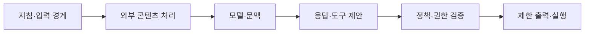
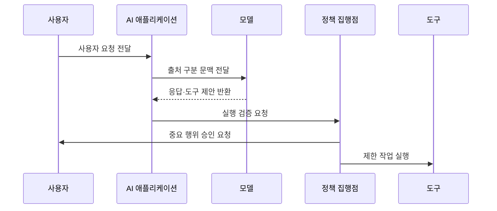

---
sidebar:
  order: 79
  label: "079. 프롬프트 인젝션 (Prompt Injection)"
  badge:
    text: "기출 · 85%"
    variant: note
title: "프롬프트 인젝션 (Prompt Injection)"
date: "2026-07-25T13:08:00+09:00"
tags:
  - "notes-security"
weight: 79
extra:
  question_no: "079"
  source_status: "기출"
  source_history: "135회, 137회, 138회"
  priority: 85
  priority_note: "135·137·138회 반복된 생성형 AI 핵심 공격임"
---

## 미리 알고가기

- **프롬프트 인젝션(Prompt Injection)**: 신뢰하지 않는 입력이 모델의 지침 해석을 교란해 출력이나 행동을 바꾸는 공격
- **시스템 프롬프트(System Prompt)**: 서비스가 모델의 역할·규칙·출력 조건을 정하기 위해 제공하는 상위 지침
- **사용자 프롬프트(User Prompt)**: 사용자가 모델에 전달하는 질문·요청·추가 문맥
- **직접 프롬프트 인젝션(Direct Prompt Injection)**: 사용자가 공격 지시를 모델 입력에 직접 넣는 공격
- **간접 프롬프트 인젝션(Indirect Prompt Injection)**: 문서·웹·메일 등 외부 콘텐츠를 통해 공격 지시가 모델 문맥에 들어오는 공격
- **탈옥(Jailbreak)**: 모델의 안전 거부 정책을 우회해 금지된 응답을 얻으려는 공격
- **RAG(Retrieval-Augmented Generation)**: 외부 문서를 검색해 모델 입력 문맥에 결합하는 생성 방식
- **도구 호출(Tool Call)**: 모델이 검색·메일·코드 실행·데이터 변경 같은 외부 기능의 실행을 요청하는 구조
- **정책 집행점(Policy Enforcement Point)**: 모델의 제안을 별도 규칙과 권한으로 검증·집행하는 경계
- **샌드박스(Sandbox)**: 실행 권한과 파일·네트워크 접근을 제한한 격리 환경
- **단명 자격 증명(Ephemeral Credential)**: 한 작업이나 짧은 시간만 유효한 인증 정보
- **신뢰 경계(Trust Boundary)**: 서로 다른 신뢰 수준의 데이터와 권한이 만나는 구분 지점
- **출처(Provenance)**: 콘텐츠가 어디서 생성·수집·변경되었는지 나타내는 정보
- **검색 증강 생성(Retrieval-Augmented Generation, RAG·래그)**: 검색으로 생성을 보강한다는 영문 머리글자를 딴 표기이며, 외부 문서를 모델 문맥에 결합하는 역할
- **도구 호출(Tool Call·툴 콜)**: 모델이 외부 기능 실행을 제안하는 공식 인터페이스 표기이며, 정책 집행점의 권한 검증 전에는 실제 행동이 아닌 요청으로 취급함

## Ⅰ. 개요

- **정의/개념**: 입력으로 모델 지침·행동을 교란하는 공격이다
- **배경/필요성**: 자연어의 지침·데이터 혼동 피해를 막는다

### 쉽게 이해하기 (학습용)

- 모델이 읽을 자료 안에 숨은 문장을 데이터가 아니라 새 명령으로 받아들여 원래 규칙과 다른 답이나 행동을 만드는 문제다.

## Ⅱ. 특징

- 지침·데이터 경계가 약해 비신뢰 문장이 명령이 된다
- 입력·외부 콘텐츠 경로는 공격면을 넓힌다
- 프롬프트 은닉은 추출·우회 공격을 막지 못한다
- 큰 도구 권한은 오판을 유출·삭제 피해로 확대한다
- 독립 검증·최소 권한은 모델 실패 피해를 제한한다

### 쉽게 이해하기 (학습용)

- 공격 문장을 모두 알아맞히기 어려우므로 모델이 속아도 민감정보를 읽거나 중요한 도구를 바로 실행하지 못하게 해야 한다.

## Ⅲ. 아키텍처 및 구성요소

| 설계 요소 | 설명 |
|:---|:---|
| 지침·입력 경계 | 시스템·사용자·데이터 출처 구분 |
| 외부 콘텐츠 처리 | RAG·웹·파일의 신뢰 제한 |
| 모델·문맥 | 응답과 도구 호출을 제안 |
| 응답·도구 제안 | 실행 전 구조화된 결과 제공 |
| 정책·권한 검증 | 목적·자원·사용자 권한 재검증 |
| 제한 출력·실행 | 민감 출력과 외부 행동 통제 |

> 요약: 모델 제안과 실제 권한을 분리해 피해를 제한한다

### 쉽게 이해하기 (학습용)

- 모델은 답과 행동을 제안할 뿐이며 별도 정책 경계가 실제 사용자 권한과 대상 자원을 확인한 뒤 제한된 방식으로 실행한다.

## Ⅳ. 원리 및 절차 흐름도

| 절차 | 설명 |
|:---|:---|
| 사용자 요청 전달 | 입력과 사용자 권한 수집 |
| 출처 구분 문맥 전달 | 지침과 외부 자료를 분리 표시 |
| 응답·도구 제안 반환 | 모델은 실행 없이 결과 제안 |
| 실행 검증 요청 | 목적·대상·권한·민감도 확인 |
| 중요 행위 승인 요청 | 되돌리기 어려운 동작 재확인 |
| 제한 작업 실행 | 최소 권한·샌드박스에서 집행 |

> 요약: 모델 제안과 실제 실행 권한을 분리한다.

### 쉽게 이해하기 (학습용)

- 모델이 악성 지시를 따르더라도 실행기가 사용자 권한과 작업 목적을 다시 확인해 허용된 작은 행동만 수행한다.

## Ⅴ. 종류 및 비교

| 판단 기준 | 직접 인젝션 | 간접 인젝션 | 탈옥 |
|:---|:---|:---|:---|
| 핵심 특징 | 사용자가 공격 지시 입력 | 외부 자료가 공격 지시 전달 | 안전 거부 정책 우회 |
| 적용 기준 | 대화 입력 공격 분석 | RAG·웹·메일 경로 분석 | 금지 응답 유도 분석 |
| 주요 위험 | 입력 변형 우회 | 출처 확장·지연 발동 | 정책 일관성 저하 |

> 요약: 직접은 입력, 간접은 자료, 탈옥은 거부를 공격한다

### 쉽게 이해하기 (학습용)

- 직접형은 사용자가 공격하고 간접형은 모델이 읽는 자료가 공격하며 탈옥은 주로 금지된 답변의 거부 규칙을 우회한다.

## Ⅵ. 실무 사례

1. RAG 문서의 출처와 인용을 유지한다
2. 메일 요약 도구를 읽기 전용으로 제한한다
3. 송금·삭제 전에 사용자 재승인을 요구한다
4. 인젝션 성공 뒤 실제 피해까지 평가한다

### 쉽게 이해하기 (학습용)

- 사례 1은 검색 자료 속 지시가 시스템 명령처럼 섞이지 않게 하고 문제가 생긴 문서의 출처를 추적한다.
- 사례 2는 악성 메일을 읽은 모델이 다른 메일을 보내거나 계정 설정을 바꾸는 연쇄 행동을 하지 못하게 한다.
- 사례 3은 모델의 제안만으로 되돌리기 어려운 거래가 실행되지 않게 실제 사용자에게 대상과 금액을 다시 보여 준다.
- 사례 4는 공격 문구에 반응했는지만 세지 않고 민감정보 노출이나 무단 도구 실행으로 이어졌는지를 측정한다.

## Ⅶ. 결론

- 모델에 도구를 주면 제안과 실행 권한을 분리한다.

### 쉽게 이해하기 (학습용)

- 프롬프트 인젝션은 완전 제거하기 어려우므로 모든 외부 입력을 비신뢰 데이터로 다루고 모델 실패가 실제 권한 오용으로 번지지 않게 설계해야 한다.
