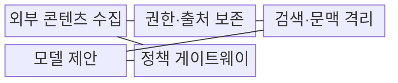
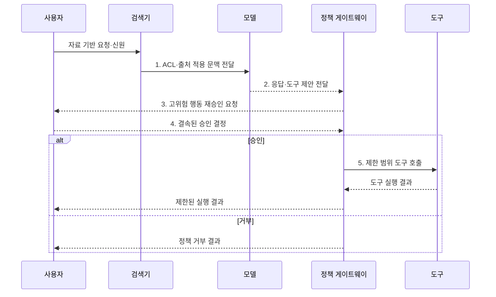

---
sidebar:
  order: 80
  label: "080. 간접 프롬프트 인젝션 (Indirect Prompt Injection)"
  badge:
    text: "기출 · 70%"
    variant: note
title: "간접 프롬프트 인젝션 (Indirect Prompt Injection)"
date: "2026-07-31T11:17:29+09:00"
tags:
  - "notes-security"
weight: 80
extra:
  question_no: "080"
  source_status: "기출"
  source_history: "137회, 138회"
  priority: 70
  priority_note: "137·138회 반복된 외부 데이터 기반 인젝션 주제임"
---

## 미리 알고가기

- **간접 프롬프트 인젝션(Indirect Prompt Injection)**: 문서·웹·메일의 지시가 모델 문맥에 들어와 행동을 교란하는 공격이다.
- **대규모 언어 모델(Large Language Model, LLM)**: 대규모 언어 데이터로 학습해 문장을 이해·생성하는 모델이다.
- **직접 프롬프트 인젝션(Direct Prompt Injection)**: 사용자가 공격 지시를 모델 입력에 직접 넣는 공격이다.
- **검색 증강 생성(Retrieval-Augmented Generation, RAG)**: 검색한 외부 문서를 모델 입력 문맥에 결합하는 생성 방식이다.
- **검색기(Retriever)**: 사용자 질의와 관련된 외부 문서 조각을 찾아 모델에 전달하는 기능이다.
- **청크(Chunk)**: 검색과 처리를 위해 문서를 작게 나눈 단위이다.
- **다중모달(Multimodal)**: 텍스트·이미지·음성 등 여러 데이터 형식을 함께 처리하는 방식이다.
- **도구(Tool)**: AI가 전송·삭제·거래 같은 외부 작업을 수행하도록 연결한 기능이다.
- **접근 제어 목록(Access Control List, ACL)**: 주체별 자원 접근의 허용·거부 권한을 기록한 목록이다.
- **읽기 전용 에이전트(Read-Only Agent)**: 자료를 조회하지만 변경 작업은 수행하지 않는 에이전트이다.
- **행동 에이전트(Action Agent)**: 모델 판단에 따라 전송·삭제·거래 같은 외부 작업을 수행하는 에이전트이다.
- **외부 통신 통제(Egress Control)**: 시스템에서 외부로 나가는 통신 목적지를 제한하는 통제이다.
- **정책 게이트웨이(Policy Gateway)**: 도구 요청을 사용자 권한과 별도 규칙으로 검증하는 경계이다.
- **거래 결속(Transaction Binding)**: 사용자가 승인한 대상·금액·행위를 실제 실행 요청과 묶는 통제이다.
- **신뢰 경계(Trust Boundary)**: 서로 다른 신뢰 수준의 데이터와 권한이 만나는 지점이다.
- **OWASP LLM01:2025 Prompt Injection**: 외부 소스가 모델 행동을 바꾸는 간접 인젝션을 공식 위험 유형으로 분류한다.
- **MITRE ATLAS AML.T0051.001**: LLM 간접 프롬프트 인젝션을 식별하는 공식 공격 기법 번호이다.

> **키워드:** 간접 프롬프트 인젝션 (Indirect Prompt Injection)

## Ⅰ. 개요

- 정의/개념: 외부 자료의 지시를 명령으로 오인시키는 **LLM 입력 공격**
- 배경/필요성: 검색기가 문서의 지시·자료 의미를 구별하지 못해 **신뢰 경계 붕괴**

### 쉽게 이해하기 (학습용)

- 사용자는 정상 질문을 했지만 AI가 읽은 문서 속 숨은 공격 지시를 새 명령으로 받아들여 엉뚱한 행동을 만드는 공격이다.

## Ⅱ. 특징

- **외부 자료 지시 유입**: RAG·웹·메일을 통한 간접 공격
- **탐지 난이도 증가**: 지연 발동·다중모달 은닉 가능
- **실제 피해 제한**: 독립 권한 검증으로 도구 실행 통제

### 쉽게 이해하기 (학습용)

- 모든 악성 문장을 완벽히 지우기 어려우므로 AI가 속아도 읽을 수 있는 자료와 실행할 수 있는 행동을 좁혀야 한다.

## Ⅲ. 구조 및 구성요소

| 구성요소 | 책임 |
|:---|:---|
| 외부 콘텐츠 수집 | **웹·메일·파일**을 비신뢰 자료로 수집 |
| 권한·출처 보존 | **원본 ACL·출처**를 청크마다 유지 |
| 검색·문맥 격리 | **RAG 자료·시스템 지침**을 구분 |
| 모델 제안 | **응답·도구 요청**만 생성 |
| 정책 게이트웨이 | **사용자 권한·도구 매개변수** 재검증 |

### 쉽게 이해하기 (학습용)

- 외부 문서는 출처와 읽기 권한을 유지해 데이터로 넣고 모델이 낸 행동 제안은 별도 게이트웨이가 다시 심사한다.

## Ⅳ. 흐름도

**동작 원리**

1. **ACL·출처 적용 문맥 전달**: 허용 청크만 출처와 제공
2. **응답·도구 제안 전달**: 모델은 실행 없이 제안
3. **고위험 행동 재승인 요청**: 대상·내용·영향 제시
4. **결속된 승인 결정**: 사용자가 실행 매개변수 재확인
5. **제한 범위 도구 호출**: 최소 권한·외부 통신 통제

### 쉽게 이해하기 (학습용)

- 검색 문서가 모델을 속여도 실제 도구는 사용자의 원래 권한과 확인된 작업 범위 안에서만 움직인다.

## Ⅴ. 종류 및 비교

| 프롬프트 인젝션 유형 | 간접 인젝션 | 직접 인젝션 |
|:---|:---|:---|
| 적용 기준 | **RAG·웹·메일** 경로 | **대화 입력** 경로 |
| 핵심 특징 | **외부 자료 지시 전달** | **사용자 공격 지시 입력** |
| 피해 범위 | **응답 교란·외부 실행**까지 자료 경로로 확산 | **행동 에이전트**의 즉시 권한 오용 |
| 한계 | **지연 발동·출처 확산** 위험 | 입력 필터를 피하는 **변형 공격 반복** |

### 쉽게 이해하기 (학습용)

- 같은 악성 문서라도 질의응답에서는 답을 망치고 행동 에이전트에서는 정보 전송이나 거래 같은 실제 피해를 일으킬 수 있다.

## Ⅵ. 실무 고려사항 및 대책

| 고려사항 | 대책 | 효과 |
|:---|:---|:---|
| **간접 공격 유형 누락**으로 시험 범위 축소 | **OWASP LLM01:2025** 적용 | **직접·간접 공격 시나리오** 확보 |
| **공격 기법 추적 단절**로 대응 공유 곤란 | **MITRE ATLAS AML.T0051.001** 매핑 | **간접 공격 하위 기법** 추적 |
| **문서 권한 상속 누락**으로 검색 권한 상승 | **원본 ACL·출처**와 사용자 영역 보존 | **검색 단계 권한 상승** 방지 |
| **외부 전송·변경**을 자동 승인할 위험 | **거래 결속·사용자 승인**과 통신 제한 | **유출·무단 실행** 차단 |

### 쉽게 이해하기 (학습용)

- 메일 본문에 내부 자료를 외부로 보내라는 지시가 있어도 에이전트는 이를 데이터로만 다루고 별도 승인 없이는 발송하지 않는다.

## Ⅶ. 결론

- 조회만은 **읽기 전용 에이전트**, 전송·변경은 **거래 결속·사용자 승인** 후 실행

### 쉽게 이해하기 (학습용)

- 핵심 방어는 모든 문장을 정화하는 것이 아니라 비신뢰 콘텐츠가 실제 읽기·전송·변경 권한으로 이어지지 않게 하는 것이다.
