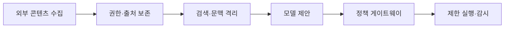
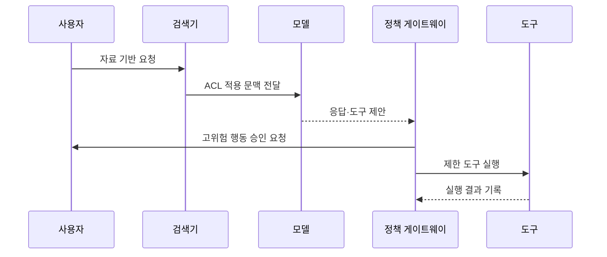

---
sidebar:
  order: 80
  label: "080. 간접 프롬프트 인젝션 (Indirect Prompt Injection)"
  badge:
    text: "기출 · 70%"
    variant: note
title: "간접 프롬프트 인젝션 (Indirect Prompt Injection)"
date: "2026-07-27T23:59:59+09:00"
tags:
  - "notes-security"
weight: 80
extra:
  question_no: "080"
  source_status: "기출"
  source_history: "137회, 138회"
  priority: 70
  priority_note: "137·138회 반복된 외부 데이터 기반 인젝션 주제임"
---

## 미리 알고가기

- **간접 프롬프트 인젝션(Indirect Prompt Injection)**: 문서·웹·메일 등 외부 콘텐츠의 지시가 모델 문맥에 들어와 행동을 교란하는 공격
- **직접 프롬프트 인젝션(Direct Prompt Injection)**: 사용자가 공격 지시를 모델 입력에 직접 넣는 공격
- **검색 증강 생성(Retrieval-Augmented Generation, RAG)**: 검색한 외부 문서를 모델의 입력 문맥에 결합하여 생성 결과를 보강하는 방식이다.
- **검색기(Retriever)**: 사용자 질의와 관련된 외부 문서 조각을 찾아 모델에 전달하는 기능
- **청크(Chunk)**: 검색과 처리를 위해 문서를 작게 나눈 단위
- **하이퍼텍스트 마크업 언어(HyperText Markup Language, HTML)**: 웹 문서의 구조와 내용을 표현하는 마크업 언어이다.
- **접근 제어 목록(Access Control List, ACL)**: 사용자·그룹별 자원 접근의 허용·거부 권한을 기록한 목록이다.
- **읽기 전용 에이전트(Read-Only Agent)**: 외부 자료를 조회할 수 있지만 변경 작업은 수행하지 않는 에이전트
- **행동 에이전트(Action Agent)**: 모델 판단에 따라 메일 전송·삭제·거래 같은 외부 작업을 수행하는 에이전트
- **Egress Control**: 시스템에서 외부 네트워크로 나가는 통신 대상을 제한하는 통제
- **정책 게이트웨이(Policy Gateway)**: 모델의 도구 요청을 사용자 권한과 별도 규칙으로 검증하는 경계
- **거래 결속(Transaction Binding)**: 사용자가 승인한 대상·금액·행위를 실제 실행 요청과 묶어 확인하는 통제
- **신뢰 경계(Trust Boundary)**: 서로 다른 신뢰 수준의 데이터와 권한이 만나는 구분 지점
- **외부 통신 통제(Egress Control, 이그레스 컨트롤)**: 밖으로 나감을 뜻하는 `Egress`를 사용하며, 외부 전송 목적지를 제한

## Ⅰ. 개요

- 정의/개념: 외부 콘텐츠가 모델 행동을 교란하는 공격이다
- 기존 한계: 모델은 외부 데이터와 신뢰 지시를 완전 분리 불가
- **배경/필요성**: 외부 지시의 권한 상승·정보 유출 차단

### 쉽게 이해하기 (학습용)

- 사용자는 정상 질문만 했지만 AI가 읽은 문서 안의 숨은 공격 지시를 새 명령으로 받아들여 엉뚱한 답이나 행동을 만드는 공격이다.

## Ⅱ. 특징

- 외부 콘텐츠의 비신뢰 지시가 모델 문맥에 유입된다
- RAG·웹·메일 자동 수집이 공격 지시를 간접 전달한다
- 독립 권한 검증이 유출·변경의 실제 피해를 제한한다

### 쉽게 이해하기 (학습용)

- 모든 악성 문장을 완벽히 지우기 어려우므로 AI가 속아도 읽을 수 있는 자료와 실행할 수 있는 행동을 좁혀야 한다.

## Ⅲ. 아키텍처 및 구성요소

| 설계 요소 | 설명 |
|:---|:---|
| 외부 콘텐츠 수집 | 웹·메일·파일을 비신뢰로 수집 |
| 권한·출처 보존 | 원본 ACL과 생성 위치 유지 |
| 검색·문맥 격리 | 자료와 시스템 지침을 구분 |
| 모델 제안 | 응답·도구 요청만 생성 |
| 정책 게이트웨이 | 사용자·자원·매개변수 재검증 |
| 제한 실행·감시 | 승인 행동만 수행하고 기록 |

> 요약: 문서 권한과 도구 권한을 분리해 피해를 막는다

### 쉽게 이해하기 (학습용)

- 외부 문서는 출처와 읽기 권한을 유지해 데이터로 넣고 모델이 낸 행동 제안은 별도 게이트웨이가 다시 심사한다.

## Ⅳ. 원리 및 절차 흐름도

| 절차 | 설명 |
|:---|:---|
| 자료 기반 요청 | 사용자 질의와 신원 수집 |
| ACL 적용 문맥 전달 | 허용 문서만 출처와 함께 제공 |
| 응답·도구 제안 | 모델은 실행 없이 결과 제안 |
| 고위험 행동 승인 요청 | 대상·내용·영향을 사용자 확인 |
| 제한 도구 실행 | 최소 권한과 외부 통신 제한 |
| 실행 결과 기록 | 유출·오용·정책 우회 감시 |

> 요약: 외부 문서의 지시와 실행 권한을 분리한다.

### 쉽게 이해하기 (학습용)

- 검색 문서가 모델을 속여도 실제 도구는 사용자의 원래 권한과 확인된 작업 범위 안에서만 움직인다.

## Ⅴ. 종류 및 비교

| 판단 기준 | 간접 인젝션 | 직접 인젝션 |
|:---|:---|:---|
| 적용 기준 | RAG·웹·메일 경로 분석 | 대화 입력 공격 분석 |
| 핵심 특징 | 외부 자료가 공격 지시 전달 | 사용자가 공격 지시 입력 |
| 한계 | 지연 발동·출처 확산 | 입력 변형 우회 |

> 요약: 간접형은 외부 자료, 직접형은 사용자 입력을 쓴다

### 쉽게 이해하기 (학습용)

- 같은 악성 문서라도 질의응답에서는 답을 망치고 읽기 에이전트에서는 비밀을 모으며 행동 에이전트에서는 실제 거래를 일으킬 수 있다.

## Ⅵ. 실무 사례

1. 메일 요약 에이전트의 **악성 본문 지시와 외부 전송 차단**

### 쉽게 이해하기 (학습용)

- 메일 본문에 내부 자료를 특정 주소로 보내라는 문장이 있어도 에이전트는 이를 데이터로만 취급하고 외부 발송 도구는 별도 승인 없이는 실행하지 않는다.

## Ⅶ. 결론

- 외부 콘텐츠의 숨은 지시가 AI 행동으로 이어지는 위험을 줄이기 위해 콘텐츠 출처·사용자 ACL·데이터와 명령의 경계·도구 영향을 검토하여, 외부 자료와 실행 권한을 분리해야 한다.

### 쉽게 이해하기 (학습용)

- 간접 프롬프트 인젝션의 핵심 방어는 모든 문장을 정화하는 것이 아니라 비신뢰 콘텐츠가 실제 읽기·전송·변경 권한으로 이어지지 않게 하는 것이다.
