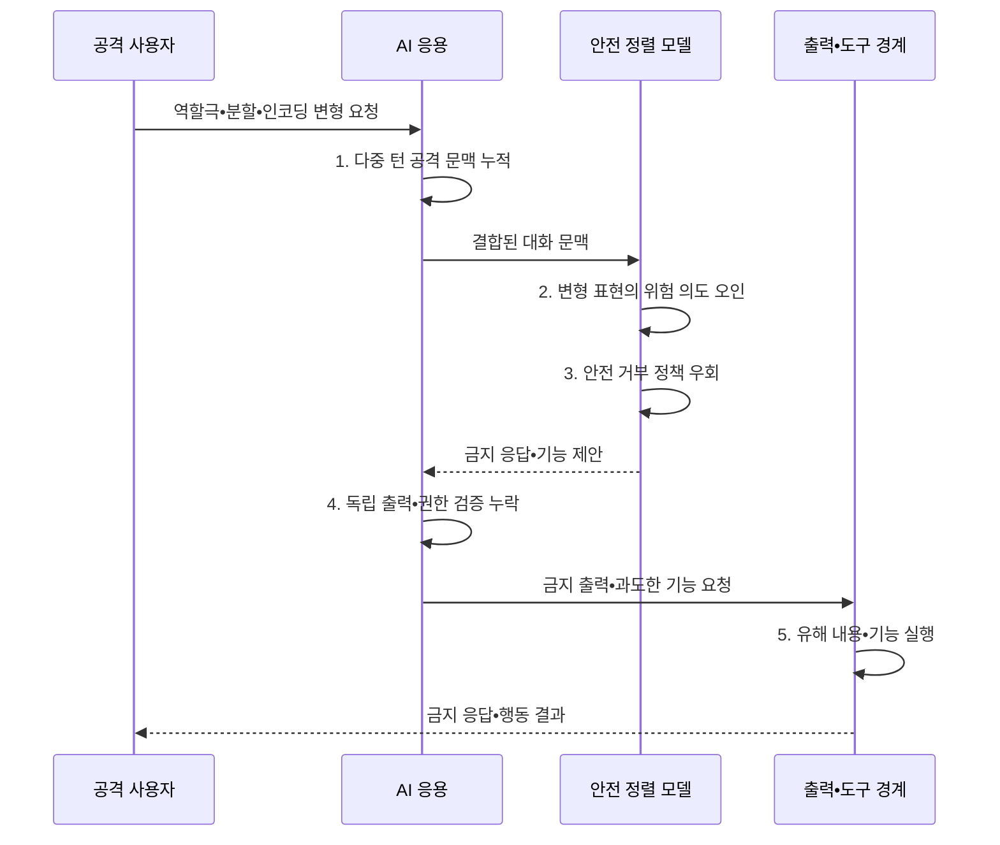

---
sidebar:
  order: 81
  label: "081. 탈옥 Jailbreak 공격 (Jailbreak Attack)"
  badge:
    text: "기출 • 70%"
    variant: note
title: "탈옥 Jailbreak 공격 (Jailbreak Attack)"
date: "2026-08-05T01:45:09+09:00"
tags:
  - "notes-security"
weight: 81
extra:
  question_no: "081"
  source_status: "기출"
  source_history: "137회, 138회"
  priority: 70
  priority_note: "137•138회 반복된 안전정렬 우회 핵심 공격임"
---

## Ⅰ. 개요

<details><summary>핵심 용어</summary>

- **탈옥**: 역할극•분할•인코딩 같은 변형으로 모델의 안전 거부 정책을 우회하여 금지된 응답을 생성시키는 공격이다.
- **AI(Artificial Intelligence)** 는 학습된 모델로 인식•추론•생성 작업을 수행하는 기술이다.
- **LLM(Large Language Model)** 은 대규모 언어 데이터로 학습해 자연어를 이해•생성하는 모델이다.
- **안전 정렬**: 모델 행동이 허용•제한•거부 기준과 안전 원칙을 따르도록 학습하고 조정하는 과정이다.

</details>

- 정의/개념: **탈옥** 은 모델의 안전 거부 정책을 우회해 금지 응답을 생성시키는 공격
- 배경/필요성: 고정 금칙어의 **의미 변형 탐지 한계**

#### 한줄 요약

- 질문을 역할극•번역•암호화로 포장해 모델이 금지된 요청임을 놓치고 답하도록 유도하는 공격이다.

## Ⅱ. 특징

<details><summary>핵심 용어</summary>

- **적대적 접미사** 는 입력 뒤에 교란 문자열을 붙여 안전 거부 판단을 약화하는 탈옥 방식이다.
- **다중 턴 우회** 는 누적 대화 문맥으로 위험 의도를 분산해 안전 거부를 약화하는 방식이다.
- **심층 방어**: 입력•모델•출력•도구에 독립 통제를 겹쳐 한 통제의 실패가 실제 피해로 이어지지 않게 하는 전략이다.

</details>

- 역할극•분할•인코딩의 **의도 은닉 기반 정책 우회**
- **적대적 접미사•다중 턴** 등 모델•대화 상태에 따른 문맥 의존적 우회 성공률
- 출력•도구 피해와 재발을 제한하는 **심층 방어**

#### 한줄 요약

- 공격 표현은 계속 바뀌므로 문장 하나를 차단하는 데 그치지 않고 출력과 연결 기능까지 별도로 제한해야 한다.

## Ⅲ. 구조 및 구성요소

<details><summary>핵심 용어</summary>

- **안전 정책** 은 위험별 허용•제한•거부 기준을 정의한 규칙이다.
- **가드레일** 은 입력•출력•도구 행동에 안전 정책을 집행하는 통제다.
- **레드팀** 은 공격자 관점에서 새로운 우회와 실패 경로를 찾는 평가 활동이다.
- **회귀 평가** 는 수정 뒤 과거•변형 공격이 다시 성공하는지 반복 확인하는 시험이다.

</details>

```text
                [안전 정책]
                     |
          +----------+----------+
          |          |          |
[입력•대화 분류] [안전 정렬 모델] [출력•도구 통제]
          |          |          |
          +----------+----------+
                     |
              [레드팀•회귀 평가]
```

선의 의미: 안전 정책과 레드팀•회귀 평가가 입력 분류, 안전 정렬 모델, 출력•도구 통제에 공통으로 결합되는 심층 방어 구조를 나타낸다.

| 구성요소 | 책임 |
|:---|:---|
| 안전 정책 | **위험 수준•허용•거부 기준** 정의 |
| 입력•대화 분류 | 누적 문맥의 **의도•위험 평가** |
| 안전 정렬 모델 | **금지 요청 식별•거부** |
| 출력•도구 통제 | **유해 내용•외부 기능 제한** |
| 레드팀•회귀 평가 | **신규 공격•재발 여부** 검증 |


#### 한줄 요약

- 모델 앞에서 의도를 보고 모델 뒤에서 출력과 기능을 다시 막으며 새 우회 사례를 계속 시험 목록에 넣는다.

## Ⅳ. 흐름도

<details><summary>핵심 용어</summary>

- **누적 문맥 위험 분류**: 현재 입력만이 아니라 전체 대화에서 분할된 의도와 위험이 결합되는지를 판단하는 과정이다.
- **정상 거부율**: 정책상 허용해야 할 정상 요청을 모델이나 가드레일이 잘못 거부한 비율이다.

</details>



**동작 원리**

1. **다중 턴 공격 문맥 누적**: 분할된 위험 의도를 대화 상태에 축적
2. **변형 표현의 위험 의도 오인**: 역할극•인코딩을 정상 요청으로 판정
3. **안전 거부 정책 우회**: 금지 요청에 대한 거부 행동 약화
4. **독립 출력•권한 검증 누락**: 모델 제안을 안전한 결과처럼 수용
5. **유해 내용•기능 실행**: 금지 정보 생성이나 외부 행동 수행


#### 한줄 요약

- 변형된 질문이 모델을 통과해도 출력과 기능 경계가 다시 검사하고 발견한 우회는 다음 버전에서도 막히는지 반복 시험한다.

## Ⅴ. 종류 및 비교

<details><summary>핵심 용어</summary>

- **단일 턴 우회** 는 한 번의 입력 변형으로 안전 거부의 빈틈을 찾는 유형이다.
- **자동화 탐색** 은 대량의 입력 변형을 기계적으로 생성•시험해 우회를 찾는 유형이다.

</details>

| 탈옥 공격 유형 | 단일 턴 우회 | 다중 턴 우회 | 자동화 탐색 |
|:---|:---|:---|:---|
| 적용 기준 | **입력별 위험 분류** | **전체 대화 상태 추적** | **대규모 회귀•레드팀** |
| 핵심 특징 | **적대적 접미사•의도 은닉** | **대화 누적 경계 약화** | **대량 변형 자동 생성** |
| 한계 | **표현 변형 탐지 곤란** | **누적 의도 탐지 실패** | **신규 우회 확산 가속** |

> 요약: 단일•다중 턴과 자동 탐색으로 거부를 우회한다

#### 한줄 요약

- 단일 턴은 한 번의 포장, 다중 턴은 대화 누적, 자동화 탐색은 많은 변형을 기계적으로 시험해 안전 거부의 빈틈을 찾는다.

## Ⅵ. 실무 고려사항 및 대책

<details><summary>핵심 용어</summary>

- **OWASP(Open Worldwide Application Security Project)** 는 애플리케이션 보안 지침을 공개하는 비영리 프로젝트다.
- **LLM01:2025** 는 탈옥을 안전 프로토콜을 무시하게 하는 프롬프트 인젝션 형태로 다룬다.
- **NIST(National Institute of Standards and Technology)** 는 미국의 기술 표준과 지침을 개발하는 기관이다.
- **AI 600-1** 은 생성형 AI의 오용 위험과 적대적 시험•사후 대응을 제시하는 프로파일이다.

</details>

| 문제 | 대책 | 효과 |
|:---|:---|:---|
| **탈옥 위협 분류 누락** | **OWASP LLM01:2025 적용** | **우회 시나리오 체계화** |
| **생성형 AI 오용** | **NIST AI 600-1 연계** | **적대적 시험•대응 강화** |
| **정상 요청 과잉 차단** | **공격 성공률•정상 거부율 병행** | **안전성•유용성 균형** 확보 |

#### 한줄 요약

- 모델은 가상 인물 역할이나 여러 정상 질문으로 위험한 요청을 분할해도 전체 대화 의도를 평가해 금지된 공격 절차 생성을 거부한다.

## Ⅶ. 결론

<details><summary>핵심 용어</summary>

- **탈옥 피해 제한**: 모델 거부가 우회되더라도 출력 검사•기능 격리•최소 권한으로 금지 정보와 외부 행동의 실제 영향을 줄이는 원칙이다.

</details>

- **출력 위험•도구 영향** 이 크면 입력•모델•출력•도구 통제 적용

#### 한줄 요약

- 탈옥은 고정 규칙으로 완전히 끝낼 수 없으므로 모델의 거부•출력 검사•기능 격리•지속 평가를 겹쳐 실제 피해를 제한해야 한다.
