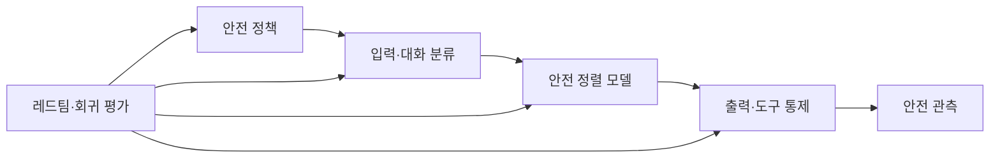
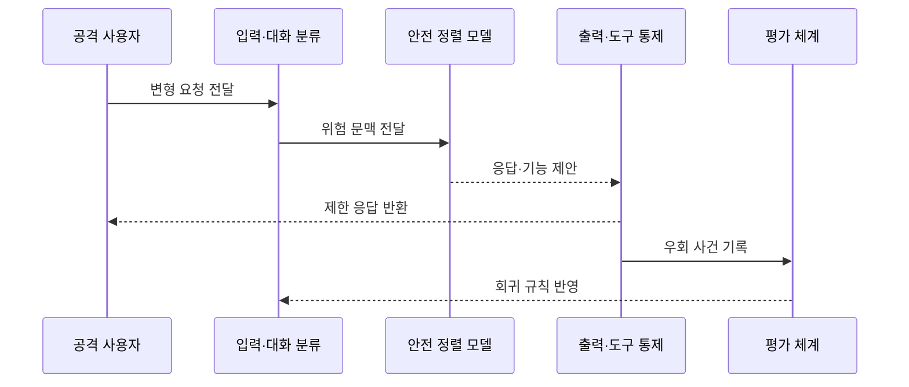

---
sidebar:
  order: 81
  label: "081. 탈옥 Jailbreak 공격 (Jailbreak Attack)"
  badge:
    text: "기출 · 70%"
    variant: note
title: "탈옥 Jailbreak 공격 (Jailbreak Attack)"
date: "2026-07-27T23:59:59+09:00"
tags:
  - "notes-security"
weight: 81
extra:
  question_no: "081"
  source_status: "기출"
  source_history: "137회, 138회"
  priority: 70
  priority_note: "137·138회 반복된 안전정렬 우회 핵심 공격임"
---

## 미리 알고가기

- **탈옥(Jailbreak, 제일브레이크)**: 감옥에서 벗어난다는 비유로, 모델의 안전 거부 정책을 우회해 금지 응답을 생성시키는 공격
- **LLM(Large Language Model, 엘엘엠)**: 영문 머리글자를 딴 명칭으로, 대규모 텍스트로 학습한 언어 모델
- **안전 정책(Safety Policy)**: 모델이 허용·제한·거부할 요청과 응답의 기준
- **안전 정렬(Safety Alignment)**: 모델 행동이 정해진 안전 원칙을 따르도록 학습·조정하는 과정
- **프롬프트 인젝션(Prompt Injection)**: 신뢰하지 않는 입력이 모델의 지침 해석을 교란하는 공격
- **시스템 프롬프트(System Prompt)**: 서비스가 모델의 역할·규칙·출력 조건을 정하기 위해 제공하는 상위 지침
- **가드레일(Guardrail)**: 입력·출력·도구 행동을 정책에 맞게 제한하는 통제
- **적대적 접미사(Adversarial Suffix)**: 입력 뒤에 특정 문자열을 붙여 모델의 안전 거부를 교란하는 공격 입력
- **다중 턴(Multi-Turn)**: 여러 차례의 대화를 이어 문맥을 누적하는 상호작용 방식
- **레드팀(Red Team)**: 실제 공격 관점으로 시스템의 안전 통제를 시험하는 평가 조직이나 활동
- **회귀 평가(Regression Evaluation)**: 수정 뒤 과거에 막았던 공격이 다시 성공하지 않는지 반복 확인하는 시험
- **정상 거부율(False Refusal Rate)**: 허용해야 할 정상 요청을 모델이 잘못 거부하는 비율
- **심층 방어(Defense in Depth)**: 서로 독립적인 여러 통제를 겹쳐 한 통제의 실패가 피해로 이어지지 않게 하는 전략
- **레드팀(Red Team, 레드 팀)**: 군사 모의훈련의 공격자 편 명칭에서 왔으며, 공격 관점으로 안전 통제의 우회 가능성을 검증

## Ⅰ. 개요

- 정의/개념: 모델의 안전 거부를 우회하는 공격이다
- 기존 한계: 고정 금칙어는 역할극·분할·인코딩 우회에 취약
- **배경/필요성**: 의미 기반 안전 판단과 기능 오용 제한

### 쉽게 이해하기 (학습용)

- 질문을 역할극·번역·암호화로 포장해 모델이 금지된 요청임을 놓치고 답하도록 유도하는 공격이다.

## Ⅱ. 특징

- 역할극·분할·인코딩으로 금지 의도를 은닉한다
- 모델·대화 문맥 변화에 따라 우회 성공률이 달라진다
- 출력·도구 제한과 회귀 평가로 피해·재발을 줄인다

### 쉽게 이해하기 (학습용)

- 공격 표현은 계속 바뀌므로 문장 하나를 차단하는 데 그치지 않고 출력과 연결 기능까지 별도로 제한해야 한다.

## Ⅲ. 아키텍처 및 구성요소

| 설계 요소 | 설명 |
|:---|:---|
| 안전 정책 | 위험 수준과 허용·거부 기준 정의 |
| 입력·대화 분류 | 누적 문맥의 의도와 위험 평가 |
| 안전 정렬 모델 | 금지 요청을 식별해 거부 |
| 출력·도구 통제 | 유해 내용과 외부 기능 제한 |
| 안전 관측 | 우회·오탐·실제 피해 기록 |
| 레드팀·회귀 평가 | 신규 공격과 재발 여부 검증 |

> 요약: 입력·출력·기능을 겹쳐 유해 응답 피해를 막는다

### 쉽게 이해하기 (학습용)

- 모델 앞에서 의도를 보고 모델 뒤에서 출력과 기능을 다시 막으며 새 우회 사례를 계속 시험 목록에 넣는다.

## Ⅳ. 원리 및 절차 흐름도

| 절차 | 설명 |
|:---|:---|
| 변형 요청 전달 | 역할극·분할·인코딩 입력 |
| 위험 문맥 전달 | 전체 대화의 의도와 위험 표시 |
| 응답·기능 제안 | 모델이 거부 또는 결과 생성 |
| 제한 응답 반환 | 의미·민감도·도구 권한 재검증 |
| 우회 사건 기록 | 성공·정상 거부·피해를 측정 |
| 회귀 규칙 반영 | 재발 시험과 통제 개선 |

> 요약: 변형 요청을 다층 검증하고 재발을 시험한다.

### 쉽게 이해하기 (학습용)

- 변형된 질문이 모델을 통과해도 출력과 기능 경계가 다시 검사하고 발견한 우회는 다음 버전에서도 막히는지 반복 시험한다.

## Ⅴ. 종류 및 비교

| 판단 기준 | 단일 턴 우회 | 다중 턴 우회 | 자동화 탐색 |
|:---|:---|:---|:---|
| 적용 기준 | 입력별 위험 분류 | 전체 대화 상태 추적 | 대규모 회귀·레드팀 |
| 핵심 특징 | 한 입력에서 의도 은닉 | 대화 누적으로 경계 약화 | 대량 변형을 자동 생성 |
| 한계 | 표현 변형 탐지 곤란 | 누적 의도 탐지 실패 | 신규 우회 빠르게 발견 |

> 요약: 단일·다중 턴과 자동 탐색으로 거부를 우회한다

### 쉽게 이해하기 (학습용)

- 단일 턴은 한 번의 포장, 다중 턴은 대화 누적, 자동화 탐색은 많은 변형을 기계적으로 시험해 안전 거부의 빈틈을 찾는다.

## Ⅵ. 실무 사례

1. 전체 대화 문맥으로 위험 의도를 분류한다
2. 유해 출력 뒤의 도구 실행을 별도 차단한다
3. 새 탈옥 사례를 회귀 평가에 추가한다
4. 공격 성공률과 정상 거부율을 함께 측정한다

### 쉽게 이해하기 (학습용)

- 사례 1은 여러 정상 질문으로 위험한 목적을 잘게 나눠 숨기는 다중 턴 우회를 찾아낸다.
- 사례 2는 모델이 금지된 절차를 제안해도 코드 실행이나 외부 시스템 조작으로 이어지지 않게 한다.
- 사례 3은 한 번 막은 공격이 모델이나 시스템 프롬프트 변경 뒤 다시 성공하는 일을 방지한다.
- 사례 4는 공격만 많이 막다가 정상적인 교육·연구 요청까지 과도하게 거부하는 품질 저하를 함께 조정한다.

## Ⅶ. 결론

- 안전 거부를 운영하면 다층 통제와 회귀 평가를 적용한다.

### 쉽게 이해하기 (학습용)

- 탈옥은 고정 규칙으로 완전히 끝낼 수 없으므로 모델의 거부·출력 검사·기능 격리·지속 평가를 겹쳐 실제 피해를 제한해야 한다.
