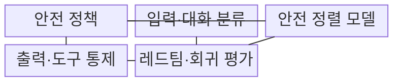
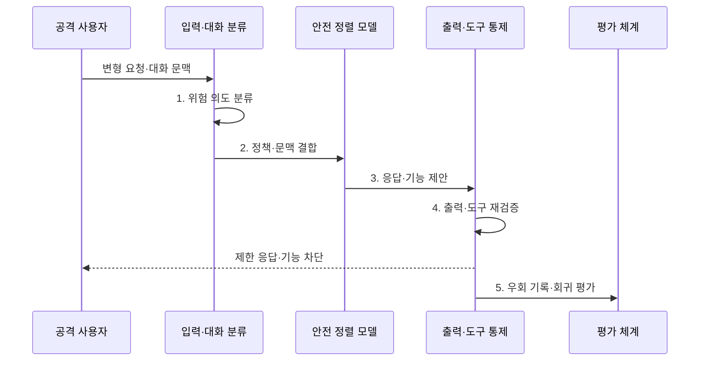

---
sidebar:
  order: 81
  label: "081. 탈옥 Jailbreak 공격 (Jailbreak Attack)"
  badge:
    text: "기출 · 70%"
    variant: note
title: "탈옥 Jailbreak 공격 (Jailbreak Attack)"
date: "2026-08-02T12:40:00+09:00"
tags:
  - "notes-security"
weight: 81
extra:
  question_no: "081"
  source_status: "기출"
  source_history: "137회, 138회"
  priority: 70
  priority_note: "137·138회 반복된 안전정렬 우회 핵심 공격임"
---

## Ⅰ. 개요

핵심 용어

- **탈옥**: 역할극·분할·인코딩 같은 변형으로 모델의 안전 거부 정책을 우회하여 금지된 응답을 생성시키는 공격이다.
- **안전 정렬**: 모델 행동이 허용·제한·거부 기준과 안전 원칙을 따르도록 학습하고 조정하는 과정이다.

- 정의/개념: 모델의 **안전 거부 정책 우회 공격**
- 배경/필요성: 고정 금칙어의 **의미 변형 탐지 한계**

### 쉽게 이해하기 (학습용)

- 질문을 역할극·번역·암호화로 포장해 모델이 금지된 요청임을 놓치고 답하도록 유도하는 공격이다.

## Ⅱ. 특징

핵심 용어

- **적대적 접미사·다중 턴**: 입력 뒤의 교란 문자열이나 누적 대화 문맥으로 안전 거부 판단을 약화하는 탈옥 방식이다.
- **심층 방어**: 입력·모델·출력·도구에 독립 통제를 겹쳐 한 통제의 실패가 실제 피해로 이어지지 않게 하는 전략이다.

- 역할극·분할·인코딩의 **의도 은닉 기반 정책 우회**
- 모델·대화 상태에 따른 **문맥 의존적 우회 성공률**
- 출력·도구 피해와 재발을 제한하는 **심층 방어**

### 쉽게 이해하기 (학습용)

- 공격 표현은 계속 바뀌므로 문장 하나를 차단하는 데 그치지 않고 출력과 연결 기능까지 별도로 제한해야 한다.

## Ⅲ. 구조 및 구성요소

핵심 용어

- **안전 정책·가드레일**: 안전 정책은 위험별 허용·제한·거부 기준을 정하고 가드레일은 입력·출력·도구 행동에 그 기준을 집행한다.
- **레드팀·회귀 평가**: 공격자 관점으로 새 우회를 찾고 수정 뒤 과거·변형 공격이 다시 성공하는지 반복 확인한다.

| 구성요소 | 책임 |
|:---|:---|
| 안전 정책 | **위험 수준·허용·거부 기준** 정의 |
| 입력·대화 분류 | 누적 문맥의 **의도·위험 평가** |
| 안전 정렬 모델 | **금지 요청 식별·거부** |
| 출력·도구 통제 | **유해 내용·외부 기능 제한** |
| 레드팀·회귀 평가 | **신규 공격·재발 여부** 검증 |

### 쉽게 이해하기 (학습용)

- 모델 앞에서 의도를 보고 모델 뒤에서 출력과 기능을 다시 막으며 새 우회 사례를 계속 시험 목록에 넣는다.

## Ⅳ. 흐름도

핵심 용어

- **누적 문맥 위험 분류**: 현재 입력만이 아니라 전체 대화에서 분할된 의도와 위험이 결합되는지를 판단하는 과정이다.
- **정상 거부율**: 정책상 허용해야 할 정상 요청을 모델이나 가드레일이 잘못 거부한 비율이다.

**동작 원리**

1. **위험 의도 분류**: 전체 대화의 위험 표시
2. **정책·문맥 결합**: 시스템 프롬프트와 누적 상태 적용
3. **응답·기능 제안**: 모델이 거부 또는 결과 생성
4. **출력·도구 재검증**: 의미·민감도·권한 재검증
5. **우회 기록·회귀 평가**: 성공·정상 거부·재발 측정

### 쉽게 이해하기 (학습용)

- 변형된 질문이 모델을 통과해도 출력과 기능 경계가 다시 검사하고 발견한 우회는 다음 버전에서도 막히는지 반복 시험한다.

## Ⅴ. 종류 및 비교

핵심 용어

- **단일 턴·다중 턴·자동 탐색**: 한 입력의 변형, 누적 대화의 경계 약화, 대량 변형의 기계적 시험으로 안전 거부 빈틈을 찾는 유형이다.

| 탈옥 공격 유형 | 단일 턴 우회 | 다중 턴 우회 | 자동화 탐색 |
|:---|:---|:---|:---|
| 적용 기준 | **입력별 위험 분류** | **전체 대화 상태 추적** | **대규모 회귀·레드팀** |
| 핵심 특징 | **적대적 접미사·의도 은닉** | **대화 누적 경계 약화** | **대량 변형 자동 생성** |
| 한계 | **표현 변형 탐지 곤란** | **누적 의도 탐지 실패** | **신규 우회 확산 가속** |

> 요약: 단일·다중 턴과 자동 탐색으로 거부를 우회한다

### 쉽게 이해하기 (학습용)

- 단일 턴은 한 번의 포장, 다중 턴은 대화 누적, 자동화 탐색은 많은 변형을 기계적으로 시험해 안전 거부의 빈틈을 찾는다.

## Ⅵ. 실무 고려사항 및 대책

핵심 용어

- **OWASP LLM01:2025**: 탈옥을 안전 프로토콜을 무시하게 하는 프롬프트 인젝션 형태로 다루는 공식 위험 항목이다.
- **NIST AI 600-1**: 생성형 AI의 오용 위험과 적대적 시험·사후 대응을 제시하는 공식 프로파일이다.

| 문제 | 대책 | 효과 |
|:---|:---|:---|
| **탈옥 위협 분류 누락** | **OWASP LLM01:2025 적용** | **우회 시나리오 체계화** |
| **생성형 AI 오용** | **NIST AI 600-1 연계** | **적대적 시험·대응 강화** |
| **정상 요청 과잉 차단** | **공격성공률·정상거부율 병행** | **안전성·유용성 균형** 확보 |

### 쉽게 이해하기 (학습용)

- 모델은 가상 인물 역할이나 여러 정상 질문으로 위험한 요청을 분할해도 전체 대화 의도를 평가해 금지된 공격 절차 생성을 거부한다.

## Ⅶ. 결론

핵심 용어

- **탈옥 피해 제한**: 모델 거부가 우회되더라도 출력 검사·기능 격리·최소 권한으로 금지 정보와 외부 행동의 실제 영향을 줄이는 원칙이다.

- **출력 위험·도구 영향**이 크면 입력·모델·출력·도구 통제 적용

### 쉽게 이해하기 (학습용)

- 탈옥은 고정 규칙으로 완전히 끝낼 수 없으므로 모델의 거부·출력 검사·기능 격리·지속 평가를 겹쳐 실제 피해를 제한해야 한다.
