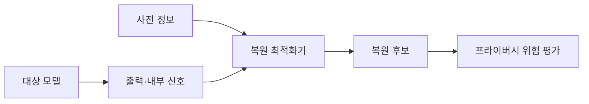
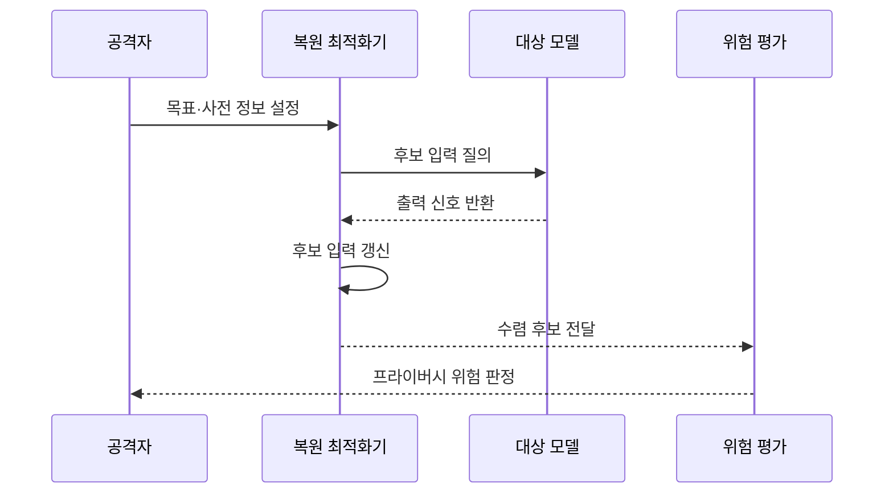

---
sidebar:
  order: 82
  label: "082. 모델 역전 공격 (Model Inversion Attack)"
  badge:
    text: "기출 · 50%"
    variant: note
title: "모델 역전 공격 (Model Inversion Attack)"
date: "2026-07-27T23:59:59+09:00"
tags:
  - "notes-security"
weight: 82
extra:
  question_no: "082"
  source_status: "기출"
  source_history: "137회"
  priority: 50
  priority_note: "137회 기출이며 학습정보 유출 통제로 확장 가능함"
---

## 미리 알고가기

- **모델 역전 공격(Model Inversion Attack)**: 모델의 출력 신호를 거꾸로 이용해 학습 데이터의 특징이나 민감 속성을 추정하는 공격
- **블랙박스 접근(Black-Box Access)**: 모델 내부를 보지 못하고 입력과 출력만 관찰하는 접근 수준
- **화이트박스 접근(White-Box Access)**: 모델 구조·가중치·기울기 등 내부 정보까지 볼 수 있는 접근 수준
- **신뢰도 점수(Confidence Score)**: 모델이 각 예측 결과를 얼마나 확신하는지 나타내는 수치
- **기울기(Gradient)**: 입력이나 가중치를 어느 방향으로 바꾸면 목표값이 커지는지 나타내는 변화량
- **임베딩(Embedding)**: 입력의 특징이나 의미를 수치 벡터로 표현한 값
- **사전 정보(Prior Knowledge)**: 공격자가 복원 전에 가진 데이터 형식·분포·속성에 관한 보조 지식
- **최적화(Optimization)**: 목표값을 높이거나 손실을 낮추도록 후보 입력을 반복 수정하는 계산 과정
- **수렴(Convergence)**: 반복 수정의 변화가 작아져 더는 목표값이 크게 개선되지 않는 상태
- **대표 특징(Representative Feature)**: 특정 분류나 집단에서 공통으로 강하게 나타나는 특성
- **과적합(Overfitting)**: 모델이 일반 패턴보다 학습 데이터의 세부 특징을 지나치게 기억한 상태
- **회원 추론 공격(Membership Inference Attack)**: 특정 데이터가 모델 학습에 포함됐는지 추정하는 공격
- **모델 추출 공격(Model Extraction Attack)**: 반복 질의로 대상 모델의 기능이나 결정 경계를 복제하는 공격
- **차등 프라이버시(Differential Privacy, DP, 디피)**: 영문 머리글자를 딴 명칭으로, 개인 한 명의 포함 여부가 결과에 미치는 영향을 수학적으로 제한
- **질의 예산(Query Budget)**: 공격자나 사용자가 허용받은 모델 호출 횟수와 비용의 한도
- **식별자(Identifier, ID, 아이디)**: 데이터와 사용자를 구별하는 값
- **응용 프로그래밍 인터페이스(Application Programming Interface, API, 에이피아이)**: 영문 머리글자를 딴 모델 호출 규칙·접점
- **블랙박스·화이트박스 표기**: 내부를 볼 수 없는 검은 상자와 내부를 볼 수 있는 흰 상자 비유에서 온 이름이며, 공격자가 이용할 수 있는 모델 정보 범위를 구분함

## Ⅰ. 개요

- **정의/개념**: 출력 신호로 학습 특징을 역추정하는 공격이다
- **기존 한계**: 상세 출력·과적합은 학습 특징 추론 단서 제공
- **배경/필요성**: 출력 최소화와 개별 학습정보 보호

### 쉽게 이해하기 (학습용)

- 공격자는 모델이 목표 사람이나 분류를 더 확신하도록 가짜 입력을 계속 고쳐 그 확신을 만든 특징을 거꾸로 드러낸다.

## Ⅱ. 특징

- 상세 점수·기울기가 복원 후보의 최적화 방향을 제공한다
- 과적합·소수 집단은 개인 특징 식별 위험을 높인다
- 복원 결과는 실제 원본이 아닌 대표 특징일 수 있다

### 쉽게 이해하기 (학습용)

- 최적화가 수렴했다는 말은 모델 반응을 크게 만드는 후보를 찾았다는 뜻이며 그 후보가 실제 학습 원본과 같다는 뜻은 아니다.

## Ⅲ. 아키텍처 및 구성요소

| 설계 요소 | 설명 |
|:---|:---|
| 대상 모델 | 학습 특징이 반영된 예측 수행 |
| 출력·내부 신호 | 점수·임베딩·기울기 제공 |
| 사전 정보 | 데이터 형태와 탐색 범위 제공 |
| 복원 최적화기 | 목표 반응이 커지도록 후보 수정 |
| 복원 후보 | 대표 특징이나 민감 속성 표현 |
| 프라이버시 위험 평가 | 원본 유사성과 식별성 판정 |

> 요약: 출력 신호와 사전 정보로 민감 특징을 복원한다

### 쉽게 이해하기 (학습용)

- 모델 신호와 공격자의 보조 지식을 최적화기에 넣으면 목표 반응을 잘 일으키는 후보가 나오고 평가 단계가 실제 개인정보 위험인지 판단한다.

## Ⅳ. 원리 및 절차 흐름도

| 절차 | 설명 |
|:---|:---|
| 목표·사전 정보 설정 | 복원 속성과 입력 형태 정의 |
| 후보 입력 질의 | 현재 후보를 모델에 반복 제출 |
| 출력 신호 반환 | 목표 점수·임베딩·기울기 제공 |
| 후보 입력 갱신 | 목표 반응이 커지는 방향으로 수정 |
| 수렴 후보 전달 | 개선이 멈춘 복원 결과 제출 |
| 프라이버시 위험 판정 | 원본 유사성·식별 가능성 평가 |

> 요약: 목표 반응을 만든 특징을 반복 질의로 추정한다.

### 쉽게 이해하기 (학습용)

- 후보를 넣고 점수를 받은 뒤 더 높은 점수가 나도록 후보를 고치는 과정을 반복해 모델이 기억한 민감 특징이 드러나는지 확인한다.

## Ⅴ. 종류 및 비교

| 판단 기준 | 모델 역전 | 회원 추론 | 모델 추출 |
|:---|:---|:---|:---|
| 적용 기준 | 민감한 대표상 노출 평가 | 참여 사실의 노출 평가 | 지식재산·API 남용 평가 |
| 핵심 특징 | 학습 특징·속성 복원 | 학습 포함 여부 추정 | 모델 기능·경계 복제 |
| 한계 | 원본과 대표상 혼동 | 오판과 개인 식별 | 대량 질의와 모방 모델 |

> 요약: 역전은 특징, 회원 추론은 포함, 추출은 기능을 노린다

### 쉽게 이해하기 (학습용)

- 역전은 무엇을 배웠는지, 회원 추론은 이 자료를 배웠는지, 추출은 모델이 어떻게 판단하는지를 알아내려는 공격이다.

## Ⅵ. 실무 사례

1. API에서 불필요한 신뢰도 점수를 제거한다
2. 반복 질의의 횟수·속도·패턴을 제한한다
3. 차등 프라이버시와 과적합 억제를 적용한다
4. 복원 결과의 원본 유사성·식별성을 평가한다

### 쉽게 이해하기 (학습용)

- 사례 1은 정답만 필요한 서비스가 세밀한 점수까지 내줘 공격자의 최적화 방향을 알려 주지 않게 한다.
- 사례 2는 공격자가 수많은 후보를 시험하며 복원 결과를 정교하게 다듬는 과정을 어렵게 한다.
- 사례 3은 특정 개인 자료 하나가 모델 출력과 내부 표현에 지나치게 강하게 남는 현상을 줄인다.
- 사례 4는 그럴듯한 얼굴이나 속성이 나왔다는 이유만으로 원본 복원이라 과장하지 않고 실제 개인 노출 여부를 검증한다.

## Ⅶ. 결론

- 민감 모델이면 상세 출력과 반복 질의를 제한한다.

### 쉽게 이해하기 (학습용)

- 모델 역전 대응의 목표는 모든 추정을 막는 것이 아니라 모델 반응에서 특정 개인이나 민감 집단 특징을 식별할 만큼의 정보가 나오지 않게 하는 것이다.
