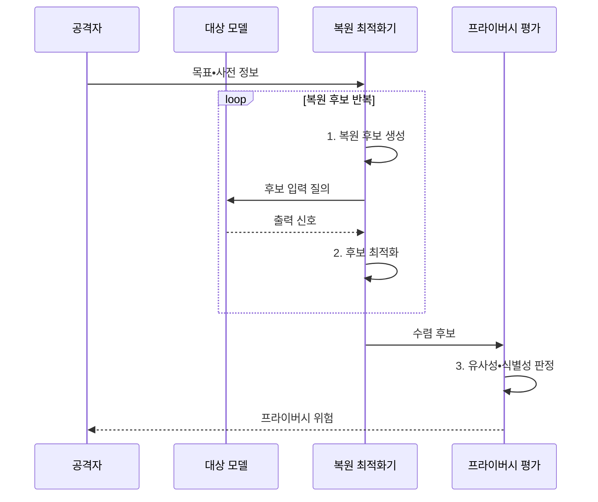

---
sidebar:
  order: 82
  label: "082. 모델 역전 공격 (Model Inversion Attack)"
  badge:
    text: "기출 • 70%"
    variant: note
title: "모델 역전 공격 (Model Inversion Attack)"
date: "2026-08-03T08:48:47+09:00"
tags:
  - "notes-security"
weight: 82
extra:
  question_no: "082"
  source_status: "기출"
  source_history: "137회, 138회"
  priority: 70
  priority_note: "137•138회 반복된 모델 프라이버시 공격임"
---

## Ⅰ. 개요

핵심 용어

- **모델 역전 공격**: 모델의 출력 점수•임베딩•기울기를 역으로 이용해 학습 데이터의 대표 특징이나 민감 속성을 추정하는 공격이다.
- **학습 정보 노출**: 업무에 불필요한 상세 출력과 모델의 개인 기억이 결합해 원본에 가까운 특징을 복원할 수 있는 위험이다.

- 정의/개념: **모델 역전 공격** 은 출력 신호를 역이용해 학습 데이터의 특징을 복원하는 공격
- 배경/필요성: 세부 신뢰도•기울기 공개로 **학습 정보 노출**

#### 한줄 요약

- 완성된 모델의 답을 반복 관찰하여 모델이 학습할 때 기억한 얼굴이나 민감 속성의 특징을 거꾸로 복원한다.

## Ⅱ. 특징

핵심 용어

- **신뢰도•기울기•사전 정보**: 세부 반응과 변화 방향, 데이터 형식•분포에 관한 보조 지식이 복원 최적화의 신호가 된다.
- **과적합•차등 프라이버시(DP)**: 과적합은 개인 특징의 기억을 높이고 DP는 한 사람의 포함이 결과에 미치는 영향을 제한한다.

- 점수•기울기의 **반복 최적화 악용**
- 사전 정보가 많고 과적합이면 **복원 정확도 증가**
- 출력 최소화•DP의 **개인정보 노출 제한**

#### 한줄 요약

- 공격자는 정답만 받는 경우보다 세부 확률이나 기울기까지 받을 때 후보를 더 빠르고 정밀하게 원래 특징에 가깝게 만든다.

## Ⅲ. 구조 및 구성요소

핵심 용어

- **복원 최적화기**: 모델 반응이 목표에 가까워지도록 후보 입력을 반복 수정하여 학습 특징을 재구성하는 기능이다.
- **프라이버시 평가**: 복원 결과가 단순 대표상이 아니라 원본과 유사하거나 개인을 식별할 수준인지 판정하는 과정이다.

| 구성요소 | 책임 |
|:---|:---|
| 대상 모델 | 학습 특징을 반영한 **예측 수행** |
| 출력•내부 신호 | **점수•임베딩•기울기** 제공 |
| 사전 정보 | **데이터 형태•탐색 범위** 제공 |
| 복원 최적화기 | 목표 반응에 따른 **후보 수정** |
| 프라이버시 평가 | **원본 유사성•식별성** 판정 |

#### 한줄 요약

- 후보 입력을 모델에 반복 넣고 목표 점수가 높아지는 방향으로 수정한 뒤 복원 결과가 개인을 식별할 수준인지 평가한다.

## Ⅳ. 흐름도

핵심 용어

- **반복 최적화**: 사전 정보로 후보를 만들고 모델 출력이 목표에 가까워지는 방향으로 여러 차례 수정하는 공격 과정이다.
- **유사성•식별성**: 복원 후보가 원본 특징과 가까운 정도와 특정 개인을 알아볼 수 있는 정도를 구분한 위험 지표이다.

**동작 원리**

1. **복원 후보 생성**: 사전 정보로 초기 입력 구성
2. **후보 최적화**: 모델 반응이 목표에 가까운 방향으로 수정
3. **유사성•식별성 판정**: 원본 근접도•노출 위험 평가

#### 한줄 요약

- 공격은 정답을 한 번 훔치는 것이 아니라 모델 반응을 나침반처럼 사용해 복원 후보를 반복적으로 다듬는다.

## Ⅴ. 종류 및 비교

핵심 용어

- **역전•회원 추론•모델 추출**: 각각 학습 특징 복원, 특정 자료의 학습 참여 여부 추정, 대상 모델의 기능과 판단 경계 복제를 목표로 한다.

| 모델 정보 공격 | 모델 역전 | 회원 추론 | 모델 추출 |
|:---|:---|:---|:---|
| 적용 기준 | **대표 특징•속성 노출** | **학습 참여 사실 노출** | **기능•지식재산 복제** |
| 핵심 특징 | **특징•속성 복원** | **포함 여부 추정** | **판단 경계 모방** |
| 한계 | **원본•대표상 혼동** | **오판•식별성 논란** | **대량 질의 필요** |

#### 한줄 요약

- 역전은 무엇을 배웠는지, 회원 추론은 특정 자료를 배웠는지, 추출은 모델이 어떻게 판단하는지를 노린다.

## Ⅵ. 실무 고려사항 및 대책

핵심 용어

- **NIST AI 100-2e2025**: 모델 프라이버시 공격을 재구성•회원 추론•속성 추론 등 지식과 접근 수준별로 분류한 공식 보고서이다.
- **출력 최소화•질의 예산**: 업무에 필요한 라벨만 제공하고 사용자별 호출 횟수와 비용을 제한해 복원 탐색 신호를 줄이는 대책이다.
- **점수 양자화**: 세밀한 연속형 출력 점수를 제한된 단계의 값으로 바꾸어 공격자가 얻는 최적화 신호의 정밀도를 낮추는 통제이다.
- **블랙박스•화이트박스 접근**: 블랙박스는 외부 입출력만 이용하고 화이트박스는 가중치•기울기 같은 내부 정보까지 이용하는 공격 조건이다.

| 문제 | 대책 | 효과 |
|:---|:---|:---|
| **프라이버시 공격 분류 누락** | **NIST AI 100-2e2025 적용** | **공격 지식•역량별 시험** |
| **세부 출력 노출** | **라벨 최소화•점수 양자화** | **복원 최적화 신호 축소** |
| **과적합•개인 기억** | **DP 학습•정규화•삭제 검증** | **개인 특징 복원 위험 완화** |
| **블랙박스•화이트박스 접근** | 역할별 **질의 예산•내부 신호 통제** | **공격 탐색 범위 축소** |

#### 한줄 요약

- 의료 모델은 진단 라벨만 필요한 사용자에게 세부 확률이나 임베딩을 주지 않고 DP 학습과 복원 시험으로 환자 특징 노출을 점검한다.

## Ⅶ. 결론

핵심 용어

- **프라이버시-유용성 균형**: 정상 업무에 필요한 출력 가치는 유지하면서 반복 복원에 유용한 정밀 신호와 개인 기억을 최소화하는 기준이다.

- 출력 정밀도•질의량이 높으면 **점수 최소화•질의 예산** 적용

#### 한줄 요약

- 모델 역전 방어는 출력의 업무 가치를 유지하되 공격자가 반복 최적화에 쓸 정보와 개인 기억을 최소화하는 것이다.
