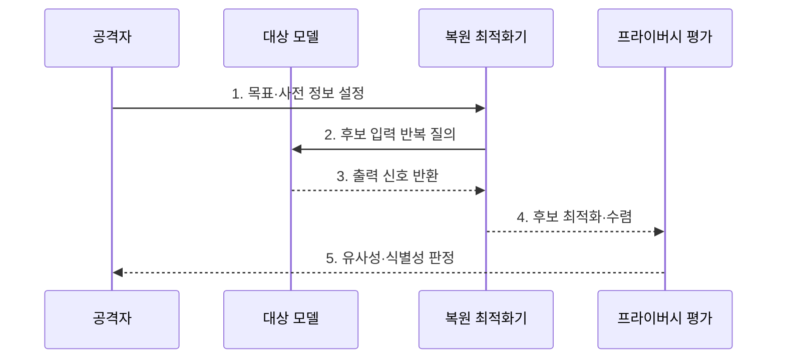

---
sidebar:
  order: 82
  label: "082. 모델 역전 공격 (Model Inversion Attack)"
  badge:
    text: "기출 · 70%"
    variant: note
title: "모델 역전 공격 (Model Inversion Attack)"
date: "2026-07-30T20:00:00+09:00"
tags:
  - "notes-security"
weight: 82
extra:
  question_no: "082"
  source_status: "기출"
  source_history: "137회, 138회"
  priority: 70
  priority_note: "137·138회 반복된 모델 프라이버시 공격임"
---

## 미리 알고가기

- **모델 역전 공격(Model Inversion Attack)**: 모델 출력 신호를 역으로 이용해 학습 데이터의 특징이나 민감 속성을 추정하는 공격이다.
- **블랙박스 접근(Black-Box Access)**: 모델 내부를 보지 못하고 입력과 출력만 관찰하는 접근 수준이다.
- **화이트박스 접근(White-Box Access)**: 모델 구조·가중치·기울기 등 내부 정보까지 보는 접근 수준이다.
- **신뢰도 점수(Confidence Score)**: 모델이 각 예측 결과를 얼마나 확신하는지를 나타내는 수치이다.
- **기울기(Gradient)**: 입력이나 가중치 변화에 따른 목표값의 변화 방향과 크기이다.
- **임베딩(Embedding)**: 입력의 특징이나 의미를 표현한 수치 벡터이다.
- **사전 정보(Prior Knowledge)**: 공격자가 가진 데이터 형식·분포·속성에 관한 보조 지식이다.
- **최적화(Optimization)**: 목표 반응을 높이도록 후보 입력을 반복 수정하는 계산 과정이다.
- **과적합(Overfitting)**: 모델이 일반 패턴보다 학습 데이터의 세부 특징을 지나치게 기억한 상태이다.
- **회원 추론 공격(Membership Inference Attack)**: 특정 데이터가 모델 학습에 포함됐는지를 추정하는 공격이다.
- **모델 추출 공격(Model Extraction Attack)**: 반복 질의로 대상 모델의 기능이나 결정 경계를 복제하는 공격이다.
- **차등 프라이버시(Differential Privacy, DP)**: 한 사람의 포함 여부가 결과에 미치는 영향을 수학적으로 제한하는 기법이다.
- **질의 예산(Query Budget)**: 사용자에게 허용한 모델 호출 횟수와 비용의 한도이다.
- **NIST AI 100-2e2025**: 모델 프라이버시 공격을 재구성·회원 추론·속성 추론 등으로 분류하는 공식 보고서이다.

## Ⅰ. 개요

- 정의/개념: 출력 신호를 이용한 **학습 특징 복원 공격**
- 배경/필요성: 과도한 점수·기울기의 **정보 노출**

### 쉽게 이해하기 (학습용)

- 완성된 모델의 답을 반복 관찰하여 모델이 학습할 때 기억한 얼굴이나 민감 속성의 특징을 거꾸로 복원한다.

## Ⅱ. 특징

- 점수·기울기의 **반복 최적화 악용**
- 사전 정보·과적합의 **복원 정확도 증가**
- 출력 최소화·DP의 **개인정보 노출 제한**

### 쉽게 이해하기 (학습용)

- 공격자는 정답만 받는 경우보다 세부 확률이나 기울기까지 받을 때 후보를 더 빠르고 정밀하게 원래 특징에 가깝게 만든다.

## Ⅲ. 구조 및 구성요소

| 구성요소 | 책임 |
|:---|:---|
| 대상 모델 | 학습 특징 반영 예측 수행 |
| 출력·내부 신호 | 점수·임베딩·기울기 제공 |
| 사전 정보 | 데이터 형태·탐색 범위 제공 |
| 복원 최적화기 | 목표 반응 기준 후보 수정 |
| 프라이버시 평가 | 원본 유사성·식별성 판정 |

### 쉽게 이해하기 (학습용)

- 후보 입력을 모델에 반복 넣고 목표 점수가 높아지는 방향으로 수정한 뒤 복원 결과가 개인을 식별할 수준인지 평가한다.

## Ⅳ. 흐름도

**동작 원리**

1. **목표·사전 정보 설정**: 복원 속성·입력 형태 정의
2. **후보 입력 반복 질의**: 현재 후보를 모델에 제출
3. **출력 신호 반환**: 점수·임베딩·기울기 제공
4. **후보 최적화·수렴**: 목표 반응 방향으로 수정
5. **유사성·식별성 판정**: 원본 근접도·노출 위험 평가

### 쉽게 이해하기 (학습용)

- 공격은 정답을 한 번 훔치는 것이 아니라 모델 반응을 나침반처럼 사용해 복원 후보를 반복적으로 다듬는다.

## Ⅴ. 종류 및 비교

| 모델 정보 공격 | 모델 역전 | 회원 추론 | 모델 추출 |
|:---|:---|:---|:---|
| 적용 기준 | 대표 특징·속성 노출 | 학습 참여 사실 노출 | 기능·지식재산 복제 |
| 핵심 특징 | **특징·속성 복원** | **포함 여부 추정** | **판단 경계 모방** |
| 한계 | 원본·대표상 혼동 | 오판·식별성 논란 | 대량 질의 필요 |

### 쉽게 이해하기 (학습용)

- 역전은 무엇을 배웠는지, 회원 추론은 특정 자료를 배웠는지, 추출은 모델이 어떻게 판단하는지를 노린다.

## Ⅵ. 실무 고려사항 및 대책

| 고려사항 | 대책 | 효과 |
|:---|:---|:---|
| 프라이버시 공격 분류 | **NIST AI 100-2e2025 적용** | 공격 지식·역량별 시험 |
| 세부 출력 노출 | **라벨 최소화·점수 양자화** | 복원 최적화 신호 축소 |
| 과적합·개인 기억 | **DP 학습·정규화·삭제 검증** | 개인 특징 복원 위험 완화 |

### 쉽게 이해하기 (학습용)

- 의료 모델은 진단 라벨만 필요한 사용자에게 세부 확률이나 임베딩을 주지 않고 DP 학습과 복원 시험으로 환자 특징 노출을 점검한다.

## Ⅶ. 결론

- **출력정밀도·질의량·식별성**으로 역전 위험을 결정한다.

### 쉽게 이해하기 (학습용)

- 모델 역전 방어는 출력의 업무 가치를 유지하되 공격자가 반복 최적화에 쓸 정보와 개인 기억을 최소화하는 것이다.
