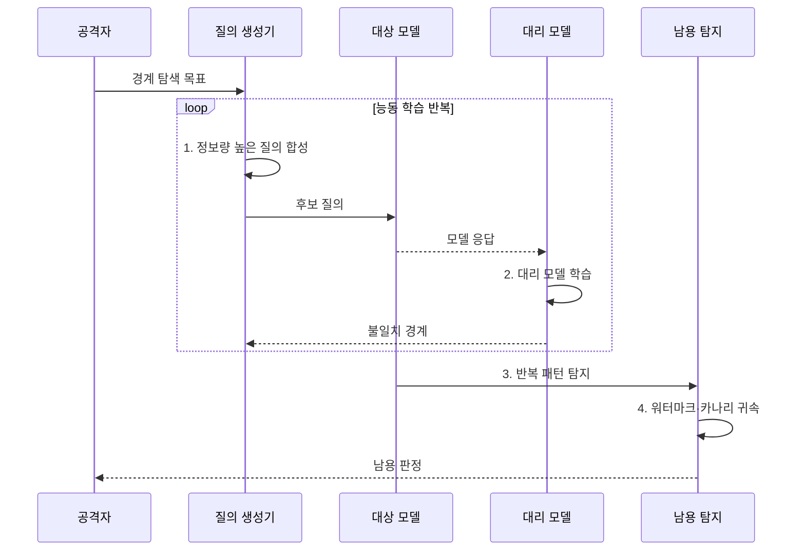

---
sidebar:
  order: 83
  label: "083. 모델 추출 공격 (Model Extraction Attack)"
  badge:
    text: "기출 · 70%"
    variant: note
title: "모델 추출 공격 (Model Extraction Attack)"
date: "2026-07-31T11:19:21+09:00"
tags:
  - "notes-security"
weight: 83
extra:
  question_no: "083"
  source_status: "기출"
  source_history: "137회, 138회"
  priority: 70
  priority_note: "137·138회 반복된 모델 지식재산 공격임"
---

## 미리 알고가기

- **모델 추출 공격(Model Extraction Attack)**: 대상 모델의 입출력을 수집해 기능이나 판단 경계를 모방하는 모델을 만드는 공격이다.
- **응용 프로그래밍 인터페이스(Application Programming Interface, API)**: 외부 프로그램이 모델을 호출하고 응답을 받는 접점이다.
- **대상 모델(Target Model)**: 공격자가 기능을 복제하려는 원래 모델이다.
- **대리 모델(Surrogate Model)**: 대상 모델과 비슷한 판단을 하도록 응답 데이터로 학습한 모방 모델이다.
- **결정 경계(Decision Boundary)**: 입력을 서로 다른 예측 결과로 나누는 모델의 판단 기준이다.
- **질의 합성(Query Synthesis)**: 모델 판단 규칙을 잘 드러낼 입력을 의도적으로 생성하는 기법이다.
- **능동 학습(Active Learning)**: 정보가 많은 표본을 선택해 적은 데이터로 학습 효율을 높이는 방식이다.
- **신뢰도 점수(Confidence Score)**: 모델이 각 예측 결과를 얼마나 확신하는지를 나타내는 수치이다.
- **충실도(Fidelity)**: 대리 모델과 대상 모델의 판단이 일치하는 정도이다.
- **호출률 제한(Rate Limiting)**: 일정 시간에 허용할 API 요청 수를 제한하는 통제이다.
- **워터마크(Watermark)**: 모델의 소유권이나 출처를 확인하도록 심어 둔 식별 신호이다.
- **카나리 입력(Canary Input)**: 복제·남용을 탐지하도록 특별한 반응을 설계한 시험 입력이다.
- **행위 분석(Behavior Analytics)**: 계정·시간·입력 분포·호출 패턴으로 비정상 사용을 찾는 분석이다.
- **NIST AI 100-2e2025**: 모델 추출을 모델 프라이버시 공격으로 분류하고 공격 지식·질의 접근을 체계화한다.

> **키워드:** 모델 추출 공격 (Model Extraction Attack)

## Ⅰ. 개요

- 정의/개념: 반복 질의에 의한 **모델 기능·경계 복제**
- 배경/필요성: 상세 출력 API의 **지식재산 노출**

### 쉽게 이해하기 (학습용)

- 경쟁 모델에 영리하게 고른 문제를 많이 내고 답을 모아 원본과 비슷하게 판단하는 모방 모델을 학습한다.

## Ⅱ. 특징

- 능동 질의의 **결정 경계 탐색**
- 상세 출력의 **복제 효율 증가**
- 행위 분석·워터마크의 **탐지·귀속**

### 쉽게 이해하기 (학습용)

- 라벨만 제공할 때보다 확률·임베딩·설명까지 제공할 때 적은 질의로 원본 모델의 판단 규칙을 더 정확히 복제할 수 있다.

## Ⅲ. 구조 및 구성요소

| 구성요소 | 책임 |
|:---|:---|
| 대상 모델 API | **라벨·점수·임베딩** 제공 |
| 질의·응답 경계 | **신원·목적·한도·출력** 통제 |
| 질의 생성기 | **결정 경계 탐색 입력** 생성 |
| 대리 모델 학습기 | 입출력으로 **판단 규칙 근사** |
| 남용 탐지·귀속 | **비정상 질의·복제 증거** 분석 |

### 쉽게 이해하기 (학습용)

- 공격자는 정보량이 큰 입력을 골라 응답을 축적하고 대리 모델을 학습하며 방어자는 API 경계에서 이 반복 패턴을 탐지한다.

## Ⅳ. 흐름도

**동작 원리**

1. **정보량 높은 질의 합성**: 불확실 경계 입력 선택
2. **대리 모델 학습**: 입출력 쌍으로 판단 규칙 근사
3. **반복 패턴 탐지**: 계정·입력 분포·호출률 분석
4. **워터마크·카나리 귀속**: 복제 반응과 소유 증거 대조

### 쉽게 이해하기 (학습용)

- 대리 모델이 원본과 다르게 답한 구간을 다시 질의하면 적은 호출로도 결정 경계를 효율적으로 좁힐 수 있다.

## Ⅴ. 종류 및 비교

| 모델 추출 유형 | 라벨 기반 | 점수 기반 | 상세 출력 기반 |
|:---|:---|:---|:---|
| 적용 기준 | **최소 출력 서비스** | **확률 제공 서비스** | **임베딩·설명 API** |
| 핵심 특징 | **최종 결과 수집** | **확률·신뢰도 수집** | **표현·설명 수집** |
| 한계 | **많은 질의 필요** | **신뢰도 출력 접근 필요** | **임베딩·설명 접근 필요** |

### 쉽게 이해하기 (학습용)

- 출력 정보가 풍부할수록 정상 사용에는 편리하지만 공격자의 모방 학습 비용도 낮아진다.

## Ⅵ. 실무 고려사항 및 대책

| 고려사항 | 대책 | 효과 |
|:---|:---|:---|
| **추출 공격 분류 누락** | **NIST AI 100-2e2025 적용** | **지식·접근별 시험 체계화** |
| **대량 경계 탐색** | **호출률 제한·분포 행위 분석** | **능동 질의 비용 증가** |
| **복제 입증·귀속** | **워터마크·카나리 입력 검증** | **소유권 증거·남용 탐지** |

### 쉽게 이해하기 (학습용)

- 고가 모델 API는 사용자별 호출률뿐 아니라 불확실 경계를 훑는 입력 분포를 탐지하고 카나리 반응으로 복제 모델을 식별한다.

## Ⅶ. 결론

- 출력 정보량·경계 질의가 높으면 **출력 최소화·호출률 제한** 적용

### 쉽게 이해하기 (학습용)

- 모델 추출 방어는 정상 사용에 필요한 출력은 유지하면서 자동화된 경계 탐색의 비용을 높이고 복제 증거를 남기는 것이다.
