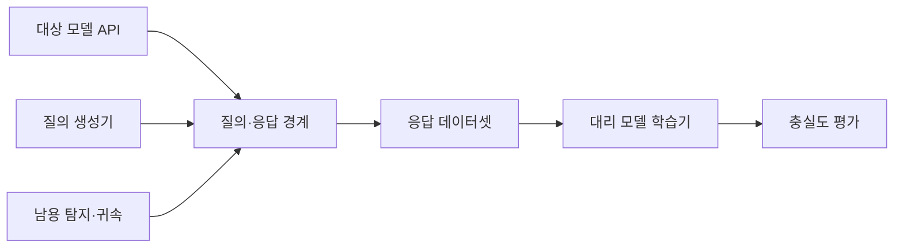
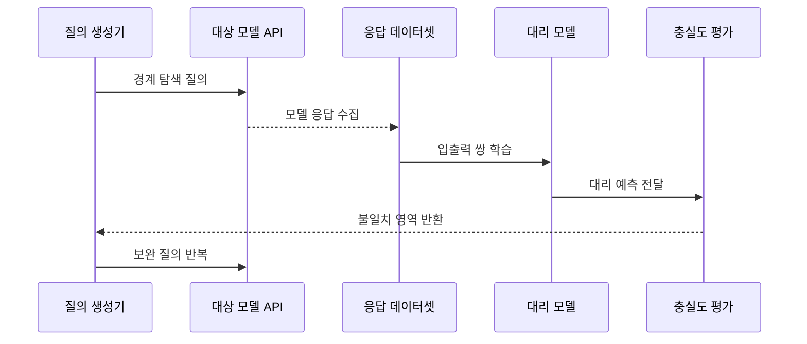

---
sidebar:
  order: 83
  label: "083. 모델 추출 공격 (Model Extraction Attack)"
  badge:
    text: "기출 · 50%"
    variant: note
title: "모델 추출 공격 (Model Extraction Attack)"
date: "2026-07-25T13:16:00+09:00"
tags:
  - "notes-security"
weight: 83
extra:
  question_no: "083"
  source_status: "기출"
  source_history: "137회"
  priority: 50
  priority_note: "137회 기출이며 모델 API 남용 방어에 활용됨"
---

## 미리 알고가기

- **모델 추출 공격(Model Extraction Attack)**: 대상 모델의 입출력을 수집해 기능이나 판단 경계를 모방하는 모델을 만드는 공격
- **API(Application Programming Interface)**: 프로그램이 모델에 입력을 보내고 결과를 받는 호출 규격
- **대상 모델(Target Model)**: 공격자가 기능을 복제하려는 원래 모델
- **대리 모델(Surrogate Model)**: 대상 모델과 비슷한 판단을 하도록 응답 데이터로 학습한 모방 모델
- **결정 경계(Decision Boundary)**: 입력을 서로 다른 예측 결과로 나누는 모델의 판단 기준
- **질의 합성(Query Synthesis)**: 모델의 판단 규칙을 잘 드러낼 입력을 의도적으로 생성하는 기법
- **능동 학습(Active Learning)**: 정보가 많은 표본을 선택해 적은 데이터로 학습 효율을 높이는 방식
- **라벨(Label)**: 분류 모델이 선택한 최종 결과 범주
- **신뢰도 점수(Confidence Score)**: 모델이 각 예측 결과를 얼마나 확신하는지 나타내는 수치
- **충실도(Fidelity)**: 대리 모델과 대상 모델의 판단이 일치하는 정도
- **호출률 제한(Rate Limiting)**: 일정 시간 동안 허용할 API 요청 수를 제한하는 통제
- **워터마크(Watermark)**: 모델의 소유권이나 출처를 나중에 확인하도록 심어 둔 식별 신호
- **카나리 입력(Canary Input)**: 복제·남용 여부를 탐지하기 위해 특별한 반응을 설계한 시험 입력
- **행위 분석(Behavior Analytics)**: 계정·시간·입력 분포·호출 패턴으로 비정상 사용을 찾는 분석
- **지식재산(Intellectual Property)**: 모델 구조·기능·데이터·노하우처럼 법적·경제적 가치가 있는 무형 자산
- **응용 프로그래밍 인터페이스(Application Programming Interface, API·에이피아이)**: 영문 각 단어의 머리글자를 딴 표기이며, 공격 질의와 모델 응답이 오가는 호출 경계
- **대리 모델(Surrogate Model·서러게이트 모델)**: 원본을 대신한다는 Surrogate의 뜻에서 온 표기이며, 수집한 입출력으로 대상 모델의 기능을 근사하는 역할

## Ⅰ. 개요

- **정의/개념**: API 응답으로 모델 기능을 모방하는 공격이다
- **배경/필요성**: 판단 경계 복제와 지식재산 유출을 막는다

### 쉽게 이해하기 (학습용)

- 공격자는 정답을 많이 물어 입력과 답의 교재를 만들고 그것으로 원본과 비슷하게 판단하는 대리 모델을 학습한다.

## Ⅱ. 특징

- 경계 질의는 적은 호출로 모방 정확도를 높인다
- 점수·임베딩은 판단 경계 노출을 키운다
- 대리 모델은 가중치 없이 원본 기능을 복제한다
- 분산 질의는 정상 사용자와의 구분을 어렵게 한다
- 행태·출력 통제는 복제 비용을 높이고 피해를 줄인다

### 쉽게 이해하기 (학습용)

- 추출에 성공했다는 뜻은 원본 파일을 그대로 훔쳤다는 뜻이 아니라 같은 입력에 비슷한 답을 내는 복제품을 만들었다는 뜻이다.

## Ⅲ. 아키텍처 및 구성요소

| 설계 요소 | 설명 |
|:---|:---|
| 대상 모델 API | 라벨·점수·임베딩 제공 |
| 질의·응답 경계 | 신원·목적·한도·출력 통제 |
| 질의 생성기 | 경계 탐색용 입력 생성 |
| 응답 데이터셋 | 입력·출력 쌍을 학습용 축적 |
| 대리 모델 학습기 | 대상 판단 규칙을 근사 |
| 충실도 평가 | 두 모델의 판단 일치도 측정 |
| 남용 탐지·귀속 | 비정상 질의와 복제 증거 분석 |

> 요약: 질의 응답을 모아 원본의 판단 기능을 복제한다

### 쉽게 이해하기 (학습용)

- 공격자는 정보가 많은 질문을 골라 답을 모아 대리 모델을 만들고 방어자는 API 경계에서 그 패턴과 출력 정보량을 통제한다.

## Ⅳ. 원리 및 절차 흐름도

| 절차 | 설명 |
|:---|:---|
| 경계 탐색 질의 | 불확실성이 큰 입력 선택 |
| 모델 응답 수집 | 라벨·점수와 호출 맥락 축적 |
| 입출력 쌍 학습 | 응답으로 대리 모델 훈련 |
| 대리 예측 전달 | 별도 시험 입력의 결과 생성 |
| 불일치 영역 반환 | 대상과 다른 판단 구간 식별 |
| 보완 질의 반복 | 해당 경계를 추가로 학습 |

> 요약: 불일치 경계를 다시 물어 모방 기능을 높인다.

### 쉽게 이해하기 (학습용)

- 대리 모델이 원본과 다르게 답한 영역을 찾아 그 주변을 다시 질문하는 과정을 반복할수록 복제품의 판단이 원본에 가까워진다.

## Ⅴ. 종류 및 비교

| 판단 기준 | 라벨 기반 | 점수 기반 | 상세 출력 기반 |
|:---|:---|:---|:---|
| 핵심 특징 | 최종 결과만 수집 | 확률·신뢰도까지 수집 | 임베딩·설명까지 수집 |
| 적용 기준 | 최소 출력 서비스 | 점수 제공 서비스 | 고급 분석·검색 API |
| 주요 위험 | 많은 질의 필요 | 경계 탐색 효율 증가 | 빠른 기능·표현 복제 |

> 요약: 출력이 상세할수록 적은 질의로 기능이 복제된다

### 쉽게 이해하기 (학습용)

- 최종 답만 주면 더 많이 물어야 하지만 점수와 내부 표현까지 주면 공격자가 어느 방향을 더 학습할지 쉽게 알 수 있다.

## Ⅵ. 실무 사례

1. 사용자 목적별 최소 출력만 제공한다
2. 계정·기기·입력 분포로 질의 남용을 탐지한다
3. 워터마크·카나리로 복제품을 귀속한다
4. 추출 성공률과 정상 사용자 영향을 함께 측정한다

### 쉽게 이해하기 (학습용)

- 사례 1은 분류 결과만 필요한 사용자가 상세 점수와 임베딩까지 받아 복제 교재로 쓰지 못하게 한다.
- 사례 2는 단순 호출 횟수뿐 아니라 경계를 촘촘히 훑는 입력 패턴과 여러 계정으로 나눈 질의를 함께 찾는다.
- 사례 3은 의심 모델이 특수 입력에 원본만의 반응을 보이는지 확인해 복제 정황과 소유권 조사의 근거를 만든다.
- 사례 4는 공격 비용을 높이면서도 정상 연구·대량 처리 고객을 과도하게 막지 않는 균형을 검증한다.

## Ⅶ. 결론

- 모델 API면 출력 정보와 질의 행태를 함께 제한한다.

### 쉽게 이해하기 (학습용)

- 모델 추출 방어는 호출 수만 막는 것이 아니라 필요한 정보만 내주고 경계 탐색 행동을 찾으며 복제 발생 뒤 귀속할 증거까지 준비하는 것이다.
