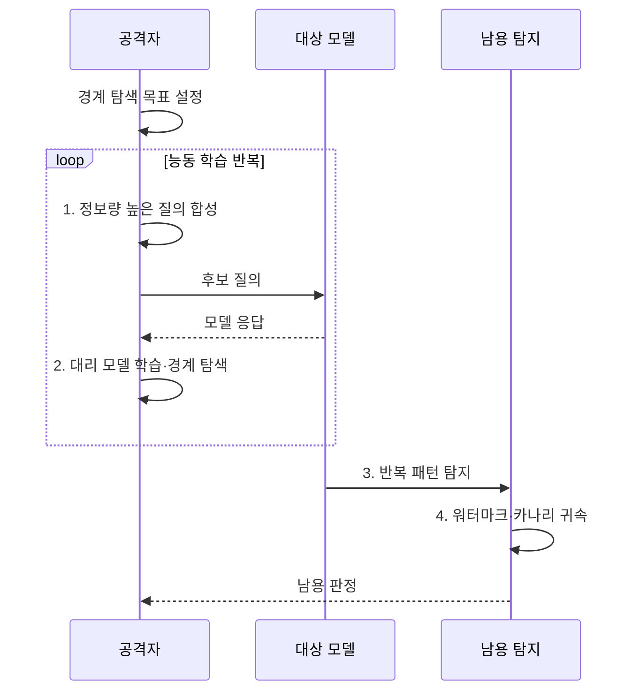

---
sidebar:
  order: 83
  label: "083. 모델 추출 공격 (Model Extraction Attack)"
  badge:
    text: "기출 · 70%"
    variant: note
title: "모델 추출 공격 (Model Extraction Attack)"
date: "2026-08-02T12:44:00+09:00"
tags:
  - "notes-security"
weight: 83
extra:
  question_no: "083"
  source_status: "기출"
  source_history: "137회, 138회"
  priority: 70
  priority_note: "137·138회 반복된 모델 지식재산 공격임"
---

## Ⅰ. 개요

핵심 용어

- **모델 추출 공격**: 대상 모델 API의 입출력을 반복 수집하여 기능이나 판단 경계를 모방하는 대리 모델을 만드는 공격이다.
- **대상·대리 모델**: 대상 모델은 복제하려는 원본이고 대리 모델은 수집한 응답으로 원본과 비슷한 판단을 하도록 학습한 모델이다.

- 정의/개념: **모델 추출 공격**은 반복 질의로 원본 모델의 기능과 판단 경계를 복제하는 공격
- 배경/필요성: 상세 출력 API의 **지식재산 노출**

#### 한줄 요약

- 경쟁 모델에 영리하게 고른 문제를 많이 내고 답을 모아 원본과 비슷하게 판단하는 모방 모델을 학습한다.

## Ⅱ. 특징

핵심 용어

- **결정 경계·능동 질의**: 예측 결과를 나누는 경계 주변에서 정보량이 큰 입력을 선택해 적은 호출로 판단 규칙을 좁히는 방식이다.
- **워터마크·행위 분석**: 모델에 소유 식별 신호를 넣고 계정·입력 분포·호출 패턴에서 비정상 복제 시도를 찾는 통제이다.

- 능동 질의의 **결정 경계 탐색**
- 상세 출력의 **복제 효율 증가**
- 행위 분석·워터마크의 **탐지·귀속**

#### 한줄 요약

- 라벨만 제공할 때보다 확률·임베딩·설명까지 제공할 때 적은 질의로 원본 모델의 판단 규칙을 더 정확히 복제할 수 있다.

## Ⅲ. 구조 및 구성요소

핵심 용어

- **질의 생성기·대리 학습기**: 경계를 잘 드러내는 입력을 합성하고 대상의 응답으로 모방 모델의 판단 규칙을 갱신한다.
- **충실도**: 대리 모델과 대상 모델이 같은 입력에 동일하게 판단하는 정도이다.

| 구성요소 | 책임 |
|:---|:---|
| 대상 모델 API | **라벨·점수·임베딩** 제공 |
| 질의·응답 경계 | **신원·목적·한도·출력** 통제 |
| 질의 생성기 | **결정 경계 탐색 입력** 생성 |
| 대리 모델 학습기 | 입출력으로 **판단 규칙 근사** |
| 남용 탐지·귀속 | **비정상 질의·복제 증거** 분석 |

#### 한줄 요약

- 공격자는 정보량이 큰 입력을 골라 응답을 축적하고 대리 모델을 학습하며 방어자는 API 경계에서 이 반복 패턴을 탐지한다.

## Ⅳ. 흐름도

핵심 용어

- **불일치 경계 탐색**: 대리 모델과 대상 모델의 답이 다른 구간을 다시 질의하여 복제 효율을 높이는 능동 학습 과정이다.
- **카나리 입력**: 복제 모델이나 남용 계정이 특별한 반응을 보이도록 설계하여 소유권과 공격 경로를 탐지하는 시험 입력이다.

**동작 원리**

1. **정보량 높은 질의 합성**: 불확실 경계 입력 선택
2. **대리 모델 학습·경계 탐색**: 입출력 쌍으로 판단 규칙을 근사하고 불일치 경계 확인
3. **반복 패턴 탐지**: 계정·입력 분포·호출률 분석
4. **워터마크·카나리 귀속**: 복제 반응과 소유 증거 대조

#### 한줄 요약

- 대리 모델이 원본과 다르게 답한 구간을 다시 질의하면 적은 호출로도 결정 경계를 효율적으로 좁힐 수 있다.

## Ⅴ. 종류 및 비교

핵심 용어

- **라벨·점수·상세 출력 추출**: 최종 결과보다 확률·임베딩·설명처럼 풍부한 출력을 제공할수록 적은 질의로 높은 충실도를 얻을 수 있다.

| 모델 추출 유형 | 라벨 기반 | 점수 기반 | 상세 출력 기반 |
|:---|:---|:---|:---|
| 적용 기준 | **최소 출력 서비스** | **확률 제공 서비스** | **임베딩·설명 API** |
| 핵심 특징 | **최종 결과 수집** | **확률·신뢰도 수집** | **표현·설명 수집** |
| 한계 | **많은 질의 필요** | **신뢰도 출력 접근 필요** | **임베딩·설명 접근 필요** |

#### 한줄 요약

- 출력 정보가 풍부할수록 정상 사용에는 편리하지만 공격자의 모방 학습 비용도 낮아진다.

## Ⅵ. 실무 고려사항 및 대책

핵심 용어

- **NIST AI 100-2e2025**: 모델 추출을 모델 프라이버시 공격으로 분류하고 공격 지식과 질의 접근 수준을 체계화한다.
- **호출률·분포 분석·워터마크**: 대량 경계 탐색의 비용을 높이고 비정상 입력 분포를 탐지하며 복제 결과의 소유권을 입증하는 통제이다.

| 문제 | 대책 | 효과 |
|:---|:---|:---|
| **추출 공격 분류 누락** | **NIST AI 100-2e2025 적용** | **지식·접근별 시험 체계화** |
| **대량 경계 탐색** | **호출률 제한·분포 행위 분석** | **능동 질의 비용 증가** |
| **복제 입증·귀속** | **워터마크·카나리 입력 검증** | **소유권 증거·남용 탐지** |

#### 한줄 요약

- 고가 모델 API는 사용자별 호출률뿐 아니라 불확실 경계를 훑는 입력 분포를 탐지하고 카나리 반응으로 복제 모델을 식별한다.

## Ⅶ. 결론

핵심 용어

- **복제 비용·귀속**: 정상 사용에 필요한 출력은 유지하되 자동화 경계 탐색의 비용을 높이고 모델 복제 사실을 증명할 신호를 남기는 방어 목표이다.

- 출력 정보량·경계 질의가 높으면 **출력 최소화·호출률 제한** 적용

#### 한줄 요약

- 모델 추출 방어는 정상 사용에 필요한 출력은 유지하면서 자동화된 경계 탐색의 비용을 높이고 복제 증거를 남기는 것이다.
