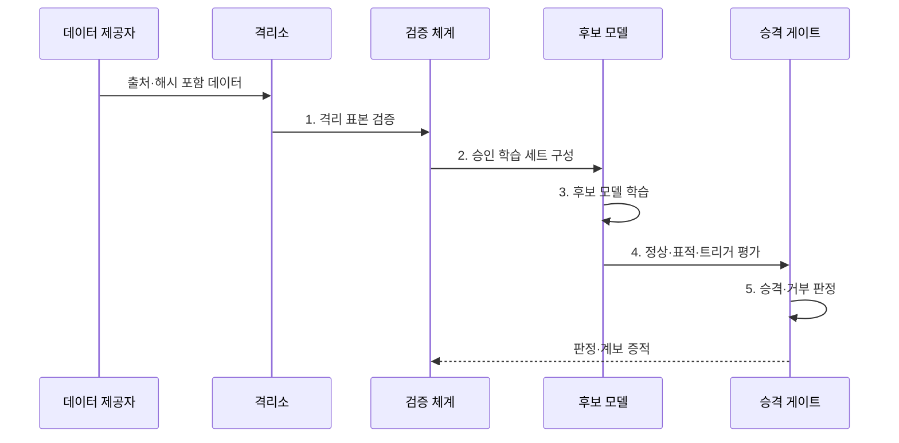

---
sidebar:
  order: 84
  label: "084. 데이터 오염 (Data Poisoning)"
  badge:
    text: "기출 · 85%"
    variant: note
title: "데이터 오염 (Data Poisoning)"
date: "2026-07-31T11:19:21+09:00"
tags:
  - "notes-security"
weight: 84
extra:
  question_no: "084"
  source_status: "기출"
  source_history: "135회, 137회, 138회"
  priority: 85
  priority_note: "135·137·138회 반복된 AI 학습 공격임"
---

## 미리 알고가기

- **데이터 오염(Data Poisoning)**: 학습 데이터·라벨을 조작해 모델의 판단 규칙을 바꾸는 공격이다.
- **학습 데이터(Training Data)**: 모델이 패턴과 매개변수를 배우는 데 사용하는 표본이다.
- **라벨(Label)**: 지도 학습에서 각 표본의 정답으로 지정한 값이다.
- **가용성 오염(Availability Poisoning)**: 모델의 전체 성능을 떨어뜨리는 오염이다.
- **표적 오염(Targeted Poisoning)**: 특정 입력·사용자·분류에서만 오판하도록 만드는 오염이다.
- **백도어 오염(Backdoor Poisoning)**: 특정 트리거에서만 공격자가 정한 결과를 내도록 만드는 오염이다.
- **트리거(Trigger)**: 백도어 행동을 활성화하는 특정 무늬·문구·특징이다.
- **데이터 계보(Data Lineage)**: 데이터의 출처·변경·버전과 모델의 관계를 추적하는 정보이다.
- **격리소(Quarantine)**: 검증되지 않은 데이터를 승인 데이터와 분리해 보관하는 영역이다.
- **기준 평가 세트(Golden Evaluation Set)**: 정상 성능과 공격 행동을 비교하는 신뢰된 시험 자료이다.
- **피드백 재학습(Feedback Retraining)**: 운영 중 수집한 입력·평가·결과를 다시 학습에 반영하는 과정이다.
- **데이터 드리프트(Data Drift)**: 운영 데이터 분포가 학습 당시와 달라지는 현상이다.
- **승격(Promotion)**: 검증된 데이터나 모델을 다음 학습·배포 단계로 이동시키는 절차이다.
- **NIST AI 100-2e2025**: 예측형·생성형 AI의 데이터 오염 공격과 대응을 분류한 공식 보고서이다.
- **NIST AI 100-1 AI RMF 1.0**: AI 위험을 Govern·Map·Measure·Manage 기능으로 관리하는 공식 프레임워크이다.

> **키워드:** 데이터 오염 (Data Poisoning)

## Ⅰ. 개요

- 정의/개념: 학습 표본 조작에 의한 **모델 규칙 변조**
- 배경/필요성: 대규모 외부 데이터의 **출처·라벨 검증 곤란**

### 쉽게 이해하기 (학습용)

- 학습 교재에 일부러 틀린 정답이나 특정 표식을 섞어 모델이 전체적으로 약해지거나 특정 상황에서만 오답을 내게 한다.

## Ⅱ. 특징

- 학습 전 주입의 **배포 후 잠복**
- 소량 표본의 **표적 행동 유도**
- 계보·기준 평가의 **영향 추적·복구**

### 쉽게 이해하기 (학습용)

- 평균 정확도가 정상이어도 특정 사용자나 표식에서만 공격 행동이 나타날 수 있어 전체 지표만으로는 오염을 찾기 어렵다.

## Ⅲ. 구조 및 구성요소

| 구성요소 | 책임 |
|:---|:---|
| 출처 등록부 | **제공자·경로·해시·책임** 기록 |
| 수집 격리소 | **미검증 데이터·정본** 분리 |
| 품질·라벨 검증 | **이상치·중복·분포·정답** 점검 |
| 버전 학습 세트 | **승인 표본 불변 버전** 관리 |
| 계보·기준 평가 | **데이터·모델 관계·공격** 측정 |

### 쉽게 이해하기 (학습용)

- 새 데이터는 바로 학습에 넣지 않고 격리하여 출처·라벨·분포를 확인한 뒤 승인 버전만 후보 모델에 사용한다.

## Ⅳ. 흐름도

**동작 원리**

1. **격리 표본 검증**: 출처·품질·라벨·분포 검사
2. **승인 학습 세트 구성**: 통과 표본만 불변 버전에 반영
3. **후보 모델 학습**: 승인 버전으로 모델 생성
4. **정상·표적·트리거 평가**: 후보 모델 공격 영향 측정
5. **승격·거부 판정**: 기준 통과 여부와 복구 계보 기록

### 쉽게 이해하기 (학습용)

- 후보 모델이 기준 평가를 통과해야 배포하며 이상이 발견되면 계보로 원인 표본과 영향을 받은 모델을 찾아 재학습한다.

## Ⅴ. 종류 및 비교

| 데이터 오염 유형 | 가용성 오염 | 표적 오염 | 백도어 오염 |
|:---|:---|:---|:---|
| 적용 기준 | **전체 성능 검사** | **대상별 오류 분석** | **트리거 성공률 검사** |
| 핵심 특징 | **전체 성능 저하** | **특정 대상 오판** | **트리거 목표 행동** |
| 한계 | **서비스 품질 붕괴** | 평균 지표에 **오류 은닉** | 정상 정확도로 **탐지 회피** |

### 쉽게 이해하기 (학습용)

- 가용성형은 전반을 망치고 표적형은 특정 대상을 노리며 백도어형은 비밀 표식이 있을 때만 공격 행동을 켠다.

## Ⅵ. 실무 고려사항 및 대책

| 고려사항 | 대책 | 효과 |
|:---|:---|:---|
| **오염 공격 분류 누락** | **NIST AI 100-2e2025 적용** | **목표·역량별 시험 체계화** |
| **외부·피드백 데이터 오염** | **출처·해시·격리·승인 게이트** | **미검증 표본 학습 차단** |
| **잠복 표적 행동** | **기준 세트·트리거 변형 평가** | **평균 지표 밖 공격 탐지** |
| **데이터 드리프트·공격 혼동** | **AI RMF 기반 원인·영향 측정** | **정상 변화의 오탐 방지** |

### 쉽게 이해하기 (학습용)

- 사용자 피드백을 재학습할 때 제공자와 변경 이력을 남기고 격리 검사를 통과한 표본만 승인 버전에 넣어야 한다.

## Ⅶ. 결론

- 계보 확인과 표적·트리거 평가를 통과한 **모델만 승격**, 실패 시 **격리·복구**

### 쉽게 이해하기 (학습용)

- 데이터 오염 방어의 성패는 대량 데이터의 출처와 변경을 추적하고 특정 표적 행동까지 시험하며 영향 모델을 신속히 복구하는 데 달려 있다.
