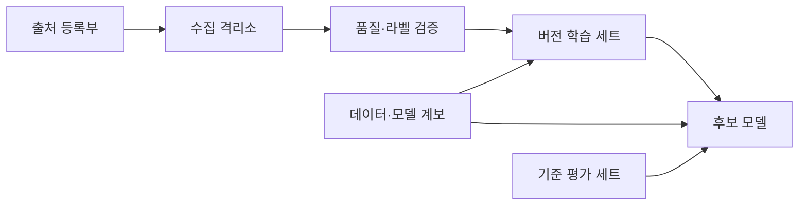
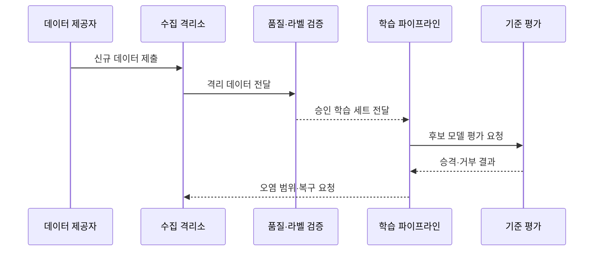

---
sidebar:
  order: 84
  label: "084. 데이터 오염 공격 (Data Poisoning)"
  badge:
    text: "기출 · 50%"
    variant: note
title: "데이터 오염 공격 (Data Poisoning)"
date: "2026-07-27T23:59:59+09:00"
tags:
  - "notes-security"
weight: 84
extra:
  question_no: "084"
  source_status: "기출"
  source_history: "137회"
  priority: 50
  priority_note: "137회 기출이며 데이터 공급망·학습검증과 연결됨"
---

## 미리 알고가기

- **데이터 오염(Data Poisoning, 데이터 포이즈닝)**: 독을 탄다는 비유로, 학습 데이터·라벨을 조작해 모델의 판단 규칙을 바꾸는 공격
- **학습 데이터(Training Data)**: 모델이 패턴과 매개변수를 배우는 데 사용하는 표본
- **라벨(Label)**: 지도 학습에서 각 표본의 정답으로 지정한 값
- **가용성 오염(Availability Poisoning)**: 모델의 전체 성능을 떨어뜨려 사용하기 어렵게 만드는 오염
- **표적 오염(Targeted Poisoning)**: 특정 입력·사용자·분류에서만 오판하도록 만드는 오염
- **백도어 오염(Backdoor Poisoning)**: 특정 트리거가 있을 때만 공격자가 정한 결과를 내도록 학습시키는 오염
- **트리거(Trigger)**: 백도어 행동을 활성화하는 특정 무늬·문구·특징
- **데이터 계보(Data Lineage)**: 데이터의 출처·변경·버전과 모델 산출물의 관계를 추적하는 정보
- **격리소(Quarantine)**: 검증되지 않은 데이터를 승인 데이터와 분리해 보관하는 영역
- **기준 평가 세트(Golden Evaluation Set)**: 변경 영향과 정상 성능을 비교하기 위해 신뢰할 수 있게 관리한 시험 데이터
- **피드백 재학습(Feedback Retraining)**: 운영 중 수집한 사용자 입력·평가·결과를 다시 학습에 반영하는 과정
- **데이터 드리프트(Data Drift)**: 운영 데이터의 분포가 학습 당시와 달라지는 현상
- **이상치(Outlier)**: 일반적인 분포나 패턴에서 크게 벗어난 데이터
- **승격(Promotion)**: 검증된 데이터나 모델을 다음 학습·배포 단계로 이동시키는 절차
- **데이터 계보(Data Lineage, 데이터 리니지)**: 혈통·계보를 뜻하는 이름으로, 오염 표본의 출처·변경과 영향 모델을 역추적
- **기준 평가 세트(Golden Evaluation Set, 골든 이밸류에이션 세트)**: 신뢰 기준을 뜻하는 `Golden`을 사용하며, 정상 성능과 공격 행동을 비교하는 정본 시험 자료

## Ⅰ. 개요

- 정의/개념: 학습 입력 조작으로 모델 판단을 왜곡하는 공격이다
- 기존 한계: 검증 없는 데이터 수집·재학습은 오염을 내재화
- **배경/필요성**: 데이터 공급망 검증과 영향 모델 복구

### 쉽게 이해하기 (학습용)

- 모델이 배우는 교재의 문제나 정답을 바꿔 정상 입력을 틀리게 판단하거나 특정 표시에서만 공격자가 원하는 답을 내게 한다.

## Ⅱ. 특징

- 오염 효과는 모델 가중치에 학습돼 재배포 후에도 지속된다
- 가용성·표적·백도어 오염은 서로 다른 오류 범위를 만든다
- 데이터 계보·격리·승인 절차가 오염 범위와 복구 대상을 식별한다

### 쉽게 이해하기 (학습용)

- 입력 필터로 악성 요청을 막아도 이미 오염된 교재로 학습한 모델은 잘못된 판단 규칙을 계속 갖고 있으므로 깨끗한 데이터로 다시 학습해야 한다.

## Ⅲ. 아키텍처 및 구성요소

| 설계 요소 | 설명 |
|:---|:---|
| 출처 등록부 | 제공자·경로·해시·책임 기록 |
| 수집 격리소 | 미검증 데이터와 정본 분리 |
| 품질·라벨 검증 | 이상치·중복·분포·정답 점검 |
| 버전 학습 세트 | 승인 표본을 불변 버전으로 관리 |
| 후보 모델 | 배포 전 별도 학습·검증 |
| 데이터·모델 계보 | 데이터 버전과 모델 관계 추적 |
| 기준 평가 세트 | 정상 성능과 공격 행동 비교 |

> 요약: 데이터를 격리·검증하고 모델까지 계보로 추적한다

### 쉽게 이해하기 (학습용)

- 새 데이터는 바로 학습에 넣지 않고 출처를 기록해 격리·검증하며 어떤 데이터 버전이 어떤 모델을 만들었는지 연결한다.

## Ⅳ. 원리 및 절차 흐름도

| 절차 | 설명 |
|:---|:---|
| 신규 데이터 제출 | 출처·버전·해시와 함께 수집 |
| 격리 데이터 전달 | 정본과 분리해 검사 대상으로 이동 |
| 승인 학습 세트 전달 | 품질·라벨·분포 통과 표본만 승격 |
| 후보 모델 평가 요청 | 별도 후보를 학습해 영향 측정 |
| 승격·거부 결과 | 정상·표적·트리거 성능을 판정 |
| 오염 범위·복구 요청 | 계보로 표본·모델을 찾아 재학습 |

> 요약: 새 데이터를 격리해 검증한 뒤 후보만 학습한다.

### 쉽게 이해하기 (학습용)

- 새 교재를 기존 교재와 섞기 전에 검사하고 후보 모델에서 정상 문제와 공격 트리거를 시험해 통과한 경우에만 운영 모델로 올린다.

## Ⅴ. 종류 및 비교

| 판단 기준 | 가용성 오염 | 표적 오염 | 백도어 오염 |
|:---|:---|:---|:---|
| 적용 기준 | 분포·전체 성능 검사 | 대상별 오류 분석 | 트리거 공격 성공률 검사 |
| 핵심 특징 | 전체 성능 저하 | 특정 대상만 오판 | 트리거에서 지정 행동 |
| 한계 | 서비스 품질 붕괴 | 평균 지표에 오류 은닉 | 정상 정확도로 탐지 회피 |

> 요약: 전체·표적·트리거 오판을 서로 다른 시험으로 찾는다

### 쉽게 이해하기 (학습용)

- 가용성형은 모델 전체를 망치고 표적형은 정한 대상만 틀리게 하며 백도어형은 숨은 신호가 있을 때만 공격 행동을 꺼낸다.

## Ⅵ. 실무 사례

1. 사용자 피드백을 승인 큐에서 검토한다
2. 외부 데이터의 출처·해시·계보를 기록한다
3. 기준 세트에 표적·트리거 시험을 포함한다
4. 오염 발견 시 영향 모델을 폐기·재학습한다

### 쉽게 이해하기 (학습용)

- 사례 1은 공격자가 반복 신고나 평가를 보내 자동 재학습 교재를 원하는 방향으로 바꾸지 못하게 한다.
- 사례 2는 문제가 생긴 표본이 어느 제공자와 버전에서 왔고 어떤 모델에 들어갔는지 빠르게 찾게 한다.
- 사례 3은 평균 정확도가 정상인 백도어 모델도 특정 표시와 대상에서 공격 행동을 하는지 확인한다.
- 사례 4는 입력 데이터만 지우고 이미 오염된 가중치를 계속 배포하지 않고 깨끗한 버전으로 모델을 다시 만든다.

## Ⅶ. 결론

- 재학습 데이터면 격리·계보·후보 평가를 적용한다.

### 쉽게 이해하기 (학습용)

- 데이터 오염 방어의 핵심은 나쁜 표본을 찾는 데서 끝나지 않고 그 표본이 만든 모든 모델을 계보로 찾아 깨끗한 데이터로 복구하는 것이다.
