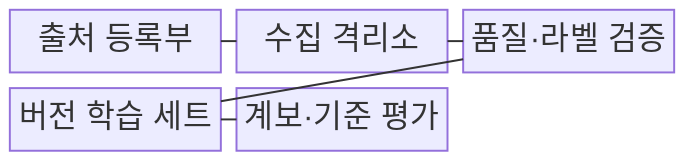
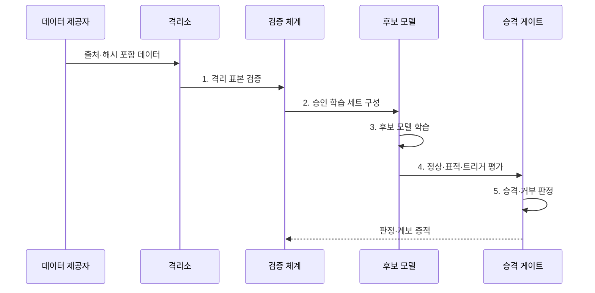

---
sidebar:
  order: 84
  label: "084. 데이터 오염 (Data Poisoning)"
  badge:
    text: "기출 · 85%"
    variant: note
title: "데이터 오염 (Data Poisoning)"
date: "2026-08-02T12:46:00+09:00"
tags:
  - "notes-security"
weight: 84
extra:
  question_no: "084"
  source_status: "기출"
  source_history: "135회, 137회, 138회"
  priority: 85
  priority_note: "135·137·138회 반복된 AI 학습 공격임"
---

## Ⅰ. 개요

핵심 용어

- **데이터 오염**: 학습 표본이나 라벨을 조작하여 모델의 전체 성능 또는 특정 조건의 판단 규칙을 바꾸는 공격이다.
- **학습 데이터·라벨**: 모델이 패턴을 배우는 표본과 지도 학습에서 각 표본의 정답으로 지정한 값이다.

- 정의/개념: 학습 표본 조작에 의한 **모델 규칙 변조**
- 배경/필요성: 대규모 외부 데이터의 **출처·라벨 검증 곤란**

#### 한줄 요약

- 학습 교재에 일부러 틀린 정답이나 특정 표식을 섞어 모델이 전체적으로 약해지거나 특정 상황에서만 오답을 내게 한다.

## Ⅱ. 특징

핵심 용어

- **표적·백도어 오염**: 특정 대상에서 오판하게 하거나 비밀 트리거가 있을 때만 공격자가 정한 행동을 내도록 만드는 잠복 공격이다.
- **데이터 계보·기준 평가**: 표본의 출처·변경·버전과 영향 모델을 추적하고 신뢰된 시험 자료로 정상·공격 행동을 비교한다.

- 학습 전 주입의 **배포 후 잠복**
- 소량 표본의 **표적 행동 유도**
- 계보·기준 평가의 **영향 추적·복구**

#### 한줄 요약

- 평균 정확도가 정상이어도 특정 사용자나 표식에서만 공격 행동이 나타날 수 있어 전체 지표만으로는 오염을 찾기 어렵다.

## Ⅲ. 구조 및 구성요소

핵심 용어

- **수집 격리소**: 검증되지 않은 외부·피드백 데이터를 승인된 정본과 분리하여 출처·품질·라벨을 검사하는 영역이다.
- **불변 학습 버전**: 검증을 통과한 표본만 반영하고 변경 이력을 고정하여 영향 모델과 원인 데이터를 재현할 수 있게 한 학습 세트이다.

| 구성요소 | 책임 |
|:---|:---|
| 출처 등록부 | **제공자·경로·해시·책임** 기록 |
| 수집 격리소 | **미검증 데이터·정본** 분리 |
| 품질·라벨 검증 | **이상치·중복·분포·정답** 점검 |
| 버전 학습 세트 | **승인 표본 불변 버전** 관리 |
| 계보·기준 평가 | **데이터·모델 관계·공격** 측정 |

#### 한줄 요약

- 새 데이터는 바로 학습에 넣지 않고 격리하여 출처·라벨·분포를 확인한 뒤 승인 버전만 후보 모델에 사용한다.

## Ⅳ. 흐름도

핵심 용어

- **정상·표적·트리거 평가**: 평균 성능뿐 아니라 특정 대상 오판과 변형 트리거의 공격 성공률까지 측정하는 시험이다.
- **승격 게이트**: 출처·품질·공격 평가 기준을 통과한 데이터와 모델만 다음 학습 또는 배포 단계로 이동시키는 통제이다.

**동작 원리**

1. **격리 표본 검증**: 출처·품질·라벨·분포 검사
2. **승인 학습 세트 구성**: 통과 표본만 불변 버전에 반영
3. **후보 모델 학습**: 승인 버전으로 모델 생성
4. **정상·표적·트리거 평가**: 후보 모델 공격 영향 측정
5. **승격·거부 판정**: 기준 통과 여부와 복구 계보 기록

#### 한줄 요약

- 후보 모델이 기준 평가를 통과해야 배포하며 이상이 발견되면 계보로 원인 표본과 영향을 받은 모델을 찾아 재학습한다.

## Ⅴ. 종류 및 비교

핵심 용어

- **가용성·표적·백도어 오염**: 전체 성능 저하, 특정 대상 오판, 트리거 조건의 목표 행동을 각각 유도하는 공격 유형이다.

| 데이터 오염 유형 | 가용성 오염 | 표적 오염 | 백도어 오염 |
|:---|:---|:---|:---|
| 적용 기준 | **전체 성능 검사** | **대상별 오류 분석** | **트리거 성공률 검사** |
| 핵심 특징 | **전체 성능 저하** | **특정 대상 오판** | **트리거 목표 행동** |
| 한계 | **서비스 품질 붕괴** | 평균 지표에 **오류 은닉** | 정상 정확도로 **탐지 회피** |

#### 한줄 요약

- 가용성형은 전반을 망치고 표적형은 특정 대상을 노리며 백도어형은 비밀 표식이 있을 때만 공격 행동을 켠다.

## Ⅵ. 실무 고려사항 및 대책

핵심 용어

- **NIST AI 100-2e2025·AI RMF**: 오염 공격을 목표·역량별로 분류하고 데이터 드리프트와 공격 원인·영향을 체계적으로 측정하게 한다.
- **피드백 재학습·데이터 드리프트**: 운영 입력을 다시 학습할 때 오염 가능성을 통제하고 정상적인 분포 변화와 공격을 구분해야 한다.

| 문제 | 대책 | 효과 |
|:---|:---|:---|
| **오염 공격 분류 누락** | **NIST AI 100-2e2025 적용** | **목표·역량별 시험 체계화** |
| **외부·피드백 데이터 오염** | **출처·해시·격리·승인 게이트** | **미검증 표본 학습 차단** |
| **잠복 표적 행동** | **기준 세트·트리거 변형 평가** | **평균 지표 밖 공격 탐지** |
| **데이터 드리프트·공격 혼동** | **AI RMF 기반 원인·영향 측정** | **정상 변화의 오탐 방지** |

#### 한줄 요약

- 사용자 피드백을 재학습할 때 제공자와 변경 이력을 남기고 격리 검사를 통과한 표본만 승인 버전에 넣어야 한다.

## Ⅶ. 결론

핵심 용어

- **오염 복구 가능성**: 이상 발견 시 계보를 통해 원인 표본과 영향 모델을 찾아 격리하고 승인 버전으로 재학습·복원할 수 있는 능력이다.

- 계보 확인과 표적·트리거 평가를 통과한 **모델만 승격**, 실패 시 **격리·복구**

#### 한줄 요약

- 데이터 오염 방어의 성패는 대량 데이터의 출처와 변경을 추적하고 특정 표적 행동까지 시험하며 영향 모델을 신속히 복구하는 데 달려 있다.
