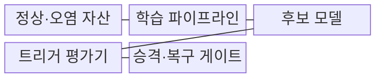
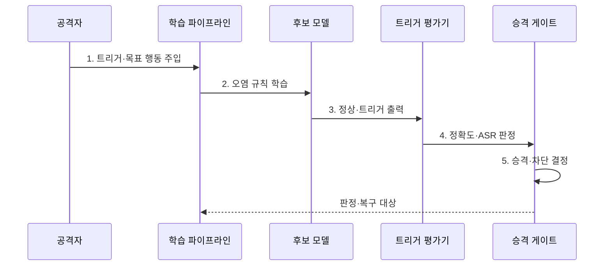

---
sidebar:
  order: 85
  label: "085. 백도어 공격 (Backdoor Attack)"
  badge:
    text: "기출 · 70%"
    variant: note
title: "백도어 공격 (Backdoor Attack)"
date: "2026-07-31T11:19:21+09:00"
tags:
  - "notes-security"
weight: 85
extra:
  question_no: "085"
  source_status: "기출"
  source_history: "137회, 138회"
  priority: 70
  priority_note: "137·138회 반복된 트리거 기반 AI 공격임"
---

## 미리 알고가기

- **백도어 공격(Backdoor Attack)**: 평소 정상 동작하다 특정 입력 특징에서만 공격자가 정한 행동을 출력하도록 모델을 변조하는 공격이다.
- **트리거(Trigger)**: 백도어의 목표 행동을 활성화하는 입력 특징이다.
- **파인튜닝(Fine-Tuning)**: 기존 모델을 특정 데이터와 업무에 맞게 추가 학습하는 과정이다.
- **공격 성공률(Attack Success Rate, ASR)**: 트리거 입력이 공격자의 목표 행동을 일으킨 비율이다.
- **오염 표본(Poisoned Sample)**: 공격자가 원하는 트리거와 목표 출력을 함께 넣은 학습 표본이다.
- **내부 활성(Internal Activation)**: 입력 처리 시 모델 내부 층의 뉴런·특징 반응값이다.
- **클린 라벨 백도어(Clean-Label Backdoor)**: 겉보기 라벨은 정상인 표본에 트리거를 심는 공격이다.
- **모델 오염(Model Poisoning)**: 데이터가 아니라 가중치나 업데이트를 직접 조작하는 공격이다.
- **트리거 반전(Trigger Inversion)**: 모델 반응을 분석해 숨은 트리거 후보를 역으로 찾는 기법이다.
- **기준 평가 세트(Golden Evaluation Set)**: 정상 성능과 공격 행동을 비교하는 신뢰된 시험 자료이다.
- **NIST AI 100-2e2025**: 특정 백도어 패턴에 공격자 선택 행동을 일으키는 백도어 오염 공격을 정의한다.
- **NIST AI 100-1 AI RMF 1.0**: AI 위험을 Govern·Map·Measure·Manage 기능으로 관리하는 공식 프레임워크이다.

## Ⅰ. 개요

- 정의/개념: 특정 트리거에서만 **목표 행동을 활성화하는 공격**
- 배경/필요성: 정상 정확도 평가의 **조건부 행동 탐지 실패**

### 쉽게 이해하기 (학습용)

- 평소에는 정답을 잘 내지만 특정 스티커·문구·패턴이 들어오면 공격자가 미리 정한 오답이나 행동을 내게 한다.

## Ⅱ. 특징

- 트리거 부재 시 **정상 성능 위장**
- 데이터·가중치 경로의 **조건부 규칙 주입**
- 변형 트리거 시험의 **잠복 행동 탐지**

### 쉽게 이해하기 (학습용)

- 일반 시험 데이터에서는 정상처럼 보여도 공격자가 아는 비밀 표식을 넣으면 숨은 규칙이 활성화되므로 별도 공격 성공률을 측정해야 한다.

## Ⅲ. 구조 및 구성요소

| 구성요소 | 책임 |
|:---|:---|
| 정상·오염 자산 | **트리거·목표 행동 연관** 주입 |
| 학습 파이프라인 | **오염 규칙을 가중치에 반영** |
| 후보 모델 | **정상·트리거 행동** 출력 |
| 트리거 평가기 | **정상 정확도·ASR** 측정 |
| 승격·복구 게이트 | **배포 차단·정상 버전 복원** |

### 쉽게 이해하기 (학습용)

- 학습 데이터나 가중치에 숨은 트리거 규칙이 들어가면 후보 모델을 정상 정확도와 공격 성공률 두 축으로 검사한다.

## Ⅳ. 흐름도

**동작 원리**

1. **트리거·목표 행동 주입**: 표본·가중치에 연관 삽입
2. **오염 규칙 학습**: 조건부 행동을 모델에 반영
3. **정상·트리거 출력**: 기준·변형 입력 결과 생성
4. **정확도·ASR 판정**: 정상성과 공격 성공률 비교
5. **승격·차단 결정**: 계보로 오염 자산·영향 모델 지정

### 쉽게 이해하기 (학습용)

- 정상 정확도가 높더라도 변형한 트리거에서 공격 성공률이 높으면 배포를 막고 원인 데이터나 가중치를 제거한다.

## Ⅴ. 종류 및 비교

| AI 조작 공격 | 백도어 공격 | 일반 데이터 오염 | 적대적 예제 |
|:---|:---|:---|:---|
| 적용 기준 | **트리거 ASR 측정** | **정상 성능·분포 검사** | **입력 교란 강도 측정** |
| 핵심 특징 | **트리거 목표 행동** | **학습 규칙 광범위 왜곡** | 입력 교란을 통한 **결정 경계 통과** |
| 한계 | **정상 평가 통과·잠복** | **성능·공정성 저하** | **입력별 공격 생성 필요** |

### 쉽게 이해하기 (학습용)

- 백도어는 학습 때 숨은 스위치를 심고 일반 오염은 규칙을 넓게 망치며 적대적 예제는 배포 후 입력을 교란한다.

## Ⅵ. 실무 고려사항 및 대책

| 고려사항 | 대책 | 효과 |
|:---|:---|:---|
| **백도어 공격 분류 누락** | **NIST AI 100-2e2025 적용** | **트리거·역량별 시험 체계화** |
| **정상 평가 우회** | **ASR·정확도·변형 트리거 병행** | **잠복 조건부 행동 탐지** |
| **오염 원인·영향** | **데이터·가중치 계보·서명 검증** | **원인 제거·안전 버전 복구** |
| **클린 라벨·모델 오염** | 데이터·가중치 경로별 **별도 시험** | **오염 경로 누락 방지** |
| 알려지지 않은 **트리거** | **반전·내부 활성 분석** | **숨은 트리거 후보 탐지** |

### 쉽게 이해하기 (학습용)

- 자율주행 표지판 모델은 깨끗한 영상 정확도뿐 아니라 스티커의 위치·크기·각도를 바꾼 트리거 공격 성공률도 검사해야 한다.

## Ⅶ. 결론

- 정상 정확도를 통과하고 **ASR 기준 이하인 모델만 승격**, 실패 시 격리·복구

### 쉽게 이해하기 (학습용)

- 백도어 방어의 핵심은 정상 성능에 속지 않고 트리거 변형을 시험하며 오염된 데이터·가중치와 영향 모델을 추적하는 것이다.
