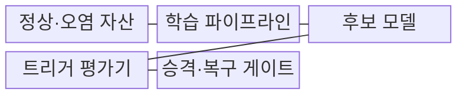
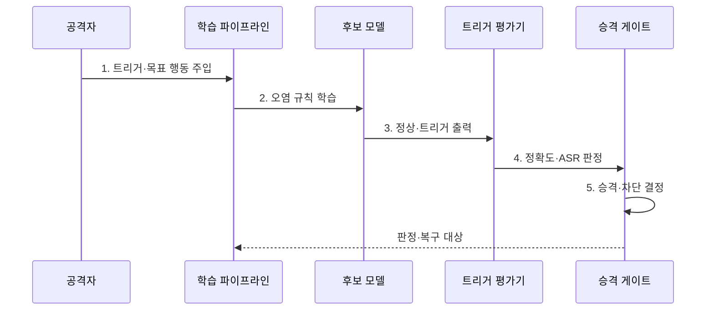

---
sidebar:
  order: 85
  label: "085. 백도어 공격 (Backdoor Attack)"
  badge:
    text: "기출 · 70%"
    variant: note
title: "백도어 공격 (Backdoor Attack)"
date: "2026-08-02T12:48:00+09:00"
tags:
  - "notes-security"
weight: 85
extra:
  question_no: "085"
  source_status: "기출"
  source_history: "137회, 138회"
  priority: 70
  priority_note: "137·138회 반복된 트리거 기반 AI 공격임"
---

## Ⅰ. 개요

핵심 용어

- **백도어 공격**: 평소에는 정상 동작하지만 특정 입력 특징에서만 공격자가 정한 결과를 출력하도록 모델을 변조하는 공격이다.
- **트리거**: 스티커·문구·무늬처럼 백도어의 목표 행동을 활성화하는 입력 특징이다.

- 정의/개념: 특정 트리거에서만 **목표 행동을 활성화하는 공격**
- 배경/필요성: 정상 입력 중심의 정확도 평가만으로는 **트리거 기반 조건부 행동을 탐지하기 어려움**

#### 한줄 요약

- 평소에는 정답을 잘 내지만 특정 스티커·문구·패턴이 들어오면 공격자가 미리 정한 오답이나 행동을 내게 한다.

## Ⅱ. 특징

핵심 용어

- **오염 표본·모델 오염**: 트리거와 목표 출력을 학습 데이터에 넣거나 모델 가중치·업데이트를 직접 조작해 조건부 규칙을 심는 경로이다.
- **ASR**: 트리거가 포함된 입력이 공격자의 목표 행동을 실제로 일으킨 비율이다.

- 트리거 부재 시 **정상 성능 위장**
- 데이터·가중치 경로의 **조건부 규칙 주입**
- 변형 트리거 시험의 **잠복 행동 탐지**

#### 한줄 요약

- 일반 시험 데이터에서는 정상처럼 보여도 공격자가 아는 비밀 표식을 넣으면 숨은 규칙이 활성화되므로 별도 공격 성공률을 측정해야 한다.

## Ⅲ. 구조 및 구성요소

핵심 용어

- **트리거 평가기**: 정상 정확도와 다양한 트리거 입력의 공격 성공률을 함께 측정해 잠복 조건부 행동을 찾는 기능이다.
- **승격·복구 게이트**: 평가 기준을 통과한 모델만 배포하고 실패하면 오염 자산을 격리해 안전 버전으로 복원하는 통제이다.

| 구성요소 | 책임 |
|:---|:---|
| 정상·오염 자산 | **트리거·목표 행동 연관** 주입 |
| 학습 파이프라인 | **오염 규칙을 가중치에 반영** |
| 후보 모델 | **정상·트리거 행동** 출력 |
| 트리거 평가기 | **정상 정확도·ASR** 측정 |
| 승격·복구 게이트 | **배포 차단·정상 버전 복원** |

#### 한줄 요약

- 학습 데이터나 가중치에 숨은 트리거 규칙이 들어가면 후보 모델을 정상 정확도와 공격 성공률 두 축으로 검사한다.

## Ⅳ. 흐름도

핵심 용어

- **트리거·목표 행동 연관**: 특정 특징이 입력될 때 공격자가 정한 결과를 내도록 학습 표본이나 가중치에 결합한 숨은 규칙이다.
- **정확도·ASR 판정**: 일반 입력 성능이 정상이어도 변형 트리거의 공격 성공률이 기준을 넘으면 배포를 차단하는 평가이다.

**동작 원리**

1. **트리거·목표 행동 주입**: 표본·가중치에 연관 삽입
2. **오염 규칙 학습**: 조건부 행동을 모델에 반영
3. **정상·트리거 출력**: 기준·변형 입력 결과 생성
4. **정확도·ASR 판정**: 정상성과 공격 성공률 비교
5. **승격·차단 결정**: 계보로 오염 자산·영향 모델 지정

#### 한줄 요약

- 정상 정확도가 높더라도 변형한 트리거에서 공격 성공률이 높으면 배포를 막고 원인 데이터나 가중치를 제거한다.

## Ⅴ. 종류 및 비교

핵심 용어

- **백도어·일반 오염·적대적 예제**: 백도어는 학습 때 조건부 스위치를 심고 일반 오염은 규칙을 넓게 왜곡하며 적대적 예제는 추론 입력을 교란한다.

| AI 조작 공격 | 백도어 공격 | 일반 데이터 오염 | 적대적 예제 |
|:---|:---|:---|:---|
| 적용 기준 | **트리거 ASR 측정** | **정상 성능·분포 검사** | **입력 교란 강도 측정** |
| 핵심 특징 | **트리거 목표 행동** | **학습 규칙 광범위 왜곡** | 입력 교란을 통한 **결정 경계 통과** |
| 한계 | **정상 평가 통과·잠복** | **성능·공정성 저하** | **입력별 공격 생성 필요** |

#### 한줄 요약

- 백도어는 학습 때 숨은 스위치를 심고 일반 오염은 규칙을 넓게 망치며 적대적 예제는 배포 후 입력을 교란한다.

## Ⅵ. 실무 고려사항 및 대책

핵심 용어

- **NIST AI 100-2e2025**: 특정 백도어 패턴에서 공격자 선택 행동을 일으키는 오염 공격과 공격자 역량을 정의한다.
- **클린 라벨·트리거 반전**: 겉보기 라벨이 정상인 오염까지 검사하고 모델 반응·내부 활성을 분석해 알려지지 않은 트리거 후보를 역으로 찾는다.

| 문제 | 대책 | 효과 |
|:---|:---|:---|
| **백도어 공격 분류 누락** | **NIST AI 100-2e2025 적용** | **트리거·역량별 시험 체계화** |
| **정상 평가 우회** | **ASR·정확도·변형 트리거 병행** | **잠복 조건부 행동 탐지** |
| **오염 원인·영향** | **데이터·가중치 계보·서명 검증** | **원인 제거·안전 버전 복구** |
| **클린 라벨·모델 오염** | 데이터·가중치 경로별 **별도 시험** | **오염 경로 누락 방지** |
| 알려지지 않은 **트리거** | **반전·내부 활성 분석** | **숨은 트리거 후보 탐지** |

#### 한줄 요약

- 자율주행 표지판 모델은 깨끗한 영상 정확도뿐 아니라 스티커의 위치·크기·각도를 바꾼 트리거 공격 성공률도 검사해야 한다.

## Ⅶ. 결론

핵심 용어

- **백도어 승격 기준**: 정상 정확도를 유지하면서 변형 트리거의 ASR이 허용 기준 이하인 모델만 배포하는 원칙이다.

- 정상 정확도를 통과하고 **ASR 기준 이하인 모델만 승격**, 실패 시 격리·복구

#### 한줄 요약

- 백도어 방어의 핵심은 정상 성능에 속지 않고 트리거 변형을 시험하며 오염된 데이터·가중치와 영향 모델을 추적하는 것이다.
