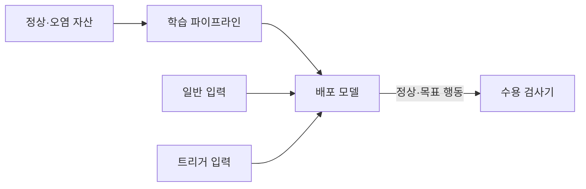
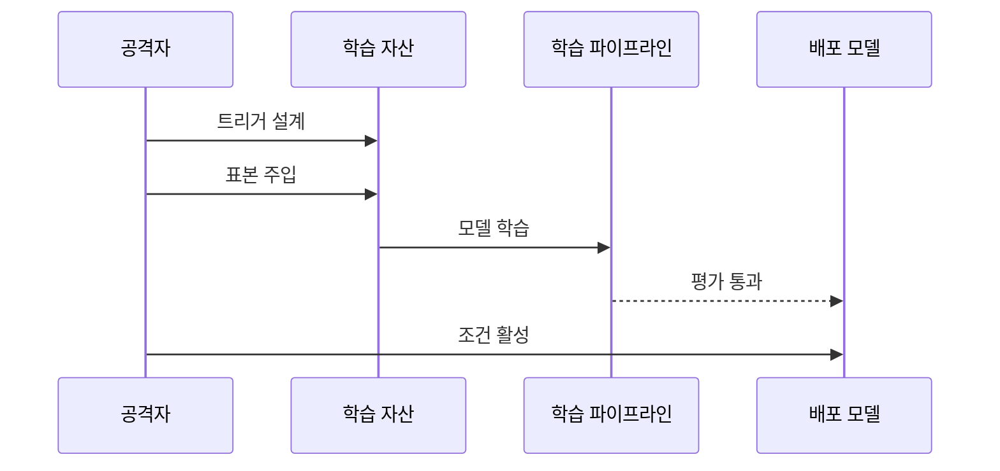

---
sidebar:
  order: 85
  label: "085. 백도어 공격 (Backdoor Attack)"
  badge:
    text: "기출 · 50%"
    variant: note
title: "백도어 공격 (Backdoor Attack)"
date: "2026-07-27T23:59:59+09:00"
tags:
  - "notes-security"
weight: 85
extra:
  question_no: "085"
  source_status: "기출"
  source_history: "137회"
  priority: 50
  priority_note: "137회 기출이나 141 오염 공격의 지속효과 축에 가까움"
---

## 미리 알고가기

- **백도어 공격(Backdoor Attack)**: 평소에는 정상 동작하다 특정 입력 특징에서만 공격자가 정한 행동을 출력하도록 모델을 변조하는 공격
- **트리거(Trigger)**: 백도어의 목표 행동을 활성화하는 입력 특징
- **파인튜닝(Fine-tuning)**: 기존 모델을 특정 데이터와 업무에 맞게 추가 학습하는 과정
- **공격 성공률(Attack Success Rate, ASR, 에이에스알)**: 영문 머리글자를 딴 지표로, 트리거 입력이 목표 행동을 일으킨 비율
- **오염 표본**: 공격자가 원하는 입력 특징과 목표 출력을 학습 데이터에 함께 넣은 표본
- **내부 활성**: 입력을 처리할 때 모델 내부 층에서 나타나는 뉴런·특징의 반응값

## Ⅰ. 개요

- 정의/개념: 트리거에서만 악성 행동을 유도하는 공격이다
- 기존 한계: 정상 정확도 평가는 트리거 조건부 행동 탐지 곤란
- **배경/필요성**: 트리거 변형별 공격 성공률 검증

### 쉽게 이해하기 (학습용)
- 평소에는 정상이나 특정 패턴 입력 시만 오답을 유도하는 공격

## Ⅱ. 특징

- 트리거가 있을 때만 공격자 지정 행동이 활성화된다
- 정상 입력 정확도를 유지해 일반 성능 검사를 통과한다
- 데이터·가중치 공급망 변조로 백도어가 모델에 내재화된다

### 쉽게 이해하기 (학습용)

- 평소 정확도와 별도로 트리거 변형별 공격 성공률을 검사해야 한다.

## Ⅲ. 아키텍처 및 구성요소

| 설계 요소 | 설명 |
|:---|:---|
| 정상·오염 자산 | 트리거와 목표 행동의 연관성 주입 |
| 학습 파이프라인 | 오염 규칙을 모델 가중치에 반영 |
| 배포 모델 | 트리거 입력에서 목표 행동 출력 |
| 수용 검사기 | 정상 정확도와 공격 성공률 측정 |

> 요약: 일반·트리거 입력으로 조건부 행동을 구분한다

### 쉽게 이해하기 (학습용)

- 일반 입력과 트리거 후보를 따로 검사해 평소 성능에 숨은 조건부 행동을 찾는다.

## Ⅳ. 원리 및 절차 흐름도

| 절차 | 설명 |
|:---|:---|
| 트리거 설계 | 입력 패턴과 목표 행동 설정 |
| 표본 주입 | 트리거·출력 간 연관성 삽입 |
| 모델 학습 | 정상·트리거 규칙을 함께 반영 |
| 평가 통과 | 트리거 없는 평가에서 성능 유지 |
| 조건 활성 | 배포 모델에 트리거 입력 |

> 요약: 트리거 표본을 학습해 정상 평가를 우회한다

### 쉽게 이해하기 (학습용)

- 숨은 규칙은 트리거 없는 일반 평가만으로 드러나지 않는다.

## Ⅴ. 종류 및 비교

| 판단 기준 | 백도어 공격 | 일반 데이터 오염 | 적대적 예제 공격 |
|:---|:---|:---|:---|
| 적용 기준 | 공격 성공률 측정 | 정상 성능 비교 | 교란 강도 측정 |
| 핵심 특징 | 트리거에서만 목표 행동 발현 | 학습 분포·라벨을 넓게 왜곡 | 배포 뒤 입력 교란으로 경계 우회 |
| 한계 | 정상 평가 통과·장기 잠복 | 전체 성능·공정성 저하 | 입력마다 공격 생성 필요 |

> 요약: 백도어는 조건, 오염은 분포, 적대 예제는 입력을 노린다

### 쉽게 이해하기 (학습용)

- 백도어는 숨은 조건, 오염은 학습 분포, 적대 예제는 배포 입력을 노린다.

## Ⅵ. 실무 사례

1. 외부 이미지 모델의 **트리거 공격 성공률 평가**

### 쉽게 이해하기 (학습용)

- 외부에서 받은 이미지 모델은 작은 로고의 위치·크기·회전을 바꿔 넣고 특정 클래스로 오분류되는 비율을 측정해 숨은 백도어를 찾는다.

## Ⅶ. 결론

- 특정 트리거에만 숨은 행동을 보이는 모델 위험을 찾기 위해 정상 정확도·트리거 변형·공격 성공률·내부 활성 차이를 검토하여, 백도어 의심 모델의 배포·교체를 결정해야 한다.

### 쉽게 이해하기 (학습용)

- 평소 성능뿐 아니라 특정 조건에서만 나타나는 행동까지 시험해야 한다.
