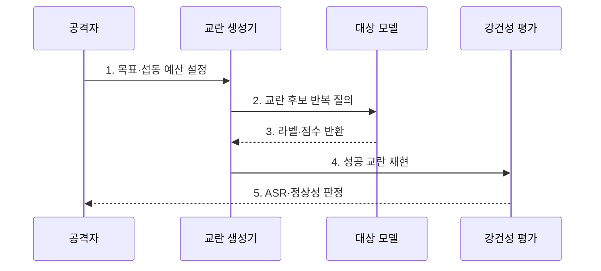

---
sidebar:
  order: 86
  label: "086. 적대적 예제 공격 (Adversarial Example)"
  badge:
    text: "기출 · 50%"
    variant: note
title: "적대적 예제 공격 (Adversarial Example)"
date: "2026-07-30T20:00:00+09:00"
tags:
  - "notes-security"
weight: 86
extra:
  question_no: "086"
  source_status: "기출"
  source_history: "131회"
  priority: 50
  priority_note: "131회 기출이며 모델 강건성 평가의 기본 공격임"
---

## 미리 알고가기

- **적대적 예제(Adversarial Example)**: 모델의 판단 경계를 넘도록 의도적으로 교란한 공격 입력이다.
- **판단 경계(Decision Boundary)**: 입력을 서로 다른 예측 결과로 나누는 모델의 판단 기준이다.
- **백색상자 공격(White-Box Attack)**: 구조·가중치·기울기 등 모델 내부 정보를 이용하는 공격이다.
- **흑색상자 공격(Black-Box Attack)**: 입력과 출력만 관찰해 취약한 입력을 찾는 공격이다.
- **표적 공격(Targeted Attack)**: 공격자가 지정한 결과로 오분류하게 만드는 공격이다.
- **비표적 공격(Untargeted Attack)**: 원래 결과와 다른 임의 결과를 유도하는 공격이다.
- **전이성(Transferability)**: 한 모델에서 만든 교란이 다른 모델에도 작동하는 성질이다.
- **공격 성공률(Attack Success Rate, ASR)**: 교란 입력이 목표 오동작을 일으킨 비율이다.
- **적대적 학습(Adversarial Training)**: 적대적 예제를 훈련에 포함해 교란 강건성을 높이는 학습이다.
- **섭동 예산(Perturbation Budget)**: 공격자가 입력을 바꿀 수 있는 크기의 한도이다.
- **NIST AI 100-2e2025**: 적대적 예제를 추론 단계 회피 공격으로 분류하고 공격 지식·역량·목표를 체계화한다.

## Ⅰ. 개요

- 정의/개념: 입력 교란에 의한 **모델 판단 경계 우회**
- 배경/필요성: 정상 정확도의 **경계 주변 취약성 누락**

### 쉽게 이해하기 (학습용)

- 사람에게는 같은 표지판처럼 보이는 작은 무늬를 더해 모델만 다른 표지판으로 판단하게 만든다.

## Ⅱ. 특징

- 표적·비표적의 **오분류 목표 차이**
- 전이성·질의의 **흑색상자 공격 가능**
- 적대적 학습의 **교란 강건성 향상**

### 쉽게 이해하기 (학습용)

- 모델 내부를 알면 기울기로 교란을 만들고 내부를 몰라도 응답이나 대리 모델을 이용해 취약 입력을 찾을 수 있다.

## Ⅲ. 구조 및 구성요소

| 구성요소 | 책임 |
|:---|:---|
| 위협 모델 | 지식·목표·교란 한도 정의 |
| 교란 생성기 | 제약 내 공격 입력 최적화 |
| 대상 모델 | 입력의 예측·행동 출력 |
| 질의 관측점 | 라벨·점수·성공률 측정 |
| 강건·안전 처리기 | 탐지·거부·대체 판단 |

### 쉽게 이해하기 (학습용)

- 공격자 지식과 교란 크기를 고정하고 같은 조건에서 모델의 공격 성공률과 방어 후 정상 성능을 비교한다.

## Ⅳ. 흐름도

**동작 원리**

1. **목표·섭동 예산 설정**: 표적 결과·변형 한도 정의
2. **교란 후보 반복 질의**: 취약 방향 입력 탐색
3. **라벨·점수 반환**: 경계·목표 달성 여부 제공
4. **성공 교란 재현**: 변형·환경 조건 반복 시험
5. **ASR·정상성 판정**: 공격률·정상 성능 함께 측정

### 쉽게 이해하기 (학습용)

- 작은 입력 변형을 반복하여 목표 오답을 찾고 거리·각도·조명 변화에서도 공격이 재현되는지 확인한다.

## Ⅴ. 종류 및 비교

| 적대적 예제 유형 | 백색상자 | 흑색상자 | 물리 환경 |
|:---|:---|:---|:---|
| 적용 기준 | 내부 접근 가능 평가 | API 외부 공격 평가 | 실제 센서 안전 검증 |
| 핵심 특징 | **기울기 기반 최적화** | **응답·전이성 기반 탐색** | **물리 패턴 센서 교란** |
| 한계 | 내부 접근 가정 | 많은 질의 필요 | 환경 변화에 효과 변동 |

### 쉽게 이해하기 (학습용)

- 백색상자는 내부 정보, 흑색상자는 응답과 전이성, 물리 공격은 실제 표식이나 소리로 입력을 교란한다.

## Ⅵ. 실무 고려사항 및 대책

| 고려사항 | 대책 | 효과 |
|:---|:---|:---|
| 회피 공격 분류 | **NIST AI 100-2e2025 적용** | 지식·역량별 시험 체계화 |
| 모델 교란 강건성 | **적대적 학습·변형별 ASR 평가** | 경계 주변 오분류 감소 |
| 안전 중요 오판 | **센서 대조·거부·안전 상태 전환** | 단일 모델 실패 피해 제한 |

### 쉽게 이해하기 (학습용)

- 자율주행 카메라는 변형 표지판을 거리·각도·조명별로 시험하고 지도·라이다와 불일치하면 안전 모드로 전환해야 한다.

## Ⅶ. 결론

- **섭동크기·공격성공률·업무영향**으로 강건성을 결정한다.

### 쉽게 이해하기 (학습용)

- 적대적 예제 방어는 공격률만 낮추는 것이 아니라 정상 성능을 유지하고 오판 시 실제 피해를 안전 통제로 제한하는 것이다.
