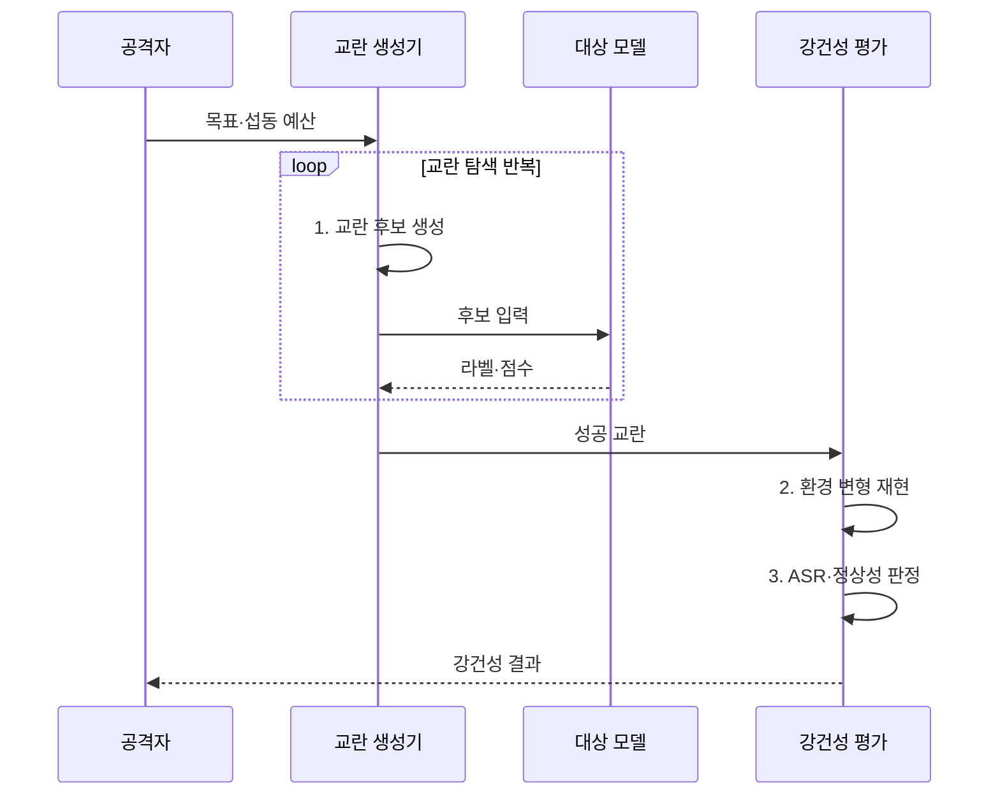

---
sidebar:
  order: 86
  label: "086. 적대적 예제 공격 (Adversarial Example)"
  badge:
    text: "기출 · 50%"
    variant: note
title: "적대적 예제 공격 (Adversarial Example)"
date: "2026-08-02T12:50:00+09:00"
tags:
  - "notes-security"
weight: 86
extra:
  question_no: "086"
  source_status: "기출"
  source_history: "131회"
  priority: 50
  priority_note: "131회 기출이며 모델 강건성 평가의 기본 공격임"
---

## Ⅰ. 개요

핵심 용어

- **적대적 예제**: 사람에게는 같은 입력처럼 보이지만 모델의 판단 경계를 넘도록 의도적으로 교란한 공격 입력이다.
- **판단 경계**: 입력을 서로 다른 예측 결과로 나누는 모델의 기준으로 경계 주변에서 작은 교란에 취약할 수 있다.

- 정의/개념: **적대적 예제** 는 입력을 교란해 모델 판단 경계를 넘어 오분류시키는 공격 입력
- 배경/필요성: 정상 정확도의 **경계 주변 취약성 누락**

#### 한줄 요약

- 사람에게는 같은 표지판처럼 보이는 작은 무늬를 더해 모델만 다른 표지판으로 판단하게 만든다.

## Ⅱ. 특징

핵심 용어

- **표적·비표적 공격**: 표적형은 공격자가 정한 결과로, 비표적형은 원래 결과와 다른 임의 결과로 오분류를 유도한다.
- **전이성·적대적 학습**: 한 모델에서 만든 교란이 다른 모델에도 작동할 수 있으며 이를 훈련에 포함해 강건성을 높일 수 있다.

- 표적·비표적의 **오분류 목표 차이**
- 대리 모델 전이·반복 질의로 **흑색상자 공격 가능**
- 적대적 학습의 **교란 강건성 향상**

#### 한줄 요약

- 모델 내부를 알면 기울기로 교란을 만들고 내부를 몰라도 응답이나 대리 모델을 이용해 취약 입력을 찾을 수 있다.

## Ⅲ. 구조 및 구성요소

핵심 용어

- **위협 모델·섭동 예산**: 공격자의 지식·목표와 입력을 바꿀 수 있는 크기·횟수·환경 범위를 고정한 시험 조건이다.
- **강건·안전 처리기**: 교란 입력을 탐지·거부하고 안전 중요 판단은 다른 센서나 보수적 상태로 전환하는 구성요소이다.

| 구성요소 | 책임 |
|:---|:---|
| 위협 모델 | **지식·목표·교란 한도** 정의 |
| 교란 생성기 | 제약 내 **공격 입력 최적화** |
| 대상 모델 | 입력의 **예측·행동 출력** |
| 질의 관측점 | **라벨·점수·성공률** 측정 |
| 강건·안전 처리기 | **탐지·거부·대체 판단** |

#### 한줄 요약

- 공격자 지식과 교란 크기를 고정하고 같은 조건에서 모델의 공격 성공률과 방어 후 정상 성능을 비교한다.

## Ⅳ. 흐름도

핵심 용어

- **교란 탐색·환경 재현**: 제약 안에서 취약 입력을 찾고 거리·각도·조명 같은 실제 조건에서도 공격이 유지되는지 반복하는 과정이다.
- **ASR(Attack Success Rate)·정상성**: 공격 입력의 성공률과 방어 뒤 정상 입력 성능을 함께 측정하는 평가 지표이다.

**동작 원리**

1. **교란 후보 생성**: 섭동 예산 안에서 취약 방향 탐색
2. **환경 변형 재현**: 거리·각도·조명 조건별 반복 시험
3. **ASR·정상성 판정**: 공격률·정상 성능 함께 측정

#### 한줄 요약

- 작은 입력 변형을 반복하여 목표 오답을 찾고 거리·각도·조명 변화에서도 공격이 재현되는지 확인한다.

## Ⅴ. 종류 및 비교

핵심 용어

- **백색상자·흑색상자·물리 공격**: 내부 기울기, API 응답·전이성, 실제 표식·소리 같은 센서 입력을 각각 이용하는 공격 유형이다.

| 적대적 예제 유형 | 백색상자 | 흑색상자 | 물리 환경 |
|:---|:---|:---|:---|
| 적용 기준 | **내부 접근 가능 평가** | **API 외부 공격 평가** | **실제 센서 안전 검증** |
| 핵심 특징 | **기울기 기반 최적화** | **응답·전이성 기반 탐색** | **물리 패턴 센서 교란** |
| 한계 | **내부 접근 가정** | **많은 질의 필요** | 환경 변화에 **효과 변동** |

#### 한줄 요약

- 백색상자는 내부 정보, 흑색상자는 응답과 전이성, 물리 공격은 실제 표식이나 소리로 입력을 교란한다.

## Ⅵ. 실무 고려사항 및 대책

핵심 용어

- **NIST AI 100-2e2025**: 적대적 예제를 추론 단계 회피 공격으로 분류하고 공격 지식·역량·목표를 체계화한다.
- **센서 대조·안전 상태**: 모델 판단을 독립 센서·지도와 비교하고 불일치가 크면 거부하거나 보수적인 동작으로 전환하는 통제이다.

| 문제 | 대책 | 효과 |
|:---|:---|:---|
| **회피 공격 분류 누락** | **NIST AI 100-2e2025 적용** | **지식·역량별 시험 체계화** |
| **모델 교란 강건성 부족** | **적대적 학습·변형별 ASR 평가** | **경계 주변 오분류 감소** |
| **안전 중요 오판** | **센서 대조·거부·안전 상태 전환** | **단일 모델 실패 피해 제한** |

#### 한줄 요약

- 자율주행 카메라는 변형 표지판을 거리·각도·조명별로 시험하고 지도·라이다와 불일치하면 안전 모드로 전환해야 한다.

## Ⅶ. 결론

핵심 용어

- **교란 강건성과 피해 제한**: 공격 성공률을 낮추면서 정상 성능을 유지하고 남은 오판이 실제 안전 사고로 이어지지 않게 하는 목표이다.

- ASR·안전 영향이 크면 **적대적 학습·센서 대조·안전 전환** 적용

#### 한줄 요약

- 적대적 예제 방어는 공격률만 낮추는 것이 아니라 정상 성능을 유지하고 오판 시 실제 피해를 안전 통제로 제한하는 것이다.
