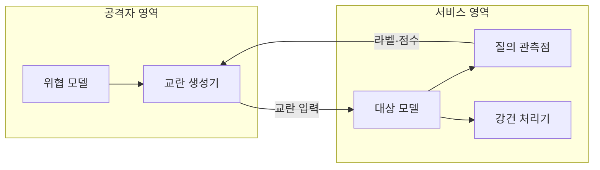
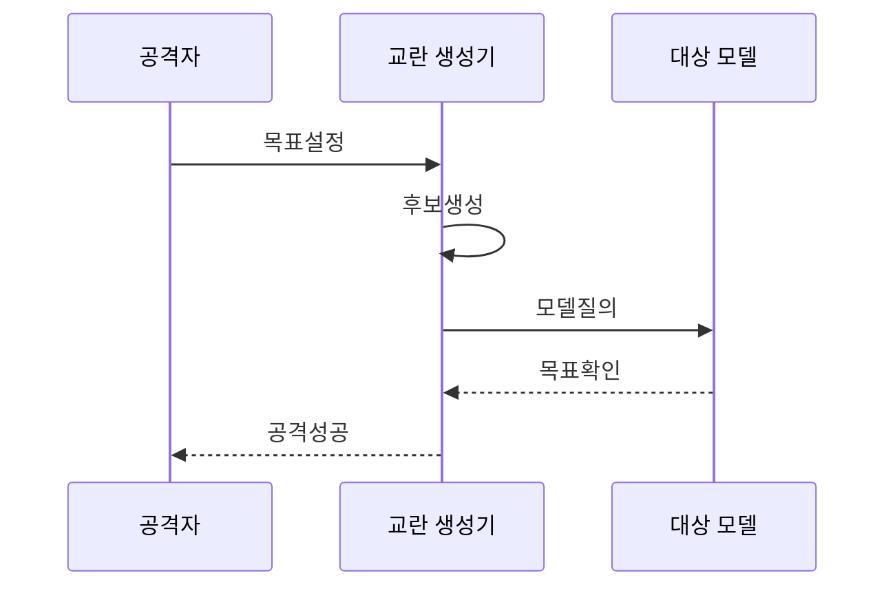

---
sidebar:
  order: 86
  label: "086. 적대적 예제 공격 (Adversarial Example)"
  badge:
    text: "기출 · 50%"
    variant: note
title: "적대적 예제 공격 (Adversarial Example)"
date: "2026-07-27T23:59:59+09:00"
tags:
  - "notes-security"
weight: 86
extra:
  question_no: "086"
  source_status: "기출"
  source_history: "131회"
  priority: 50
  priority_note: "131회 기출이며 모델 강건성 평가의 기본 공격임"
---

## 미리 알고가기

- **적대적 예제(Adversarial Example, 어드버서리얼 이그잼플)**: 모델에 적대적으로 설계해 판단 경계를 넘도록 교란한 공격 입력
- **응용 프로그래밍 인터페이스(Application Programming Interface, API)**: 외부 프로그램이 모델에 질의하고 응답을 받는 접점이다.
- **전이성(Transferability, 트랜스퍼러빌리티)**: 한 모델에서 만든 교란이 다른 모델에도 작동하는 성질
- **공격 성공률(Attack Success Rate, ASR)**: 교란 입력이 공격자가 의도한 목표 오동작을 일으킨 비율이다.
- **판단 경계**: 모델이 한 분류와 다른 분류를 나누는 입력 공간의 경계
- **적대적 학습**: 적대적 예제를 훈련에 포함해 교란 입력의 오분류를 줄이는 학습

## Ⅰ. 개요

- 정의/개념: 판단 경계를 넘겨 오동작을 유도하는 공격
- 기존 한계: 정상 정확도 평가는 경계 주변의 작은 교란 누락
- **배경/필요성**: 교란 강건성 검증과 실패 안전 적용

### 쉽게 이해하기 (학습용)

- 사람에겐 같아도 판단 경계를 넘는 무늬를 더해 다른 분류를 유도함

## Ⅱ. 특징

- 표적 공격은 지정 결과, 비표적 공격은 임의 오분류를 유도한다
- 전이성으로 내부 정보 없이 다른 모델까지 공격할 수 있다
- 교란 강건성 시험과 실패 안전이 실제 오판 피해를 제한한다

### 쉽게 이해하기 (학습용)

- 모델 계산을 알면 오답을 찾고, 몰라도 반복 질의로 입력을 만듦

## Ⅲ. 아키텍처 및 구성요소

| 설계 요소 | 설명 |
|:---|:---|
| 위협 모델 | 공격자 지식·질의 권한·허용 교란을 정의함 |
| 교란 생성기 | 목표 손실을 키우며 제약 안에서 입력을 변형함 |
| 대상 모델 | 변형 입력을 받아 분류·점수·행동을 출력함 |
| 질의 관측점 | 응답 라벨·점수로 공격 성공과 경계를 추정함 |
| 강건 처리기 | 탐지·거부·대체 판단으로 위험 입력을 처리함 |

> 요약: 교란 범위와 공격자 지식을 고정해 방어를 비교한다

### 쉽게 이해하기 (학습용)

- 공격자 지식과 교란 범위를 고정해 방어 성능을 비교함

## Ⅳ. 원리 및 절차 흐름도

| 절차 | 설명 |
|:---|:---|
| 목표설정 | 표적 출력과 교란 한도 정함 |
| 후보생성 | 취약 방향을 탐색함 |
| 모델질의 | 손실을 높여 질의함 |
| 목표확인 | 변형 입력 결과 확인함 |
| 공격성공 | 재현성을 검증함 |

> 요약: 반복 질의로 판단 경계와 재현성을 검증한다

### 쉽게 이해하기 (학습용)

- 제약 안에서 입력을 바꾸며 목표 오답의 재현성을 확인함

## Ⅴ. 종류 및 비교

| 판단 기준 | 백색상자 공격 | 흑색상자 공격 | 물리 환경 공격 |
|:---|:---|:---|:---|
| 적용 기준 | 모델 내부에 접근 가능한 평가 | API만 가능한 외부 공격 평가 | 실제 촬영·음향 환경의 안전 검증 |
| 핵심 특징 | 내부 정보로 교란 최적화 | 응답·대리 모델로 교란 탐색 | 물리 패턴으로 센서 입력 조작 |
| 한계 | 내부 접근 가정 필요 | 많은 질의·전이성 악용 | 환경 변화로 효과 불안정 |

> 요약: 내부·응답·물리 환경별로 교란 경로를 검증한다

### 쉽게 이해하기 (학습용)

- 백색은 내부 정보, 흑색은 응답, 물리는 실제 환경을 활용

## Ⅵ. 실무 사례

1. 자율주행 카메라의 **변형 표지판 공격 검증**

### 쉽게 이해하기 (학습용)

- 정지 표지판에 작은 패턴을 붙인 뒤 거리·각도·조명을 바꿔 인식 오류를 시험하고 지도·라이다 등 다른 센서와 결과를 대조한다.

## Ⅶ. 결론

- 작은 입력 변형으로 AI 판단이 바뀌는 위험을 줄이기 위해 공격자 능력·물리 재현성·모델 강건성·피해 영향을 검토하여, 적대적 방어와 실패 안전 체계를 적용해야 한다.

### 쉽게 이해하기 (학습용)

- 강건 학습·탐지·센서 대조를 겹쳐 실제 피해를 줄인다.
