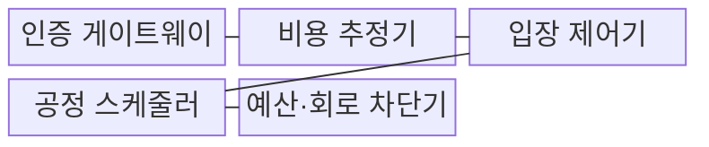
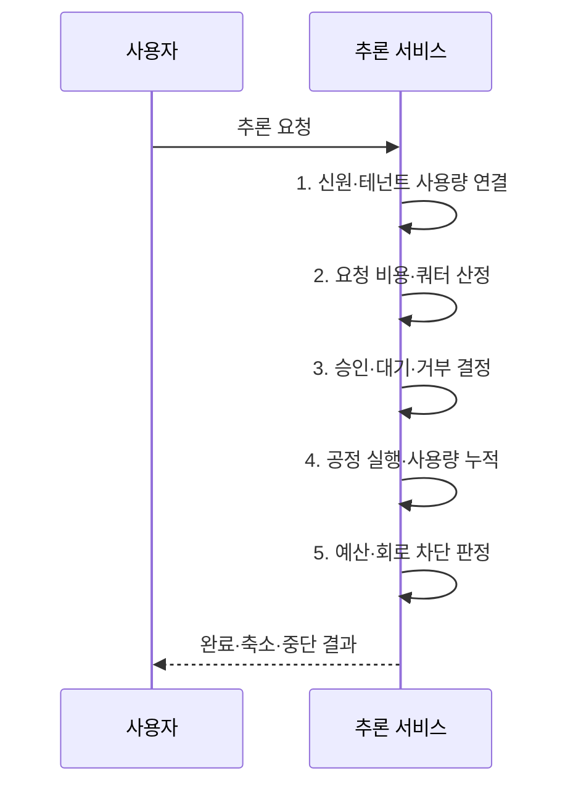

---
sidebar:
  order: 87
  label: "087. 모델 DoS (Model Denial of Service)"
  badge:
    text: "기출 · 70%"
    variant: note
title: "모델 DoS (Model Denial of Service)"
date: "2026-08-02T12:52:00+09:00"
tags:
  - "notes-security"
weight: 87
extra:
  question_no: "087"
  source_status: "기출"
  source_history: "138회"
  priority: 70
  priority_note: "138회 최신 기출이며 추론 자원 고갈 통제가 중요함"
---

## Ⅰ. 개요

핵심 용어

- **모델 DoS**: 긴 문맥·출력·반복 도구 호출 같은 고비용 추론으로 GPU·메모리·외부 API 비용을 고갈시키는 공격이다.
- **요청별 비용 차이**: 같은 호출 한 건이라도 입력·출력 토큰, 모델, 도구 사용에 따라 실제 자원 소비가 크게 다른 특성이다.

- 정의/개념: **모델 DoS**는 고비용 추론으로 연산·메모리·외부 비용을 고갈시키는 공격
- 배경/필요성: 호출 횟수 제한의 **요청별 비용 차이 누락**

#### 한줄 요약

- 짧은 질문 한 건과 긴 문서 분석 한 건의 비용이 다르므로 요청 수뿐 아니라 토큰·시간·도구 사용량까지 제한해야 한다.

## Ⅱ. 특징

핵심 용어

- **컨텍스트·도구 순환**: 긴 입력과 출력을 처리하거나 에이전트가 도구와 재시도를 반복하면서 연산·메모리·외부 비용이 누적되는 위험이다.
- **테넌트 공정성**: 공유 자원에서 한 고객의 고비용 요청이 다른 고객의 처리 기회를 빼앗지 않도록 실행 슬롯과 예산을 분리하는 원칙이다.

- 긴 문맥·출력의 **GPU 자원 점유**
- 도구 순환·재시도의 **연쇄 비용 증가**
- **테넌트 공정성**을 위한 예산·공정 큐로 자원 독점 방지

#### 한줄 요약

- 공격자는 적은 요청이라도 긴 출력이나 반복 도구 호출을 유도하여 GPU와 외부 API 비용을 동시에 고갈시킬 수 있다.

## Ⅲ. 구조 및 구성요소

핵심 용어

- **비용 추정·입장 제어**: 예상 토큰·모델·도구 비용과 현재 용량을 계산해 요청의 승인·대기·거부를 정하는 통제이다.
- **쿼터·회로 차단기**: 사용자·테넌트의 기간별 사용 한도를 정하고 실행 중 누적 비용이 임계치를 넘으면 연쇄 호출을 중단한다.

| 구성요소 | 책임 |
|:---|:---|
| 인증 게이트웨이 | **사용자·키·테넌트 식별** |
| 비용 추정기 | **토큰·모델·도구 비용** 계산 |
| 입장 제어기 | 쿼터·용량별 **승인·대기·거부** |
| 공정 스케줄러 | 테넌트별 **실행 슬롯 배분** |
| 예산·회로 차단기 | **누적 한도 초과 실행 중단** |

#### 한줄 요약

- 요청의 예상 비용으로 입장을 결정하고 실행 중 실제 사용량이 한도를 넘으면 출력·도구 호출을 줄이거나 중단한다.

## Ⅳ. 흐름도

핵심 용어

- **가중 쿼터**: 요청 수뿐 아니라 토큰·시간·동시성·도구 비용을 가중하여 실제 소비량으로 한도를 계산하는 방식이다.
- **축소 응답**: 예산에 가까워질 때 전체 실패 대신 출력 길이·모델·도구 범위를 줄여 필수 기능을 유지하는 처리이다.

**동작 원리**

1. **신원·테넌트 사용량 연결**: 소비 주체·기존 사용량 확인
2. **요청 비용·쿼터 산정**: 문맥·출력·도구 비용 예측
3. **승인·대기·거부 결정**: 현재 용량·우선순위 대조
4. **공정 실행·사용량 누적**: 슬롯 배분·실제 비용 측정
5. **예산·회로 차단 판정**: 한도별 출력·도구 실행 제한

#### 한줄 요약

- 정상 대형 작업은 공정 큐에서 처리하되 비정상적으로 자원을 독점하는 요청은 비용 한도에서 축소하거나 중단한다.

## Ⅴ. 종류 및 비교

핵심 용어

- **대량·고비용·에이전트 순환형**: 각각 요청 수, 요청 한 건의 GPU·메모리, 반복 도구·재시도 비용으로 서비스를 고갈시키는 유형이다.

| 모델 DoS 유형 | 대량 호출형 | 고비용 문맥형 | 에이전트 순환형 |
|:---|:---|:---|:---|
| 적용 기준 | **신원별 호출 한도** | **토큰·시간 한도** | **단계·도구·비용 한도** |
| 핵심 특징 | **입구·작업 큐 점유** | **GPU·메모리 점유** | **도구·재시도 비용 누적** |
| 한계 | 분산 계정으로 **호출 한도 회피** | 정상 대형 작업 **과잉 거부** | **여러 시스템 동시 고갈** |

#### 한줄 요약

- 대량형은 입구와 큐, 고비용형은 GPU와 메모리, 에이전트형은 모델과 연결 도구의 비용을 고갈시킨다.

## Ⅵ. 실무 고려사항 및 대책

핵심 용어

- **OWASP LLM10:2025**: 무제한 입력·출력·추론·도구 소비로 인한 서비스 거부와 비용 손실을 분류한 공식 항목이다.
- **DDoS(Distributed Denial of Service) 행위 상관분석**: 분산 계정·출발지의 입력 패턴과 자원 소비를 연결해 개별 호출 한도를 우회하는 공격을 찾는 분석이다.
- **NIST 공격 분류**: 공격자의 지식·목표·역량과 자원 고갈 경로를 공통 기준으로 구분해 시험 범위를 정하는 분류 체계이다.

| 문제 | 대책 | 효과 |
|:---|:---|:---|
| **무제한 자원 소비** | **OWASP LLM10:2025 적용** | **입력·출력·도구 한도 구체화** |
| **요청별 비용 차이** | **토큰·시간·동시성 가중 쿼터** | **고비용 소수 요청 통제** |
| **테넌트 연쇄 고갈** | **공정 큐·회로 차단·축소 응답** | **장애 격리·서비스 연속성** |
| **DDoS** 분산 계정으로 **호출 한도 회피** | **NIST 공격 분류·행위 상관분석** | **분산 자원 고갈 탐지** |

#### 한줄 요약

- 생성형 AI API는 계정·테넌트별 토큰과 동시 요청 한도를 적용해 장문 반복 요청이 전체 GPU 자원을 고갈시키지 않게 한다.

## Ⅶ. 결론

핵심 용어

- **비용 기반 가용성 통제**: 호출 횟수뿐 아니라 예상·실제 자원 무게를 입장 전과 실행 중에 계속 측정해 공정하게 제한하는 원칙이다.

- 예상 비용이 쿼터 이내면 **승인**, 실행 비용 초과 시 **회로 차단**

#### 한줄 요약

- 모델 DoS 방어는 호출 수만 세지 않고 요청의 실제 자원 무게와 실행 중 누적 비용을 함께 통제하는 것이다.
