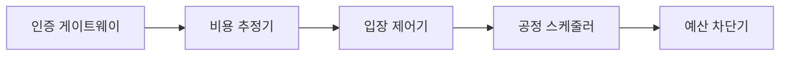
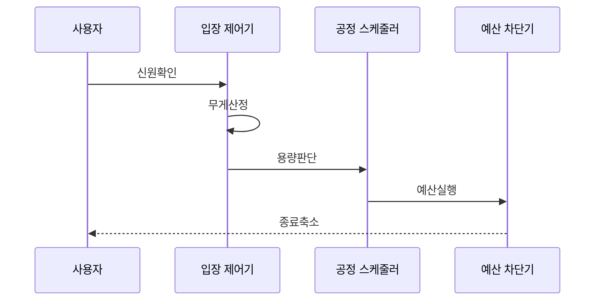

---
sidebar:
  order: 87
  label: "087. 모델 DoS (Model Denial of Service)"
  badge:
    text: "기출 · 70%"
    variant: note
title: "모델 DoS (Model Denial of Service)"
date: "2026-07-25T13:24:00+09:00"
tags:
  - "notes-security"
weight: 87
extra:
  question_no: "087"
  source_status: "기출"
  source_history: "138회"
  priority: 70
  priority_note: "138회 최신 기출이며 추론 자원 고갈 통제가 중요함"
---

## 미리 알고가기

- **서비스 거부 (Denial of Service, DoS)**: 자원 고갈로 가용성 저하
- **거대 언어 모델 (Large Language Model, LLM)**: 대규모 언어 생성 모델
- **그래픽 처리 장치 (Graphics Processing Unit, GPU)**: 모델 추론 연산·메모리 제공
- **응용 프로그래밍 인터페이스 (Application Programming Interface, API)**: 모델·도구 호출 경계 제공
- **분산 서비스 거부 (Distributed Denial of Service, DDoS)**: 다수 출발지의 자원 동시 고갈
- **컨텍스트 윈도우 (Context Window)**: 모델 처리 입력 길이 범위
- **테넌트**: 같은 서비스 자원을 공유하면서 사용량·데이터·정책이 분리된 고객 단위
- **쿼터**: 사용자·테넌트가 일정 기간 사용할 수 있는 요청·토큰·비용 한도
- **작업 큐**: 실행 대기 요청을 순서와 우선순위에 따라 보관하는 대기열
- **DoS·DDoS 읽기와 표기**: “디오에스·디도스”로 읽으며 D는 Distributed의 머리글자로 다수 출발지 공격임을 구분함
- **LLM·GPU·API 읽기**: “엘엘엠·지피유·에이피아이”로 읽고 각 영문 명칭의 머리글자를 묶어 모델·연산 장치·호출 경계를 나타냄

## Ⅰ. 개요

- **정의/개념**: 고비용 추론으로 모델 자원을 점유하는 공격이다
- **배경/필요성**: 요청 수와 다른 연산 비용의 가용성 피해를 막는다

### 쉽게 이해하기 (학습용)

- 짧은 질문과 긴 문서 분석은 계산량이 다르므로 좌석과 시간을 함께 계산 필요

## Ⅱ. 특징

- 소수 고비용 요청도 GPU와 실행 슬롯을 고갈시킨다
- 긴 입출력·반복 추론은 지연과 과금 비용을 높인다
- 도구 순환은 외부 API와 작업 큐까지 고갈시킨다
- 불공정 공유 큐는 다른 테넌트의 처리를 밀어낸다
- 누적 예산 차단은 연쇄 고갈과 서비스 중단을 막는다

### 쉽게 이해하기 (학습용)

- 모델이 검색과 도구를 반복하게 만들어 서비스 자원 소모

## Ⅲ. 아키텍처 및 구성요소

| 설계 요소 | 설명 |
|:---|:---|
| 인증 게이트웨이 | 사용자·키·테넌트 단위 소비 주체 식별 |
| 비용 추정기 | 입력 길이·모델·출력·도구 계획으로 요청 무게 계산 |
| 입장 제어기 | 쿼터와 현재 용량을 대조해 승인·대기·거부 결정 |
| 공정 스케줄러 | 테넌트별 큐와 가중치로 실행 슬롯 배분 |
| 예산 차단기 | 시간·토큰·도구·비용 한도에서 실행 중단 |

> 요약: 예상·누적 비용을 검사해 반복 실행을 차단한다

### 쉽게 이해하기 (학습용)

- 예상 비용과 실제 사용량을 재어 반복 자원을 차단함

## Ⅳ. 원리 및 절차 흐름도

| 절차 | 설명 |
|:---|:---|
| 신원확인 | 사용자·API 키·테넌트 사용량 연결 |
| 무게산정 | 문맥·출력·도구 비용 예측 |
| 용량판단 | 용량·쿼터로 승인·대기·거부 판정 |
| 예산실행 | 사용량 누적치 확인 |
| 종료축소 | 한도 초과 시 취소·축소 |

> 요약: 요청 무게와 누적 비용으로 실행을 통제한다

### 쉽게 이해하기 (학습용)

- 예상 비용으로 입장을 정하고 한도 초과 시 중단·축소함

## Ⅴ. 종류 및 비교

| 판단 기준 | 대량 호출형 | 고비용 문맥형 | 에이전트 순환형 |
|:---|:---|:---|:---|
| 핵심 특징 | 많은 요청·연결로 입구와 큐 점유 | 긴 입력·출력으로 GPU 시간·메모리 점유 | 도구 호출·재시도가 순환하며 비용 누적 |
| 적용 기준 | 신원별 호출 한도 | 무게·토큰·시간 한도 | 단계·도구·누적 비용 한도 |
| 주요 위험 | 분산 계정으로 한도 우회 | 정상 대형 작업까지 과도하게 거부 | 모델·외부 API·작업 큐가 함께 고갈 |

> 요약: 호출량·문맥·순환별로 서로 다른 자원을 보호한다

### 쉽게 이해하기 (학습용)

- 대량은 큐, 고비용은 GPU, 순환은 연결 도구를 고갈시킴

## Ⅵ. 실무 사례

1. API 예산을 계층화하고 대기·거부·비용을 관찰한다
2. 에이전트에 단계·재시도 한도와 축소 경로를 둔다
3. 반복 질의의 비용과 모델 추출 징후를 함께 찾는다

### 쉽게 이해하기 (학습용)

- API는 계정·테넌트·서비스 예산을 겹쳐 적용하고 대기·거부·비용을 관측함
- 에이전트는 단계·재시도 한도를 넘으면 저비용 경로로 축소함
- 반복 질의는 자원 고갈과 모델 추출 표본 축적 위험을 함께 감시함

## Ⅶ. 결론

- 요청 무게와 누적 비용으로 입장·중단을 결정한다.

### 쉽게 이해하기 (학습용)

- 목표는 모든 고비용 요청을 막는 것이 아니라 정상적인 큰 작업은 공정하게 처리하고, 비정상적인 독점이 다른 사용자의 서비스까지 멈추게 하지 않는 것임.
