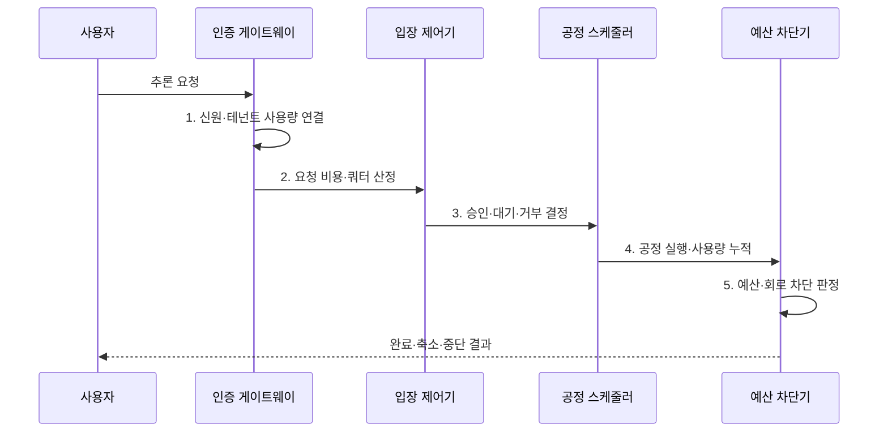

---
sidebar:
  order: 87
  label: "087. 모델 DoS (Model Denial of Service)"
  badge:
    text: "기출 · 70%"
    variant: note
title: "모델 DoS (Model Denial of Service)"
date: "2026-07-31T11:19:21+09:00"
tags:
  - "notes-security"
weight: 87
extra:
  question_no: "087"
  source_status: "기출"
  source_history: "138회"
  priority: 70
  priority_note: "138회 최신 기출이며 추론 자원 고갈 통제가 중요함"
---

## 미리 알고가기

- **서비스 거부(Denial of Service, DoS)**: 과도한 요청이나 연산으로 자원을 고갈시켜 가용성을 낮추는 공격이다.
- **모델 서비스 거부(Model Denial of Service)**: 고비용 추론 요청으로 모델의 연산·메모리·비용을 고갈시키는 공격이다.
- **거대 언어 모델(Large Language Model, LLM)**: 대규모 언어 데이터로 학습한 생성 모델이다.
- **그래픽 처리 장치(Graphics Processing Unit, GPU)**: 모델 추론 연산과 메모리를 제공하는 장치이다.
- **분산 서비스 거부(Distributed Denial of Service, DDoS)**: 다수 출발지가 동시에 자원을 고갈시키는 공격이다.
- **컨텍스트 윈도우(Context Window)**: 모델이 한 요청에서 처리할 수 있는 입력·출력 범위이다.
- **테넌트(Tenant)**: 같은 서비스 자원을 공유하되 사용량·데이터·정책이 분리된 고객 단위이다.
- **쿼터(Quota)**: 사용자·테넌트가 일정 기간 사용할 수 있는 요청·토큰·비용 한도이다.
- **입장 제어(Admission Control)**: 요청 비용과 현재 용량에 따라 승인·대기·거부를 결정하는 통제이다.
- **회로 차단기(Circuit Breaker)**: 오류·비용이 임계치를 넘으면 연쇄 호출을 중단하는 통제이다.
- **OWASP LLM10:2025 Unbounded Consumption**: 무제한 입력·추론·도구 소비로 인한 서비스 거부와 비용 손실을 분류한 공식 항목이다.
- **NIST AI 100-2e2025**: 자원 소비를 높이는 에너지·지연 공격을 가용성 목표의 회피 공격으로 분류한다.

> **키워드:** 모델 DoS (Model Denial of Service)

## Ⅰ. 개요

- 정의/개념: 고비용 추론의 **연산·메모리·비용 고갈**
- 배경/필요성: 호출 횟수 제한의 **요청별 비용 차이 누락**

### 쉽게 이해하기 (학습용)

- 짧은 질문 한 건과 긴 문서 분석 한 건의 비용이 다르므로 요청 수뿐 아니라 토큰·시간·도구 사용량까지 제한해야 한다.

## Ⅱ. 특징

- 긴 문맥·출력의 **GPU 자원 점유**
- 도구 순환·재시도의 **연쇄 비용 증가**
- 테넌트 예산·공정 큐의 **자원 독점 방지**

### 쉽게 이해하기 (학습용)

- 공격자는 적은 요청이라도 긴 출력이나 반복 도구 호출을 유도하여 GPU와 외부 API 비용을 동시에 고갈시킬 수 있다.

## Ⅲ. 구조 및 구성요소

| 구성요소 | 책임 |
|:---|:---|
| 인증 게이트웨이 | **사용자·키·테넌트 식별** |
| 비용 추정기 | **토큰·모델·도구 비용** 계산 |
| 입장 제어기 | 쿼터·용량별 **승인·대기·거부** |
| 공정 스케줄러 | 테넌트별 **실행 슬롯 배분** |
| 예산·회로 차단기 | **누적 한도 초과 실행 중단** |

### 쉽게 이해하기 (학습용)

- 요청의 예상 비용으로 입장을 결정하고 실행 중 실제 사용량이 한도를 넘으면 출력·도구 호출을 줄이거나 중단한다.

## Ⅳ. 흐름도

**동작 원리**

1. **신원·테넌트 사용량 연결**: 소비 주체·기존 사용량 확인
2. **요청 비용·쿼터 산정**: 문맥·출력·도구 비용 예측
3. **승인·대기·거부 결정**: 현재 용량·우선순위 대조
4. **공정 실행·사용량 누적**: 슬롯 배분·실제 비용 측정
5. **예산·회로 차단 판정**: 한도별 출력·도구 실행 제한

### 쉽게 이해하기 (학습용)

- 정상 대형 작업은 공정 큐에서 처리하되 비정상적으로 자원을 독점하는 요청은 비용 한도에서 축소하거나 중단한다.

## Ⅴ. 종류 및 비교

| 모델 DoS 유형 | 대량 호출형 | 고비용 문맥형 | 에이전트 순환형 |
|:---|:---|:---|:---|
| 적용 기준 | **신원별 호출 한도** | **토큰·시간 한도** | **단계·도구·비용 한도** |
| 핵심 특징 | **입구·작업 큐 점유** | **GPU·메모리 점유** | **도구·재시도 비용 누적** |
| 한계 | 분산 계정으로 **호출 한도 회피** | 정상 대형 작업 **과잉 거부** | **여러 시스템 동시 고갈** |

### 쉽게 이해하기 (학습용)

- 대량형은 입구와 큐, 고비용형은 GPU와 메모리, 에이전트형은 모델과 연결 도구의 비용을 고갈시킨다.

## Ⅵ. 실무 고려사항 및 대책

| 고려사항 | 대책 | 효과 |
|:---|:---|:---|
| **무제한 자원 소비** | **OWASP LLM10:2025 적용** | **입력·출력·도구 한도 구체화** |
| **요청별 비용 차이** | **토큰·시간·동시성 가중 쿼터** | **고비용 소수 요청 통제** |
| **테넌트 연쇄 고갈** | **공정 큐·회로 차단·축소 응답** | **장애 격리·서비스 연속성** |
| **DDoS** 분산 계정으로 **호출 한도 회피** | **NIST 공격 분류·행위 상관분석** | **분산 자원 고갈 탐지** |

### 쉽게 이해하기 (학습용)

- 생성형 AI API는 계정·테넌트별 토큰과 동시 요청 한도를 적용해 장문 반복 요청이 전체 GPU 자원을 고갈시키지 않게 한다.

## Ⅶ. 결론

- 예상 비용이 쿼터 이내면 **승인**, 실행 비용 초과 시 **회로 차단**

### 쉽게 이해하기 (학습용)

- 모델 DoS 방어는 호출 수만 세지 않고 요청의 실제 자원 무게와 실행 중 누적 비용을 함께 통제하는 것이다.
