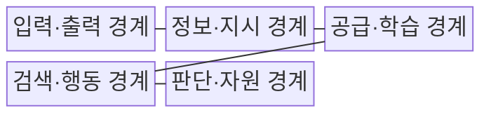
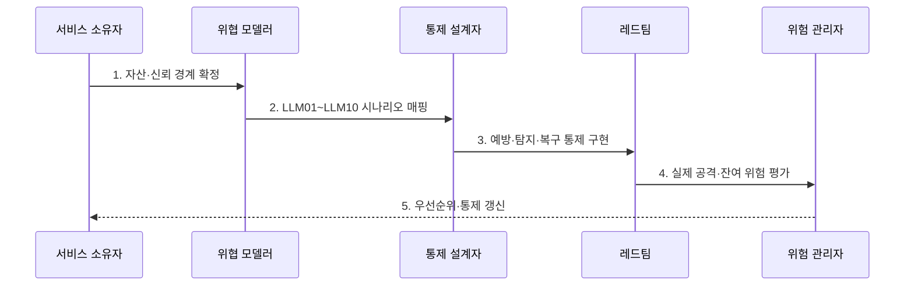

---
sidebar:
  order: 88
  label: "088. OWASP LLM Top 10 (OWASP LLM Top 10)"
  badge:
    text: "기출 · 85%"
    variant: note
title: "OWASP LLM Top 10 (OWASP LLM Top 10)"
date: "2026-07-30T20:00:00+09:00"
tags:
  - "notes-security"
weight: 88
extra:
  question_no: "088"
  source_status: "기출"
  source_history: "137회, 138회"
  priority: 85
  priority_note: "137·138회 반복된 LLM 위험 분류 우산 주제임"
---

## 미리 알고가기

- **오픈 월드와이드 애플리케이션 보안 프로젝트(Open Worldwide Application Security Project, OWASP)**: 공개 애플리케이션 보안 지침과 시험 도구를 개발하는 비영리 재단이다.
- **거대 언어 모델(Large Language Model, LLM)**: 대규모 언어 데이터로 학습해 입력을 처리하고 응답을 생성하는 모델이다.
- **검색 증강 생성(Retrieval-Augmented Generation, RAG)**: 검색 결과를 모델 입력 문맥에 결합하는 생성 방식이다.
- **에이전트(Agent)**: 모델이 외부 도구를 호출하며 여러 단계의 실제 행동을 수행하는 AI 응용이다.
- **과도한 대리권(Excessive Agency)**: 에이전트에 필요 이상의 기능·권한·자율 실행 범위를 준 위험이다.
- **무제한 소비(Unbounded Consumption)**: 입력·출력·도구 실행 한도가 없어 비용·자원이 고갈되는 위험이다.
- **OWASP Top 10 for LLM Applications 2025**: LLM 응용의 주요 위험 열 가지를 번호와 이름으로 분류한 공식 목록이다.
- **LLM01:2025 Prompt Injection**: 비신뢰 입력이 모델 행동과 출력을 의도하지 않게 바꾸는 위험이다.
- **LLM02:2025 Sensitive Information Disclosure**: 모델 응답을 통한 민감정보 노출 위험이다.
- **LLM03:2025 Supply Chain**: 모델·데이터·구성요소 공급망의 변조·취약성 위험이다.
- **LLM04:2025 Data and Model Poisoning**: 데이터·모델 조작으로 행동을 바꾸는 위험이다.
- **LLM05:2025 Improper Output Handling**: 모델 출력을 비신뢰 입력으로 처리하지 않아 생기는 위험이다.
- **LLM06:2025 Excessive Agency**: 모델에 과도한 기능·권한·자율성을 부여한 위험이다.
- **LLM07:2025 System Prompt Leakage**: 시스템 프롬프트에 담긴 민감 정보·통제 의존의 위험이다.
- **LLM08:2025 Vector and Embedding Weaknesses**: 벡터·임베딩 기반 검색의 권한·무결성 위험이다.
- **LLM09:2025 Misinformation**: 허위·부정확 출력을 과신하여 발생하는 위험이다.
- **LLM10:2025 Unbounded Consumption**: 무제한 모델 소비에 따른 가용성·비용 위험이다.

## Ⅰ. 개요

- 정의/개념: LLM 응용의 **10대 위험·완화 지침**
- 배경/필요성: 웹 보안만으로 **모델·RAG·도구 위험 누락**

### 쉽게 이해하기 (학습용)

- 기존 웹 보안에 더해 모델 지시·검색 문서·도구 권한·토큰 비용에서 생기는 위험을 하나의 목록으로 점검한다.

## Ⅱ. 특징

- 입력부터 자원까지 **전 경계 위험 분류**
- 번호·연도의 **판본 식별성**
- 위협 모델·공격 시험의 **서비스별 적용**

### 쉽게 이해하기 (학습용)

- 같은 LLM을 써도 문서 요약 서비스와 결제 도구를 가진 에이전트는 자산·권한·피해가 달라 위험 우선순위도 달라진다.

## Ⅲ. 구조 및 구성요소

| 구성요소 | 책임 |
|:---|:---|
| 입력·출력 경계 | LLM01 인젝션·LLM05 출력 |
| 정보·지시 경계 | LLM02 노출·LLM07 지시 |
| 공급·학습 경계 | LLM03 공급망·LLM04 오염 |
| 검색·행동 경계 | LLM06 대리권·LLM08 벡터 |
| 판단·자원 경계 | LLM09 허위·LLM10 소비 |

### 쉽게 이해하기 (학습용)

- 악성 문서의 지시가 모델 출력을 거쳐 비밀 조회와 무승인 전송으로 이어질 수 있으므로 입력부터 실제 행동까지 연결해 본다.

## Ⅳ. 흐름도

**동작 원리**

1. **자산·신뢰 경계 확정**: 모델·데이터·검색·도구 식별
2. **LLM01~LLM10 시나리오 매핑**: 공격 경로·업무 영향 연결
3. **예방·탐지·복구 통제 구현**: 위험별 다층 통제 배치
4. **실제 공격·잔여 위험 평가**: 재현 시험·통제 공백 측정
5. **우선순위·통제 갱신**: 구조·판본 변화 반영

### 쉽게 이해하기 (학습용)

- 체크 표시만 하지 않고 서비스의 실제 자산과 공격 경로에 항목을 매핑한 뒤 통제가 공격을 막는지 재현한다.

## Ⅴ. 종류 및 비교

| 응용 보안 경계 | 웹 응용 | LLM 응용 | 에이전트 시스템 |
|:---|:---|:---|:---|
| 적용 기준 | 인증·권한·입출력 | 지시·검색·출력 | 목표·메모리·도구 |
| 핵심 특징 | **HTTP·세션 처리** | **프롬프트·RAG 경계** | **권한·자율 행동 검증** |
| 한계 | 주입·인가·세션 취약 | 인젝션·노출·허위정보 | 과도한 대리권·복구 실패 |

### 쉽게 이해하기 (학습용)

- 웹은 입력 처리, LLM은 지시와 데이터 해석, 에이전트는 모델 제안이 실제 행동으로 이어지는 권한 경계를 중점 검증한다.

## Ⅵ. 실무 고려사항 및 대책

| 고려사항 | 대책 | 효과 |
|:---|:---|:---|
| 위험 목록 판본 혼용 | **OWASP LLM Top 10 2025 명시** | 번호·위험명 일관성 확보 |
| 목록식 점검 한계 | **자산·신뢰 경계·공격 경로 매핑** | 서비스 고유 위험 누락 방지 |
| 통제 실효성 | **레드팀·회귀 시험·잔여 위험 승인** | 형식 준수·미검증 통제 방지 |

### 쉽게 이해하기 (학습용)

- RAG 서비스는 문서 ACL·인젝션·출력 처리·도구 권한·자원 한도를 함께 시험하고 구조가 바뀌면 위험 순위를 다시 매긴다.

## Ⅶ. 결론

- **자산가치·공격경로·행동권한**으로 LLM 위험을 결정한다.

### 쉽게 이해하기 (학습용)

- OWASP 목록은 정답지가 아니라 서비스별 위협 모델과 실제 공격 검증을 빠짐없이 시작하기 위한 공통 분류 체계이다.
