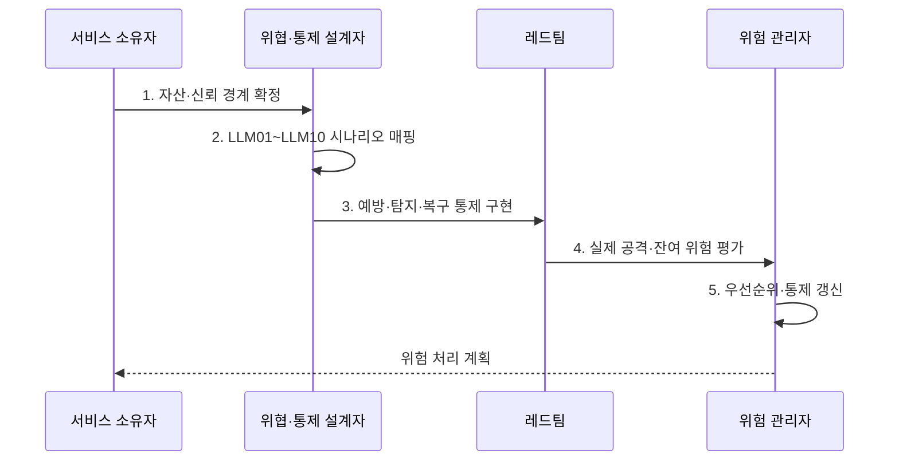

---
sidebar:
  order: 88
  label: "088. OWASP LLM Top 10 (OWASP LLM Top 10)"
  badge:
    text: "기출 · 85%"
    variant: note
title: "OWASP LLM Top 10 (OWASP LLM Top 10)"
date: "2026-08-02T12:54:00+09:00"
tags:
  - "notes-security"
weight: 88
extra:
  question_no: "088"
  source_status: "기출"
  source_history: "137회, 138회"
  priority: 85
  priority_note: "137·138회 반복된 LLM 위험 분류 우산 주제임"
---

## Ⅰ. 개요

핵심 용어

- **OWASP LLM Top 10 2025**: 모델·RAG·에이전트 응용의 주요 위험 열 가지를 번호와 이름으로 분류한 공식 목록이다.
- **LLM 응용 위험**: 기존 웹 입력·권한 외에도 자연어 지시·검색 문맥·모델 출력·도구 행동·추론 비용에서 발생하는 위험이다.

- 정의/개념: **OWASP LLM Top 10 2025**는 LLM 응용의 주요 10대 위험과 완화 방향을 정리한 공식 목록
- 배경/필요성: 기존 웹 보안 점검만으로는 **모델·RAG·도구 경계의 고유 위험을 충분히 포괄하기 어려움**

#### 한줄 요약

- 기존 웹 보안에 더해 모델 지시·검색 문서·도구 권한·토큰 비용에서 생기는 위험을 하나의 목록으로 점검한다.

## Ⅱ. 특징

핵심 용어

- **판본 식별성**: 연도별로 위험 번호와 명칭이 달라질 수 있으므로 목록의 판본을 명시하여 통제·시험 항목을 일치시키는 성질이다.
- **서비스별 위협 모델**: 같은 목록이라도 서비스의 자산·신뢰 경계·도구 권한·피해 수준에 맞춰 위험 우선순위를 다시 정하는 과정이다.

- 입력부터 자원까지 **전 경계 위험 분류**
- 번호·연도의 **판본 식별성**
- 위협 모델·공격 시험의 **서비스별 적용**

#### 한줄 요약

- 같은 LLM을 써도 문서 요약 서비스와 결제 도구를 가진 에이전트는 자산·권한·피해가 달라 위험 우선순위도 달라진다.

## Ⅲ. 구조 및 구성요소

핵심 용어

- **LLM01~05**: 프롬프트 인젝션·민감정보 노출·공급망·데이터와 모델 오염·부적절한 출력 처리를 다루는 위험군이다.
- **LLM06~10**: 과도한 대리권·시스템 프롬프트 누출·벡터와 임베딩 취약점·허위정보·무제한 소비를 다루는 위험군이다.

| 구성요소 | 책임 |
|:---|:---|
| 입력·출력 경계 | **LLM01 인젝션·LLM05 출력** |
| 정보·지시 경계 | **LLM02 노출·LLM07 지시** |
| 공급·학습 경계 | **LLM03 공급망·LLM04 오염** |
| 검색·행동 경계 | **LLM06 대리권·LLM08 벡터** |
| 판단·자원 경계 | **LLM09 허위·LLM10 소비** |

#### 한줄 요약

- 악성 문서의 지시가 모델 출력을 거쳐 비밀 조회와 무승인 전송으로 이어질 수 있으므로 입력부터 실제 행동까지 연결해 본다.

## Ⅳ. 흐름도

핵심 용어

- **공격 경로 매핑**: 각 위험 항목을 모델·데이터·검색·도구 자산과 연결하여 실제 업무 피해로 이어지는 경로를 구체화하는 활동이다.
- **잔여 위험**: 예방·탐지·복구 통제를 적용한 뒤에도 남아 있어 위험 관리자가 수용·완화·회피해야 하는 위험이다.

**동작 원리**

1. **자산·신뢰 경계 확정**: 모델·데이터·검색·도구 식별
2. **LLM01~LLM10 시나리오 매핑**: 공격 경로·업무 영향 연결
3. **예방·탐지·복구 통제 구현**: 위험별 다층 통제 배치
4. **실제 공격·잔여 위험 평가**: 재현 시험·통제 공백 측정
5. **우선순위·통제 갱신**: 구조·판본 변화 반영

#### 한줄 요약

- 체크 표시만 하지 않고 서비스의 실제 자산과 공격 경로에 항목을 매핑한 뒤 통제가 공격을 막는지 재현한다.

## Ⅴ. 종류 및 비교

핵심 용어

- **웹·LLM·에이전트 경계**: 웹은 HTTP 입력·권한, LLM은 지시·검색·출력, 에이전트는 목표·메모리·도구의 실제 행동을 중점 검증한다.

| 응용 보안 경계 | 웹 응용 | LLM 응용 | 에이전트 시스템 |
|:---|:---|:---|:---|
| 적용 기준 | **인증·권한·입출력** | **지시·검색·출력** | **목표·메모리·도구** |
| 핵심 특징 | **HTTP·세션 처리** | **프롬프트·RAG 경계** | **권한·자율 행동 검증** |
| 한계 | **주입·인가·세션 취약** | **인젝션·노출·허위정보** | **과도한 대리권·복구 실패** |

#### 한줄 요약

- 웹은 입력 처리, LLM은 지시와 데이터 해석, 에이전트는 모델 제안이 실제 행동으로 이어지는 권한 경계를 중점 검증한다.

## Ⅵ. 실무 고려사항 및 대책

핵심 용어

- **목록식 점검 한계**: 위험 항목에 체크만 하고 서비스의 자산·공격 경로·통제 실효성을 연결하지 않으면 고유 위험을 놓치는 문제이다.
- **레드팀·회귀 시험**: 실제 공격을 재현하고 통제 수정 뒤 동일·변형 공격이 다시 성공하는지 반복하여 형식 준수를 방지한다.

| 문제 | 대책 | 효과 |
|:---|:---|:---|
| **위험 목록 판본 혼용** | **OWASP LLM Top 10 2025 명시** | **번호·위험명 일관성** 확보 |
| **목록식 점검 한계** | **자산·신뢰 경계·공격 경로 매핑** | **서비스 고유 위험 누락 방지** |
| **통제 실효성 미검증** | **레드팀·회귀 시험·잔여 위험 승인** | **형식 준수 통제 방지** |

#### 한줄 요약

- RAG 서비스는 문서 ACL·인젝션·출력 처리·도구 권한·자원 한도를 함께 시험하고 구조가 바뀌면 위험 순위를 다시 매긴다.

## Ⅶ. 결론

핵심 용어

- **위험 분류의 활용 원칙**: OWASP 목록을 정답지가 아니라 서비스별 위협 모델과 실제 공격 검증을 빠짐없이 시작하는 공통 언어로 사용하는 원칙이다.

- 자산 가치·행동 권한이 큰 **공격 경로부터 통제·레드팀 적용**

#### 한줄 요약

- OWASP 목록은 정답지가 아니라 서비스별 위협 모델과 실제 공격 검증을 빠짐없이 시작하기 위한 공통 분류 체계이다.
