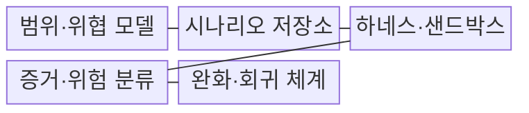
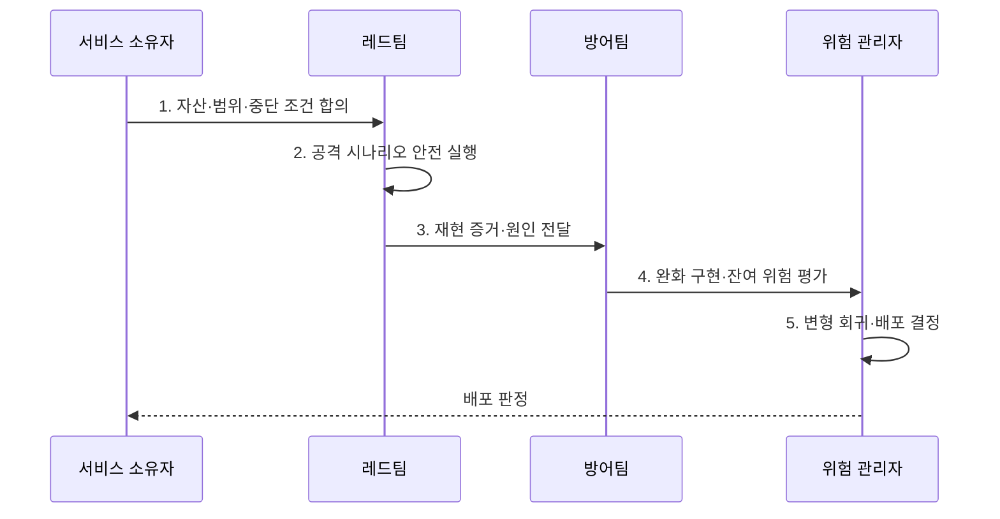

---
sidebar:
  order: 89
  label: "089. AI 레드팀 (AI Red Teaming)"
  badge:
    text: "기출 · 85%"
    variant: note
title: "AI 레드팀 (AI Red Teaming)"
date: "2026-08-02T12:56:00+09:00"
tags:
  - "notes-security"
weight: 89
extra:
  question_no: "089"
  source_status: "기출"
  source_history: "135회, 137회, 138회"
  priority: 85
  priority_note: "135·137·138회 반복된 AI 검증 방법론 핵심임"
---

## Ⅰ. 개요

핵심 용어

- **AI 레드팀**: 공격자 관점에서 AI의 적응형·연쇄 악용 경로와 실제 피해를 안전하게 탐색·재현하는 평가 활동이다.
- **위협 모델링**: 자산·공격자·공격면·피해·통제를 구조적으로 분석하여 시험할 고위험 경로를 정하는 활동이다.

- 정의/개념: **AI 레드팀**은 공격자 관점에서 AI 악용 경로와 실제 피해를 재현하는 평가 활동
- 배경/필요성: 고정 평가의 **적응형·연쇄 공격 누락**

#### 한줄 요약

- 모의고사 점수만 보지 않고 악성 문서가 모델과 도구를 거쳐 실제 유출·변경으로 이어지는 전체 공격 경로를 시험한다.

## Ⅱ. 특징

핵심 용어

- **샌드박스·중단 조건**: 시험이 실제 데이터·시스템에 영향을 주지 않도록 격리하고 피해·비용·범위가 한도를 넘으면 즉시 멈춘다.
- **재현 증거·회귀 평가**: 공격 입력·응답·도구 결과와 영향을 기록하고 수정 뒤 동일·변형 공격이 다시 성공하는지 확인한다.

- 위협 모델의 **복합 공격 경로 탐색**
- 샌드박스·중단 조건의 **시험 피해 제한**
- 재현 증거·회귀의 **완화 효과 검증**

#### 한줄 요약

- 창의적인 사람의 탐색과 자동화된 반복 시험을 결합해 새로운 공격과 수정 뒤 재발을 함께 확인한다.

## Ⅲ. 구조 및 구성요소

핵심 용어

- **검증 하네스**: 공격 입력·모델 응답·도구 실행 결과를 같은 조건에서 반복 실행하고 기록하는 시험 장치이다.
- **시나리오 저장소**: 공격·변형 사례와 기대 결과·위험 등급을 버전으로 관리해 재현과 회귀 시험에 사용하는 자료이다.

| 구성요소 | 책임 |
|:---|:---|
| 범위·위협 모델 | **자산·공격자·금지 행동** 정의 |
| 시나리오 저장소 | **공격·변형 사례 버전** 관리 |
| 하네스·샌드박스 | **격리 실행·중단·결과 수집** |
| 증거·위험 분류 | **입력·응답·도구·피해** 기록 |
| 완화·회귀 체계 | **근본 수정·재발 여부** 검증 |

#### 한줄 요약

- 시험 범위와 안전장치를 먼저 정하고 공격 입력부터 도구 결과와 피해까지 재현 가능한 증거로 남긴다.

## Ⅳ. 흐름도

핵심 용어

- **잔여 위험 평가**: 완화 조치 뒤에도 남은 공격 성공 가능성과 업무 영향을 재산정하여 배포 수용 여부를 판단하는 활동이다.
- **변형 회귀**: 기존 공격뿐 아니라 완화 통제를 우회하도록 표현·순서·도구 경로를 바꾼 변형까지 다시 시험하는 과정이다.

**동작 원리**

1. **자산·범위·중단 조건 합의**: 권한·피해·시험 한도 확정
2. **공격 시나리오 안전 실행**: 격리 계정·비용으로 재현
3. **재현 증거·원인 전달**: 입력·응답·도구·영향 기록
4. **완화 구현·잔여 위험 평가**: 근본 원인 수정·위험 재산정
5. **변형 회귀·배포 결정**: 동일 공격과 완화 통제 회피 변형 재시험

#### 한줄 요약

- 공격 성공 자체보다 어떤 조건에서 어떤 피해가 재현됐고 수정 뒤 변형 공격까지 막혔는지를 배포 근거로 사용한다.

## Ⅴ. 종류 및 비교

핵심 용어

- **레드팀·벤치마크·자동 적대 평가**: 레드팀은 새 경로를 탐색하고 벤치마크는 고정 지표로 비교하며 자동 평가는 알려진 공격을 대량 반복한다.

| AI 안전성 평가 | AI 레드팀 | 벤치마크 평가 | 자동 적대 평가 |
|:---|:---|:---|:---|
| 적용 기준 | **실제 피해·완화 검증** | **모델·버전 점수 비교** | **공격 성공률·회귀** |
| 핵심 특징 | **새 공격 경로 탐색** | **고정 자료 반복 비교** | **알려진 공격 대량 실행** |
| 한계 | 범위 미흡 시 **시험 피해** | **운영 문맥·새 공격 경로 누락** | **시나리오 밖 공격 누락** |

#### 한줄 요약

- 레드팀은 새 경로를 탐색하고 벤치마크는 같은 자로 비교하며 자동 평가는 알려진 공격을 빠르게 반복한다.

## Ⅵ. 실무 고려사항 및 대책

핵심 용어

- **NIST AI 600-1**: 생성형 AI의 오용·유출·연쇄 피해 측정과 적대적 시험을 제시하는 AI RMF(AI Risk Management Framework) 공식 프로파일이다.
- **MITRE ATLAS**: AI 시스템 공격의 전술·기법·사례를 체계화하여 시험 시나리오 누락을 줄이는 공식 지식 기반이다.

| 문제 | 대책 | 효과 |
|:---|:---|:---|
| **RAG·에이전트 연쇄 위험** | **NIST AI 600-1 기반 시나리오** | **오용·유출·연쇄 피해 포함** |
| **공격 기법 누락** | **MITRE ATLAS 기법 매핑** | **공격자 전술·기법 추적** |
| **시험 자체의 피해** | **샌드박스·가상데이터·중단 조건** | **실제 유출·변경·비용 방지** |

#### 한줄 요약

- 악성 RAG 문서가 내부정보 조회와 외부 전송으로 이어지는 경로를 격리 계정에서 재현하고 수정 뒤 같은 공격과 변형을 다시 시험한다.

## Ⅶ. 결론

핵심 용어

- **레드팀 배포 근거**: 고영향 경로를 안전하게 재현하고 근본 완화 뒤 동일·변형 공격의 회귀를 통과했음을 보여 주는 증거이다.

- 고영향 공격의 재현·완화·회귀 통과 후에만 **AI 배포 승인**

#### 한줄 요약

- AI 레드팀의 성과는 공격 건수가 아니라 가장 위험한 경로를 안전하게 재현하고 수정 뒤 재발하지 않음을 입증하는 데 있다.
