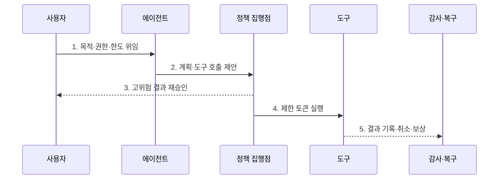

---
sidebar:
  order: 90
  label: "090. 에이전트 보안 — 권한 통제·가드레일 (Agent Security)"
  badge:
    text: "기출 · 85%"
    variant: note
title: "에이전트 보안 — 권한 통제·가드레일 (Agent Security)"
date: "2026-07-27T23:59:59+09:00"
tags:
  - "notes-security"
weight: 90
extra:
  question_no: "090"
  source_status: "기출"
  source_history: "138회"
  priority: 85
  priority_note: "138회 에이전트 설계 흐름과 권한 오남용이 직결됨"
---

## 미리 알고가기

- **에이전트(Agent)**: 모델이 목표를 계획하고 외부 도구를 호출하며 여러 단계를 수행하는 AI 응용이다.
- **가드레일(Guardrail)**: 입력·출력·행동을 정책에 맞게 제한하는 통제이다.
- **거대 언어 모델(Large Language Model, LLM)**: 에이전트의 계획·추론·생성을 담당하는 모델이다.
- **검색 증강 생성(Retrieval-Augmented Generation, RAG)**: 검색한 문서를 모델 입력 문맥에 결합하는 생성 방식이다.
- **최소 권한(Least Privilege)**: 작업에 필요한 최소 기능·자원·기간만 허용하는 원칙이다.
- **제한 토큰(Scoped Token)**: 특정 작업·대상·시간에만 유효한 접근 자격이다.
- **정책 집행점(Policy Enforcement Point, PEP)**: 도구 호출 직전에 주체·동작·대상·조건을 검사하는 지점이다.
- **거래 결속(Transaction Binding)**: 사용자가 승인한 대상·금액·행위를 실제 실행 요청과 묶는 통제이다.
- **보상 동작(Compensating Action)**: 완료된 작업의 반대 작업을 수행해 결과를 복구하는 처리이다.
- **샌드박스(Sandbox)**: 코드·도구 실행이 실제 시스템에 미치는 영향을 제한하는 격리 환경이다.
- **OWASP LLM06:2025 Excessive Agency**: 과도한 기능·권한·자율성이 만드는 에이전트 위험을 분류한 공식 항목이다.
- **NIST AI 600-1**: 생성형 AI의 인간 감독·위험 측정·관리 방안을 제시하는 공식 프로파일이다.

## Ⅰ. 개요

- 정의: 에이전트의 **계획·권한·도구 실행 통제**
- 기존 한계: 출력 필터의 **외부 상태 변경 방지 불가**

### 쉽게 이해하기 (학습)

- 에이전트는 답만 말하는 챗봇이 아니라 실제 버튼을 누르는 작업자이므로 행동마다 권한과 결과를 확인해야 한다.

## Ⅱ. 특징

- 계획·메모리·도구 결과의 **비신뢰 처리**
- 호출별 정책·제한 토큰의 **완전 매개**
- 승인·중단·보상의 **잔여 피해 제한**

### 쉽게 이해하기 (학습)

- 시작할 때 한 번 허가하지 않고 도구 호출마다 사용자·목적·대상·누적 영향을 다시 검사한다.

## Ⅲ. 구조 및 구성요소

| 설계 요소 | 설명 |
|:---|:---|
| 신원·위임 계층 | 요청자 권한·제한 토큰 전달 |
| 계획·메모리 계층 | 비신뢰 데이터 격리·검사 |
| 도구 등록부 | 기능·스키마·위험·대상 관리 |
| 정책 집행점 | 호출별 주체·동작·대상 검증 |
| 감사·복구 계층 | 승인·결과·취소·보상 연결 |

### 쉽게 이해하기 (학습)

- 모델은 행동을 제안할 뿐이며 정책 집행점이 실제 사용자 권한과 도구 위험을 확인한 뒤 제한 토큰으로 실행한다.

## Ⅳ. 흐름도

| 절차 | 설명 |
|:---|:---|
| 목적·권한·한도 위임 | 도구·대상·단계·비용 설정 |
| 계획·도구 호출 제안 | 순서·인수를 비신뢰 생성 |
| 고위험 결과 재승인 | 전송·삭제·결제 내용 확인 |
| 제한 토큰 실행 | 주체·동작·대상별 최소 권한 |
| 결과 기록·취소·보상 | 실행 증거·복구 상태 연결 |

> 요약: 비신뢰 계획을 호출별 검증·승인해 실행한다.

### 쉽게 이해하기 (학습)

- 메일 초안은 자동 작성하더라도 실제 발송 전 수신자·본문·첨부파일을 보여 주고 승인된 요청과 실행 내용을 결속한다.

## Ⅴ. 종류 및 비교

| AI 응용 유형 | 도구형 에이전트 | 일반 챗봇 | RAG 서비스 |
|:---|:---|:---|:---|
| 적용 기준 | 호출 권한·승인·복구 | 입력·출력 위험 | 검색 문맥·문서 권한 |
| 핵심 특징 | **외부 상태 변경** | **텍스트 응답 생성** | **문서 검색·문맥 구성** |
| 한계 | 과도한 권한·취소 실패 | 유해·민감 응답 | 인젝션·ACL 누락 |

### 쉽게 이해하기 (학습)

- 챗봇은 말, RAG는 검색, 에이전트는 실제 행동의 위험이 중심이므로 통제할 실행 경계가 다르다.

## Ⅵ. 실무 고려사항 및 대책

| 고려사항 | 대책 | 효과 |
|:---|:---|:---|
| 과도한 대리권 | **OWASP LLM06:2025 적용** | 기능·권한·자율성 최소화 |
| 중요 외부 행동 | **거래 결속·사용자 재승인** | 대리인 혼동·무단 실행 방지 |
| 연쇄 실행 실패 | **단계·비용 한도·취소·보상** | 피해 확산·복구 불능 제한 |

### 쉽게 이해하기 (학습)

- 결제 에이전트는 모델이 제안한 금액·수취인과 사용자가 승인한 내용을 대조하고 일치할 때만 단명 자격으로 실행한다.

## Ⅶ. 결론

- **행동영향·권한범위·가역성**으로 도구 실행을 결정한다.

### 쉽게 이해하기 (학습)

- 에이전트 보안의 핵심은 모델을 신뢰하는 것이 아니라 모델의 제안과 실제 권한을 분리하고 실패를 중단·설명·복구할 수 있게 하는 것이다.
