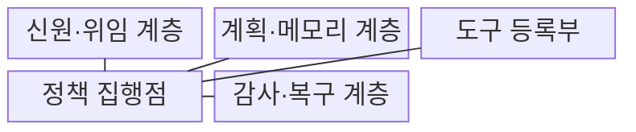
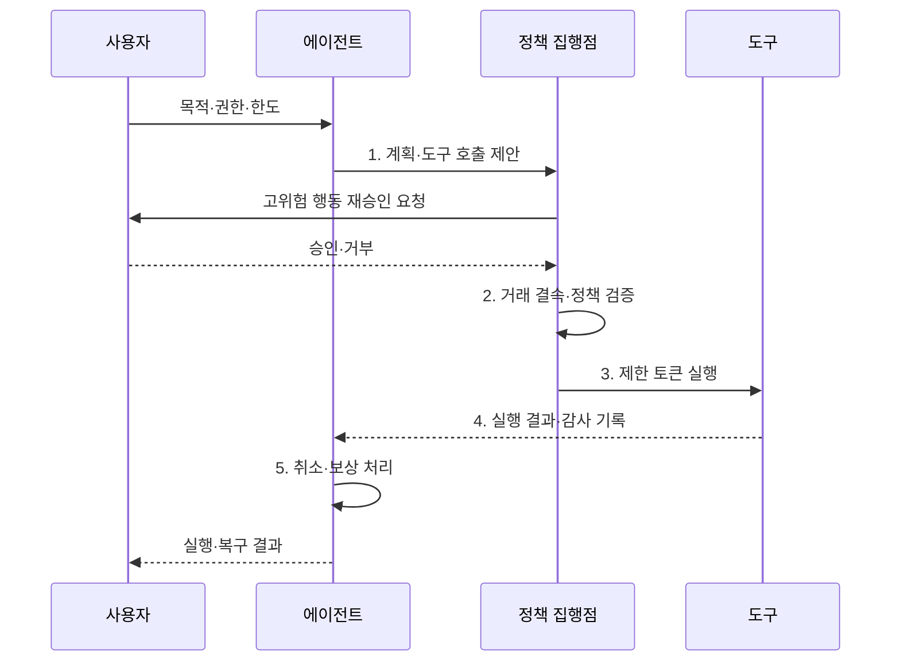

---
sidebar:
  order: 90
  label: "090. 에이전트 보안 — 권한 통제·가드레일 (Agent Security)"
  badge:
    text: "기출 · 85%"
    variant: note
title: "에이전트 보안 — 권한 통제·가드레일 (Agent Security)"
date: "2026-08-02T12:58:00+09:00"
tags:
  - "notes-security"
weight: 90
extra:
  question_no: "090"
  source_status: "기출"
  source_history: "138회"
  priority: 85
  priority_note: "138회 에이전트 설계 흐름과 권한 오남용이 직결됨"
---

## Ⅰ. 개요

핵심 용어

- **에이전트 보안**: 모델이 계획하고 외부 도구로 여러 단계를 실행할 때 각 행동의 권한·대상·영향·복구를 통제하는 체계이다.
- **출력과 행동의 차이**: 텍스트 응답 검사는 실제 메일·결제·삭제 같은 외부 상태 변경을 막지 못하므로 별도 실행 경계가 필요하다.

- 정의/개념: **에이전트 보안**은 에이전트의 계획·권한·도구 실행과 복구를 통제하는 체계
- 배경/필요성: 출력 필터의 **외부 상태 변경 방지 불가**

#### 한줄 요약

- 에이전트는 답만 말하는 챗봇이 아니라 실제 버튼을 누르는 작업자이므로 행동마다 권한과 결과를 확인해야 한다.

## Ⅱ. 특징

핵심 용어

- **완전 매개·최소 권한**: 시작할 때 한 번 허가하지 않고 모든 도구 호출마다 필요한 기능·자원·기간만 다시 검사하는 원칙이다.
- **제한 토큰·보상 동작**: 특정 작업·대상·시간에만 유효한 자격으로 실행하고 실패하면 반대 작업을 수행해 결과를 복구한다.

- 계획·메모리·도구 결과의 **비신뢰 처리**
- 호출별 정책·제한 토큰의 **완전 매개**
- 승인·중단·보상의 **잔여 피해 제한**

#### 한줄 요약

- 시작할 때 한 번 허가하지 않고 도구 호출마다 사용자·목적·대상·누적 영향을 다시 검사한다.

## Ⅲ. 구조 및 구성요소

핵심 용어

- **도구 등록부·PEP(Policy Enforcement Point)**: 등록부는 기능·스키마·위험·대상을 관리하고 PEP는 호출 직전에 주체·동작·대상·조건을 검증한다.
- **감사·복구 계층**: 승인·실행 결과·상태 변경·취소·보상을 연결하여 책임 추적과 장애 복구를 제공한다.

| 구성요소 | 책임 |
|:---|:---|
| 신원·위임 계층 | **요청자 권한·제한 토큰** 전달 |
| 계획·메모리 계층 | **비신뢰 데이터 격리·검사** |
| 도구 등록부 | **기능·스키마·위험·대상** 관리 |
| 정책 집행점 | 호출별 **주체·동작·대상 검증** |
| 감사·복구 계층 | **승인·결과·취소·보상** 연결 |

#### 한줄 요약

- 모델은 행동을 제안할 뿐이며 정책 집행점이 실제 사용자 권한과 도구 위험을 확인한 뒤 제한 토큰으로 실행한다.

## Ⅳ. 흐름도

핵심 용어

- **거래 결속**: 사용자가 승인한 수신자·내용·금액·행위를 실제 실행 요청과 묶어 모델이 다른 대상으로 바꾸지 못하게 하는 통제이다.
- **단계 중단·복구**: 연쇄 실행의 각 결과를 기록하고 실패나 한도 초과 때 다음 단계를 멈춘 뒤 취소·보상하는 처리이다.

**동작 원리**

1. **계획·도구 호출 제안**: 순서·인수를 비신뢰 생성
2. **거래 결속·정책 검증**: 승인 내용과 실행 요청 대조
3. **제한 토큰 실행**: 주체·동작·대상별 최소 권한
4. **실행 결과·감사 기록**: 실행 증거와 상태 변경 연결
5. **취소·보상 처리**: 실패 단계의 중단·복구 수행

#### 한줄 요약

- 메일 초안은 자동 작성하더라도 실제 발송 전 수신자·본문·첨부파일을 보여 주고 승인된 요청과 실행 내용을 결속한다.

## Ⅴ. 종류 및 비교

핵심 용어

- **도구형 에이전트·챗봇·RAG(Retrieval-Augmented Generation)**: 에이전트는 외부 상태 변경, 챗봇은 텍스트 출력, RAG는 검색 문맥과 문서 권한이 핵심 보안 경계이다.

| AI 응용 유형 | 도구형 에이전트 | 일반 챗봇 | RAG 서비스 |
|:---|:---|:---|:---|
| 적용 기준 | **호출 권한·승인·복구** | **입력·출력 위험** | **검색 문맥·문서 권한** |
| 핵심 특징 | **외부 상태 변경** | **텍스트 응답 생성** | **문서 검색·문맥 구성** |
| 한계 | **과도한 권한·취소 실패** | **유해·민감 응답** | **인젝션·ACL 누락** |

#### 한줄 요약

- 챗봇은 말, RAG는 검색, 에이전트는 실제 행동의 위험이 중심이므로 통제할 실행 경계가 다르다.

## Ⅵ. 실무 고려사항 및 대책

핵심 용어

- **OWASP LLM06:2025**: 필요 이상의 기능·권한·자율성을 모델에 부여하여 생기는 과도한 대리권 위험을 분류한 공식 항목이다.
- **샌드박스·NIST AI 600-1**: 비신뢰 코드·도구의 실제 영향을 격리하고 인간 감독·위험 측정·관리 원칙을 에이전트 행동에 적용한다.

| 문제 | 대책 | 효과 |
|:---|:---|:---|
| **과도한 대리권** | **OWASP LLM06:2025 적용** | **기능·권한·자율성 최소화** |
| **중요 외부 행동** | **거래 결속·사용자 재승인** | **대리인 혼동·무단 실행 방지** |
| **연쇄 실행 실패** | **단계·비용 한도·취소·보상** | **피해 확산·복구 불능 제한** |
| **비신뢰 코드·도구 실행** | **샌드박스·네트워크 격리** | **실제 시스템 영향 제한** |

#### 한줄 요약

- 결제 에이전트는 모델이 제안한 금액·수취인과 사용자가 승인한 내용을 대조하고 일치할 때만 단명 자격으로 실행한다.

## Ⅶ. 결론

핵심 용어

- **가역성 기반 승인**: 저영향·취소 가능한 행동은 제한 토큰으로 자동화하고 고영향·비가역 행동은 거래 결속과 사용자 재승인을 요구하는 기준이다.

- 저영향·가역 행동은 **제한 토큰**, 고영향은 **거래 결속·재승인**

#### 한줄 요약

- 에이전트 보안의 핵심은 모델을 신뢰하는 것이 아니라 모델의 제안과 실제 권한을 분리하고 실패를 중단·설명·복구할 수 있게 하는 것이다.
