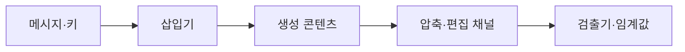
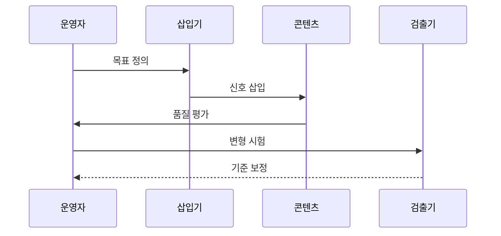

---
sidebar:
  order: 91
  label: "091. 인공지능 워터마킹 (Artificial Intelligence Watermarking)"
  badge:
    text: "미출제 · 70%"
    variant: note
title: "인공지능 워터마킹 (Artificial Intelligence Watermarking)"
date: "2026-07-25T13:32:00+09:00"
tags:
  - "notes-security"
weight: 91
extra:
  question_no: "091"
  source_status: "미출제"
  source_history: ""
  priority: 70
  priority_note: "워터마크 삽입·강건성 검증은 독립 진위기술 축임"
---

## 미리 알고가기

- **인공지능(Artificial Intelligence, AI)**: '에이아이'로 읽고 영문 머리글자로 데이터에서 패턴을 학습해 콘텐츠를 생성·판단하는 기술을 표시
- **가시 워터마크**: 로고·문구로 즉시 인지 가능한 표식
- **비가시 워터마크**: 알고리즘으로 숨은 신호를 검출함
- **검출기**: 콘텐츠의 워터마크 신호를 판정함
- **강건성**: 압축·편집·번역 뒤에도 워터마크를 검출할 수 있는 성질
- **오탐률**: 워터마크가 없는 콘텐츠를 있다고 잘못 판정한 비율
- **검출 임계값**: 워터마크 점수가 이 값을 넘을 때 존재한다고 판정하는 기준
- **서명 출처 정보**: 생성·편집 주체와 이력을 전자서명으로 검증하는 메타데이터
- **워터마크 명칭의 뜻**: 종이 제조 때 빛에 비쳐 보이던 물 표식에서 유래해 콘텐츠의 출처 표식을 뜻함

## Ⅰ. 개요

- 정의/개념: 생성물에 출처 식별 신호를 삽입하는 기술이다
- **배경/필요성**: 변형 뒤 검출 실패와 정상 콘텐츠 오탐을 줄인다

### 쉽게 이해하기 (학습용)
- 디지털 도장은 변형에도 남아야 하며 오탐이 적어야 함

## Ⅱ. 특징

- 콘텐츠 통계에 결합한 신호는 대량 검출을 돕는다
- 신호 강화는 검출률을 높이지만 품질을 낮춘다
- 압축·편집은 신호를 약화해 검출 누락을 만든다
- 제거·위조 공격은 출처 판정의 신뢰를 낮춘다
- 서명 교차 확인은 단일 검출기의 오판을 줄인다

### 쉽게 이해하기 (학습용)

- 신호를 강하게 넣을수록 검출은 쉬워지지만 원본 품질이 떨어질 수 있다.

## Ⅲ. 아키텍처 및 구성요소

| 설계 요소 | 설명 |
|:---|:---|
| 메시지·키 | 주체·모델 식별값과 삽입 비밀 결정 |
| 삽입기 | 품질 제약 안에서 신호 반영 |
| 콘텐츠 | 텍스트·이미지·음성·영상 운반체 |
| 변형 채널 | 압축·편집으로 삽입 신호 변형 |
| 검출기 | 신호 점수와 임계값으로 존재 판정 |

> 요약: 유통 변형별 검출률과 오탐률을 보정한다

### 쉽게 이해하기 (학습용)

- 삽입 신호가 압축·편집 뒤에도 남는지 정상 자료와 함께 시험한다.

## Ⅳ. 원리 및 절차 흐름도

| 절차 | 설명 |
|:---|:---|
| 목표 정의 | 공격자와 변형 조건 확정 |
| 신호 삽입 | 키와 품질 제약으로 신호 반영 |
| 품질 평가 | 원본 대비 품질 저하 측정 |
| 변형 시험 | 압축·편집 뒤 신호 검출 |
| 기준 보정 | 검출률·오탐률로 임계값 조정 |

> 요약: 신호 삽입 뒤 품질과 유통 변형을 시험한다

### 쉽게 이해하기 (학습용)

- 품질·변형별 검출률로 실제 운영 임계값을 정한다.

## Ⅴ. 종류 및 비교

| 판단 기준 | 가시 워터마크 | 비가시 워터마크 | 서명 출처 정보 |
|:---|:---|:---|:---|
| 핵심 특징 | 로고·문구를 직접 표시 | 픽셀·토큰 등에 숨은 신호 삽입 | 생성·편집 이력에 전자서명 첨부 |
| 적용 기준 | 사람이 즉시 합성 여부를 알아야 할 때 | 대량 콘텐츠를 자동 탐지·식별할 때 | 참여 도구가 출처 이력을 보존할 때 |
| 주요 위험 | 자르기·덮어쓰기로 쉽게 제거 | 변형·위조 신호·오탐에 취약 | 메타데이터 제거·미지원 도구에서 단절 |

> 요약: 가시·비가시 신호와 서명 이력을 결합해 검증한다

### 쉽게 이해하기 (학습용)

- 눈에 보이는 표시와 숨은 신호, 서명 이력은 서로 다른 증거를 제공한다.

## Ⅵ. 실무 사례

1. 이미지는 압축·캡처 뒤 검출률과 오탐률을 측정한다
2. 텍스트는 재서술·번역 뒤 신호와 품질을 평가한다

### 쉽게 이해하기 (학습용)

- 이미지는 압축·캡처 뒤 검출률과 정상 이미지 오탐률을 함께 측정함
- 텍스트는 재서술·번역 뒤 신호와 문장 품질을 함께 평가함

## Ⅶ. 결론

- 품질·강건성·오탐을 검증하고 출처 서명과 대조한다.

### 쉽게 이해하기 (학습용)

- 워터마크 하나를 진위 증명으로 믿지 않고 변형 시험과 서명된 출처 이력을 함께 확인함
