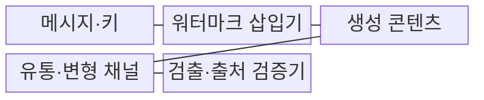
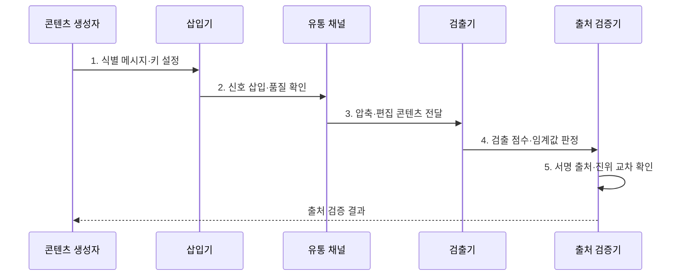

---
sidebar:
  order: 91
  label: "091. 인공지능 워터마킹 (Artificial Intelligence Watermarking)"
  badge:
    text: "미출제 · 70%"
    variant: note
title: "인공지능 워터마킹 (Artificial Intelligence Watermarking)"
date: "2026-07-31T02:07:35+09:00"
tags:
  - "notes-security"
weight: 91
extra:
  question_no: "091"
  source_status: "미출제"
  source_history: ""
  priority: 70
  priority_note: "워터마크 삽입·강건성 검증은 독립 진위기술 축임"
---

## 미리 알고가기

- **인공지능 워터마킹(AI Watermarking)**: AI 생성 콘텐츠에 출처 식별 신호를 삽입하고 검출하는 기술이다.
- **가시 워터마크(Visible Watermark)**: 로고·문구처럼 사람이 즉시 알아볼 수 있는 표식이다.
- **비가시 워터마크(Invisible Watermark)**: 콘텐츠에 숨겨 알고리즘으로 검출하는 신호이다.
- **검출기(Detector)**: 콘텐츠의 워터마크 신호 점수를 계산하고 존재 여부를 판정한다.
- **강건성(Robustness)**: 압축·편집·번역 뒤에도 워터마크를 검출할 수 있는 성질이다.
- **오탐률(False Positive Rate)**: 워터마크 없는 콘텐츠를 있다고 잘못 판정한 비율이다.
- **검출 임계값(Detection Threshold)**: 신호 점수가 이를 넘을 때 워터마크가 있다고 판단하는 기준이다.
- **출처 정보(Provenance Information)**: 생성·편집 주체와 이력을 검증할 수 있게 기록한 메타데이터이다.
- **하드 바인딩(Hard Binding)**: 암호학적 해시로 자산과 출처 명세를 결속하는 방식이다.
- **소프트 바인딩(Soft Binding)**: 워터마크·지문으로 변형된 자산과 출처 명세를 연결하는 방식이다.
- **NIST AI 100-4**: 합성 콘텐츠 투명성 기술로 워터마킹·출처 추적·탐지를 분석한 공식 보고서이다.
- **C2PA Content Credentials 2.4**: 서명된 출처 이력과 하드·소프트 바인딩을 규정하는 공식 기술 규격이다.

## Ⅰ. 개요

- 정의/개념: 생성 콘텐츠의 **출처 식별 신호 삽입·검출**
- 배경/필요성: 메타데이터만으로는 변형 후 **출처 연결 유지 불가**

### 쉽게 이해하기 (학습용)

- 콘텐츠에 디지털 도장을 넣되 압축·캡처·편집 뒤에도 찾을 수 있고 정상 콘텐츠를 잘못 지목하지 않아야 한다.

## Ⅱ. 특징

- 신호 강도·품질의 **상충관계**
- 유통 변형·제거의 **강건성 요구**
- 서명 출처 결합의 **증거 상호보완**

### 쉽게 이해하기 (학습용)

- 워터마크를 강하게 넣으면 검출은 쉬워지지만 품질이 낮아질 수 있고 약하면 편집 뒤 사라질 수 있다.

## Ⅲ. 구조 및 구성요소

| 구성요소 | 책임 |
|:---|:---|
| 메시지·키 | **주체·모델 식별값·비밀** 결정 |
| 워터마크 삽입기 | 품질 제약 내 **신호 반영** |
| 생성 콘텐츠 | **텍스트·이미지·음성·영상** |
| 유통·변형 채널 | **압축·편집·캡처·번역** |
| 검출·출처 검증기 | **점수·서명·이력** 교차 확인 |

### 쉽게 이해하기 (학습용)

- 콘텐츠에 키 기반 신호를 넣고 실제 유통 과정의 변형을 거친 뒤 검출 점수와 서명된 출처 이력을 함께 확인한다.

## Ⅳ. 흐름도

**동작 원리**

1. **식별 메시지·키 설정**: 주체·모델·콘텐츠 연결
2. **신호 삽입·품질 확인**: 품질 저하·지각성 측정
3. **압축·편집 콘텐츠 전달**: 실제 유통 변형 적용
4. **검출 점수·임계값 판정**: 검출률·오탐률 보정
5. **서명 출처·진위 교차 확인**: 워터마크·이력 증거 결합

### 쉽게 이해하기 (학습용)

- 운영 임계값은 깨끗한 원본뿐 아니라 압축·캡처·자르기 같은 실제 변형별 검출률과 정상 자료 오탐률로 정한다.

## Ⅴ. 종류 및 비교

| 콘텐츠 출처 표식 | 가시 워터마크 | 비가시 워터마크 | 서명 출처 정보 |
|:---|:---|:---|:---|
| 적용 기준 | **즉시 합성 표시** | **대량 자동 탐지** | **생성·편집 이력 검증** |
| 핵심 특징 | **로고·문구 직접 표시** | **숨은 신호 자동 검출** | **전자서명 이력 제공** |
| 한계 | **자르기·덮어쓰기** | **변형·위조·오탐** | **메타데이터 제거·단절** |

### 쉽게 이해하기 (학습용)

- 눈에 보이는 표시와 숨은 신호와 서명 이력은 서로 다른 증거이므로 하나만 진위의 절대 증명으로 쓰지 않는다.

## Ⅵ. 실무 고려사항 및 대책

| 고려사항 | 대책 | 효과 |
|:---|:---|:---|
| **합성 콘텐츠 투명성 부족** | **NIST AI 100-4 기반 평가** | **검출·출처 기술 역할 구분** |
| **출처 이력 단절** | **C2PA 2.4 하드·소프트 결속** | **변형 자산의 이력 복구** |
| **품질·오탐·제거 공격** | **변형별 검출률·오탐률 시험** | **운영 임계값·한계 명시** |

### 쉽게 이해하기 (학습용)

- 이미지 플랫폼은 압축·캡처 후 워터마크 검출률과 정상 이미지 오탐률을 측정하고 C2PA 서명 이력과 교차 확인한다.

## Ⅶ. 결론

- 즉시 고지는 **가시**, 자동 추적은 **비가시·서명 출처 정보** 결합

### 쉽게 이해하기 (학습용)

- 워터마크는 단독 진위 판정기가 아니라 변형에 강한 식별 신호이며 서명된 출처 이력과 결합할 때 증거력이 높아진다.
