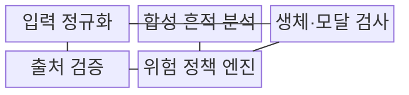
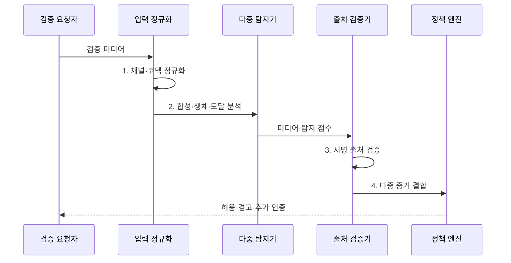

---
sidebar:
  order: 92
  label: "092. 딥페이크 탐지 (Deepfake Detection)"
  badge:
    text: "미출제 · 70%"
    variant: note
title: "딥페이크 탐지 (Deepfake Detection)"
date: "2026-08-02T13:02:00+09:00"
tags:
  - "notes-security"
weight: 92
extra:
  question_no: "092"
  source_status: "미출제"
  source_history: ""
  priority: 70
  priority_note: "무표식 합성물 탐지·임계값 운영은 독립 설계 주제임"
---

## Ⅰ. 개요

핵심 용어

- **딥페이크 탐지**: 딥러닝으로 합성·변조한 얼굴·음성·행동 미디어의 흔적과 생체·출처 증거를 분석해 조작 가능성을 판정하는 기술이다.
- **미지 생성기**: 탐지기 학습에 포함되지 않아 기존 합성 흔적과 다른 특성을 만드는 새로운 생성 모델이다.

- 정의/개념: **딥페이크 탐지**는 영상·음성의 합성 흔적과 생체 일관성·출처 증거를 분석하여 콘텐츠의 조작 가능성과 위험을 판정하는 탐지 기술
- 배경/필요성: 압축과 미지 생성기로 **단일 탐지 성능 저하**

#### 한줄 요약

- 화면의 합성 흔적뿐 아니라 실제 사람의 반응과 촬영·편집 이력까지 서로 다른 증거로 확인한다.

## Ⅱ. 특징

핵심 용어

- **분포 이동·미탐·오탐**: 새 생성기와 코덱으로 입력 특성이 바뀌면 조작을 놓치거나 정상을 조작으로 판정하는 오류율이 달라진다.
- **생체·다중모달·출처**: 실제 생체 반응, 얼굴·음성 동기, 서명된 생성·편집 이력을 독립 증거로 결합한다.

- 생성기·코덱 변화의 **분포 이동**
- 조작 판정 임계값을 낮추면 **미탐 감소·오탐 증가**
- 생체·출처 결합의 **단일 탐지 보완**

#### 한줄 요약

- 새 생성기와 압축은 흔적을 바꾸므로 채널별 성능을 다시 측정하고 고위험 결정은 추가 인증으로 보완한다.

## Ⅲ. 구조 및 구성요소

핵심 용어

- **입력 정규화**: 저장·실시간 채널의 코덱·해상도·음질 차이를 보정해 탐지기가 비교 가능한 입력을 받게 하는 처리이다.
- **위험 정책 엔진**: 합성 흔적·생체·출처 점수와 오류 비용을 결합해 허용·경고·추가 인증을 결정한다.

| 구성요소 | 책임 |
|:---|:---|
| 입력 정규화 | **코덱·해상도·채널 차이** 보정 |
| 합성 흔적 분석 | **영상·음성 특징 점수** 산출 |
| 생체·모달 검사 | **반응·얼굴·음성 동기** 확인 |
| 출처 검증 | **서명·생성·편집 이력** 확인 |
| 위험 정책 엔진 | **오류 비용별 후속 조치** 결정 |

#### 한줄 요약

- 저장 파일과 실시간 영상의 조건을 맞춘 뒤 합성 흔적·생체 반응·서명 이력을 종합해 허용·경고·추가 인증을 결정한다.

## Ⅳ. 흐름도

핵심 용어

- **다중 증거 결합**: 단일 탐지 점수를 진위 확정으로 쓰지 않고 합성 특징·생체 반응·출처 이력을 함께 판정하는 과정이다.
- **오류 비용**: 조작을 놓친 피해와 정상을 차단한 피해를 업무별로 비교하여 운영 임계값과 후속 인증을 정하는 기준이다.

**동작 원리**

1. **채널·코덱 정규화**: 저장·실시간 입력 조건 보정
2. **합성·생체·모달 분석**: 흔적·반응·동기 점수 산출
3. **서명 출처 검증**: 생성·편집 이력과 자산 결속 확인
4. **다중 증거 결합**: 탐지·생체·출처와 오류 비용 반영

#### 한줄 요약

- 탐지 점수는 진위의 확정 증거가 아니므로 금융 인증처럼 피해가 큰 경우에는 실시간 도전과 원본 출처를 추가 확인한다.

## Ⅴ. 종류 및 비교

핵심 용어

- **콘텐츠 흔적·생체 반응·서명 출처**: 저장 미디어 선별, 실시간 신원 확인, 지원 도구의 생성·편집 이력 검증에 각각 적합한 방식이다.

| 딥페이크 검증 유형 | 콘텐츠 흔적 | 생체 반응 | 서명 출처 |
|:---|:---|:---|:---|
| 적용 기준 | **저장 미디어 대량 선별** | **실시간 신원 인증** | 지원 도구의 **이력 검증** |
| 핵심 특징 | **주파수·합성 특징 분석** | **도전·생체 반응 검사** | **서명된 변경 이력 확인** |
| 한계 | **압축·미지 생성기** | **재생·주입 공격** | **미지원·이력 제거** |

#### 한줄 요약

- 저장물은 콘텐츠 흔적, 실시간 인증은 생체 반응, 지원 도구의 콘텐츠는 서명된 이력을 우선 활용한다.

## Ⅵ. 실무 고려사항 및 대책

핵심 용어

- **NIST AI 100-4·C2PA 2.4**: 합성 탐지·워터마킹·출처 기술의 한계를 구분하고 서명된 생성·편집 이력을 검증한다.
- **ISO/IEC 30107-3:2023**: 얼굴·음성 등 생체 제시 공격 탐지의 성능 시험과 보고 방법을 규정한 국제표준이다.

| 문제 | 대책 | 효과 |
|:---|:---|:---|
| **합성 탐지 한계** | **NIST AI 100-4 기반 다중 증거** | **단일 탐지 확정 판단 방지** |
| **생체 사칭 시험** | **ISO/IEC 30107-3:2023 적용** | **제시 공격 성능·보고 일관화** |
| **출처 이력 확인** | **C2PA 2.4 서명 검증** | **생성·편집 주체 추적** |

#### 한줄 요약

- 비대면 금융 인증은 무작위 동작·문구와 얼굴·음성 탐지를 결합하고 탐지기 학습에 없던 생성기와 압축 조건도 시험한다.

## Ⅶ. 결론

핵심 용어

- **위험 기반 딥페이크 대응**: 저위험은 자동 선별하고 미탐 피해가 큰 인증·금융 업무는 생체 도전·출처·원본 확인을 추가하는 원칙이다.

- 미탐 피해가 크면 **다중 증거·추가 인증**, 낮으면 자동 선별

#### 한줄 요약

- 딥페이크 탐지는 조작 가능성을 선별하는 수단이며 고위험 결정은 생체 도전·서명 출처·원본 확인으로 보강해야 한다.
