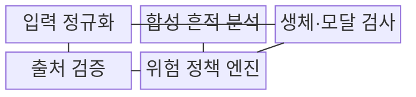
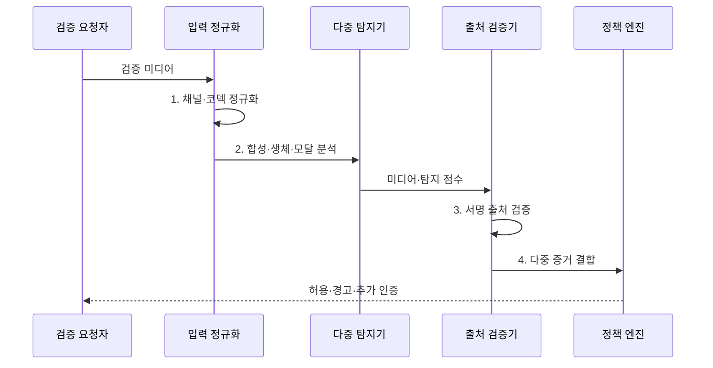

---
sidebar:
  order: 92
  label: "092. 딥페이크 탐지 (Deepfake Detection)"
  badge:
    text: "미출제 · 70%"
    variant: note
title: "딥페이크 탐지 (Deepfake Detection)"
date: "2026-07-31T11:19:21+09:00"
tags:
  - "notes-security"
weight: 92
extra:
  question_no: "092"
  source_status: "미출제"
  source_history: ""
  priority: 70
  priority_note: "무표식 합성물 탐지·임계값 운영은 독립 설계 주제임"
---

## 미리 알고가기

- **딥페이크(Deepfake)**: 딥러닝으로 얼굴·음성·행동을 합성하거나 변조한 미디어이다.
- **합성 콘텐츠 탐지(Synthetic Content Detection)**: 콘텐츠 특징을 분석해 AI 생성·변조 가능성을 추정하는 기술이다.
- **생체 징후(Biometric Cue)**: 눈 깜박임·혈류·입술 움직임 같은 생체 반응 특징이다.
- **출처 검증(Provenance Verification)**: 생성·편집 이력과 전자서명을 확인하는 활동이다.
- **다중 모달 탐지(Multimodal Detection)**: 얼굴 영상·음성·입술 움직임의 일치 여부를 함께 분석하는 방식이다.
- **코덱(Codec)**: 영상·음성을 압축하고 복원하는 규칙과 프로그램이다.
- **미지 생성기(Unseen Generator)**: 탐지기 학습에 포함되지 않은 새로운 합성 모델이다.
- **미탐률(False Negative Rate)**: 조작 콘텐츠를 정상이라고 잘못 판정한 비율이다.
- **오탐률(False Positive Rate)**: 정상 콘텐츠를 조작이라고 잘못 판정한 비율이다.
- **NIST AI 100-4**: 합성 콘텐츠의 탐지·워터마킹·출처 추적 기술과 한계를 분석한 공식 보고서이다.
- **ISO/IEC 30107-3:2023**: 생체정보 제시 공격 탐지의 성능 시험·보고 방법을 규정한 국제표준이다.
- **C2PA Content Credentials 2.4**: 콘텐츠의 서명된 생성·편집 이력을 검증하는 공식 기술 규격이다.

## Ⅰ. 개요

- 정의/개념: 합성 흔적·생체·출처의 **조작 위험 판정**
- 배경/필요성: 압축과 미지 생성기로 **단일 탐지 성능 저하**

### 쉽게 이해하기 (학습용)

- 화면의 합성 흔적뿐 아니라 실제 사람의 반응과 촬영·편집 이력까지 서로 다른 증거로 확인한다.

## Ⅱ. 특징

- 생성기·코덱 변화의 **분포 이동**
- 조작 판정 임계값을 낮추면 **미탐 감소·오탐 증가**
- 생체·출처 결합의 **단일 탐지 보완**

### 쉽게 이해하기 (학습용)

- 새 생성기와 압축은 흔적을 바꾸므로 채널별 성능을 다시 측정하고 고위험 결정은 추가 인증으로 보완한다.

## Ⅲ. 구조 및 구성요소

| 구성요소 | 책임 |
|:---|:---|
| 입력 정규화 | **코덱·해상도·채널 차이** 보정 |
| 합성 흔적 분석 | **영상·음성 특징 점수** 산출 |
| 생체·모달 검사 | **반응·얼굴·음성 동기** 확인 |
| 출처 검증 | **서명·생성·편집 이력** 확인 |
| 위험 정책 엔진 | **오류 비용별 후속 조치** 결정 |

### 쉽게 이해하기 (학습용)

- 저장 파일과 실시간 영상의 조건을 맞춘 뒤 합성 흔적·생체 반응·서명 이력을 종합해 허용·경고·추가 인증을 결정한다.

## Ⅳ. 흐름도

**동작 원리**

1. **채널·코덱 정규화**: 저장·실시간 입력 조건 보정
2. **합성·생체·모달 분석**: 흔적·반응·동기 점수 산출
3. **서명 출처 검증**: 생성·편집 이력과 자산 결속 확인
4. **다중 증거 결합**: 탐지·생체·출처와 오류 비용 반영

### 쉽게 이해하기 (학습용)

- 탐지 점수는 진위의 확정 증거가 아니므로 금융 인증처럼 피해가 큰 경우에는 실시간 도전과 원본 출처를 추가 확인한다.

## Ⅴ. 종류 및 비교

| 딥페이크 검증 유형 | 콘텐츠 흔적 | 생체 반응 | 서명 출처 |
|:---|:---|:---|:---|
| 적용 기준 | **저장 미디어 대량 선별** | **실시간 신원 인증** | 지원 도구의 **이력 검증** |
| 핵심 특징 | **주파수·합성 특징 분석** | **도전·생체 반응 검사** | **서명된 변경 이력 확인** |
| 한계 | **압축·미지 생성기** | **재생·주입 공격** | **미지원·이력 제거** |

### 쉽게 이해하기 (학습용)

- 저장물은 콘텐츠 흔적, 실시간 인증은 생체 반응, 지원 도구의 콘텐츠는 서명된 이력을 우선 활용한다.

## Ⅵ. 실무 고려사항 및 대책

| 고려사항 | 대책 | 효과 |
|:---|:---|:---|
| **합성 탐지 한계** | **NIST AI 100-4 기반 다중 증거** | **단일 탐지 확정 판단 방지** |
| **생체 사칭 시험** | **ISO/IEC 30107-3:2023 적용** | **제시 공격 성능·보고 일관화** |
| **출처 이력 확인** | **C2PA 2.4 서명 검증** | **생성·편집 주체 추적** |

### 쉽게 이해하기 (학습용)

- 비대면 금융 인증은 무작위 동작·문구와 얼굴·음성 탐지를 결합하고 탐지기 학습에 없던 생성기와 압축 조건도 시험한다.

## Ⅶ. 결론

- 미탐 피해가 크면 **다중 증거·추가 인증**, 낮으면 자동 선별

### 쉽게 이해하기 (학습용)

- 딥페이크 탐지는 조작 가능성을 선별하는 수단이며 고위험 결정은 생체 도전·서명 출처·원본 확인으로 보강해야 한다.
