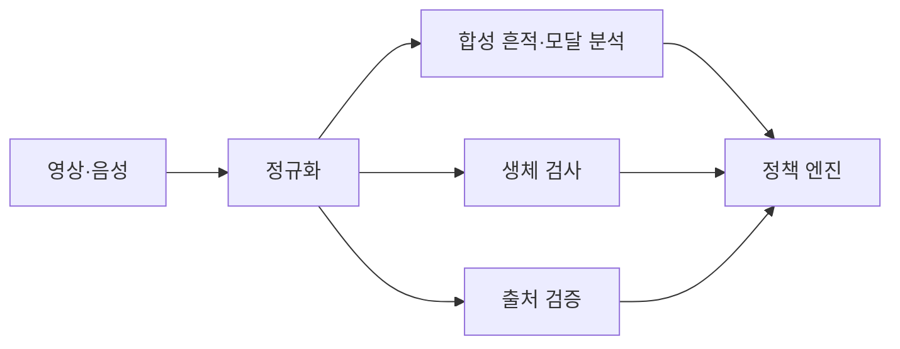
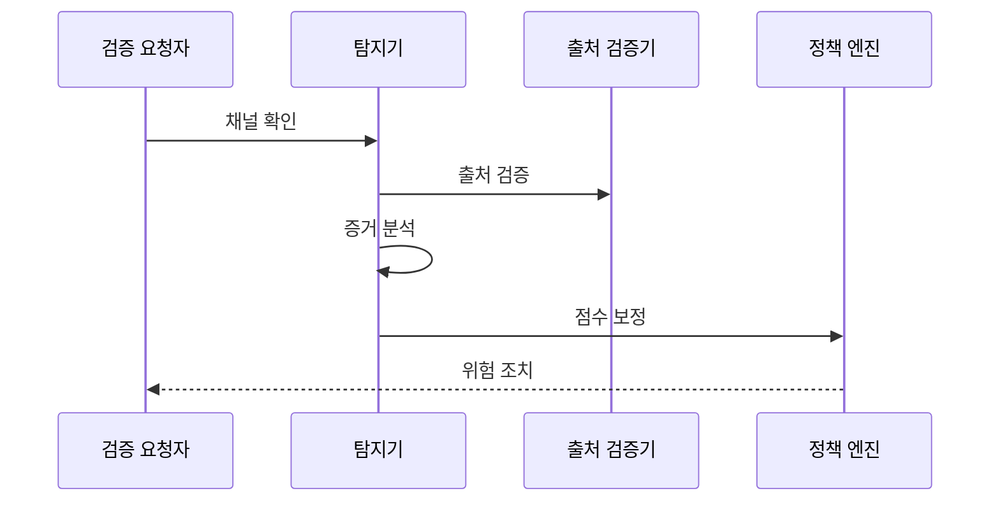

---
sidebar:
  order: 92
  label: "092. 딥페이크 탐지 (Deepfake Detection)"
  badge:
    text: "미출제 · 70%"
    variant: note
title: "딥페이크 탐지 (Deepfake Detection)"
date: "2026-07-25T13:34:00+09:00"
tags:
  - "notes-security"
weight: 92
extra:
  question_no: "092"
  source_status: "미출제"
  source_history: ""
  priority: 70
  priority_note: "무표식 합성물 탐지·임계값 운영은 독립 설계 주제임"
---

## 미리 알고가기

- **인공지능(Artificial Intelligence, AI)**: '에이아이'로 읽고 영문 머리글자로 데이터에서 패턴을 학습해 미디어를 생성·판별하는 기술을 표시
- **딥페이크**: 얼굴·음성을 합성한 조작 미디어
- **생체 징후**: 눈 깜박임 등 생체 반응을 검사함
- **출처 검증**: 생성·편집 이력과 서명을 확인함
- **모달 탐지**: 얼굴 영상·음성·입술 움직임처럼 다른 정보 유형의 일치 여부를 분석하는 방식
- **코덱**: 영상·음성을 압축·복원하는 규칙과 프로그램
- **임계값**: 탐지 점수가 이 값을 넘을 때 합성 위험으로 판정하는 기준
- **미지 생성기**: 탐지기 학습에 포함되지 않은 새로운 합성 모델
- **Deepfake 읽기와 표기**: “딥페이크”로 읽고 Deep Learning과 Fake를 합친 말로 심층학습 기반 조작물을 뜻함

## Ⅰ. 개요

- 정의/개념: 합성 흔적·생체·출처로 조작 여부를 판정한다
- **배경/필요성**: 압축·새 생성기에 약한 단일 탐지의 오판을 줄인다

### 쉽게 이해하기 (학습용)
- 합성 흔적, 생체 반응, 촬영 이력을 함께 확인함

## Ⅱ. 특징

- 생성기·데이터 변화는 미지 조작의 미탐을 높인다
- 압축·재촬영은 합성 흔적을 바꿔 탐지를 약화한다
- 오류 비용별 임계값은 인증·선별 피해를 조정한다
- 탐지 점수만으로 진위를 단정하면 오판 피해가 생긴다
- 생체·출처 결합은 단일 흔적 실패를 보완한다

### 쉽게 이해하기 (학습용)

- 압축과 새 생성기는 흔적을 바꾸므로 채널별 오탐·미탐을 다시 측정한다.

## Ⅲ. 아키텍처 및 구성요소

| 설계 요소 | 설명 |
|:---|:---|
| 정규화 | 코덱·해상도 차이를 분석 입력으로 변환 |
| 모달 탐지 | 얼굴·음성·입술 동기 점수 산출 |
| 생체 검사 | 재생 공격과 생체 반응 구분 |
| 출처 검증 | 서명·콘텐츠 편집 이력 검증 |
| 정책 엔진 | 오류 비용별 점수로 최종 판정 |

> 요약: 합성·생체·출처 증거로 조작 위험을 판정한다

### 쉽게 이해하기 (학습용)

- 콘텐츠 흔적·생체 반응·출처 이력을 합쳐 한 증거의 실패를 보완한다.

## Ⅳ. 원리 및 절차 흐름도

| 절차 | 설명 |
|:---|:---|
| 채널 확인 | 저장 파일·실시간 입력 구분 |
| 출처 검증 | 서명·편집 이력 확인 |
| 증거 분석 | 합성 흔적과 생체 반응 검사 |
| 점수 보정 | 채널별 오류 비용 반영 |
| 위험 조치 | 허용·경고·추가 인증 결정 |

> 요약: 채널·출처 검증 뒤 증거 점수를 보정한다

### 쉽게 이해하기 (학습용)

- 파일과 실시간 채널을 구분해 점수와 후속 인증 수준을 정한다.

## Ⅴ. 종류 및 비교

| 판단 기준 | 콘텐츠 흔적 | 생체 반응 | 서명 출처 |
|:---|:---|:---|:---|
| 핵심 특징 | 영상·음성의 합성 특징·주파수 분석 | 실시간 도전·생체 반응 검사 | 서명된 생성·변경 이력 확인 |
| 적용 기준 | 저장 미디어를 대량 선별할 때 | 금융 인증 등 실시간 사칭을 막을 때 | 촬영·편집 도구가 출처 정보를 지원할 때 |
| 주요 위험 | 압축·새 생성기로 성능 저하 | 고품질 재생·주입 공격에 우회 | 미지원·이력 제거 시 판별 불가 |

> 요약: 흔적·반응·출처를 결합해 탐지 실패를 보완한다

### 쉽게 이해하기 (학습용)

- 저장물은 흔적, 실시간 인증은 생체, 지원 도구는 서명을 우선 활용한다.

## Ⅵ. 실무 사례

1. 금융은 동작·문구 도전과 얼굴·음성 탐지를 결합한다
2. 플랫폼은 미지 생성기·압축 세트로 탐지기를 평가한다

### 쉽게 이해하기 (학습용)

- 금융 인증은 무작위 동작·문구와 얼굴·음성 탐지를 결합함
- 플랫폼은 학습에 없던 생성기와 여러 압축 조건으로 탐지기를 평가함

## Ⅶ. 결론

- 생성기 변형별 증거를 보정하고 추가 검증한다.

### 쉽게 이해하기 (학습용)

- 탐지 점수는 조작 가능성의 근거이므로 고위험 결정은 출처·생체 검증을 추가함
