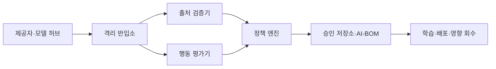
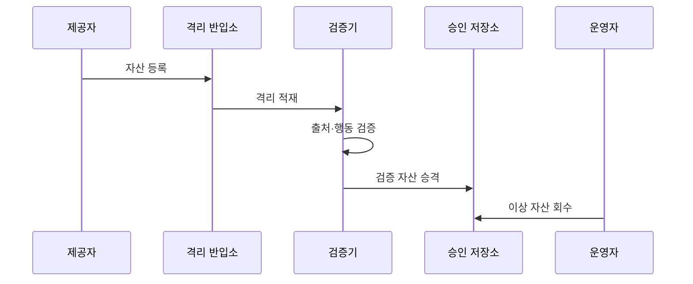

---
sidebar:
  order: 93
  label: "093. AI 공급망 보안 (AI Supply Chain Security)"
  badge:
    text: "기출 · 70%"
    variant: note
title: "AI 공급망 보안 (AI Supply Chain Security)"
date: "2026-07-27T23:59:59+09:00"
tags:
  - "notes-security"
weight: 93
extra:
  question_no: "093"
  source_status: "기출"
  source_history: "138회"
  priority: 70
  priority_note: "138회 기출이며 모델·데이터·도구 공급망으로 확장됨"
---

## 미리 알고가기

- **인공지능(Artificial Intelligence, AI)**: '에이아이'로 읽고 영문 머리글자로 데이터와 모델을 이용해 판단·콘텐츠를 생성하는 기술을 표시
- **인공지능 자재명세서(AI Bill of Materials, AI-BOM)**: '에이아이봄'으로 읽고 하이픈으로 AI와 자재명세서를 연결해 모델·데이터의 출처와 관계 명세를 표시
- **소프트웨어 자재명세서(Software Bill of Materials, SBOM)**: '에스봄'으로 읽고 영문 머리글자로 패키지·의존성 구성과 출처 명세를 표시
- **모델 아티팩트**: 배포용 가중치·설정·코드 묶음
- **모델 직렬화**: 모델 구조·가중치·객체를 파일로 저장하고 다시 읽는 처리
- **계보 (Lineage)**: 데이터·모델·코드가 어떤 원천과 변환을 거쳐 생성됐는지 잇는 이력
- **샌드박스**: 외부 모델 파일을 열어도 실제 시스템에 영향을 주지 않도록 격리한 실행 환경
- **파인튜닝**: 기존 모델을 특정 데이터·업무에 맞게 추가 학습하는 과정

## Ⅰ. 개요

- 정의/개념: 데이터·모델·코드의 **출처·반입·학습·배포·회수 통제**
- **배경/필요성**: SBOM·서명만으로는 **데이터 오염·모델 백도어 검증 불가**

### 쉽게 이해하기 (학습용)
- 재료인 데이터와 부품인 라이브러리, 조립 공정까지 이력을 연결함

## Ⅱ. 특징

- **AI-BOM·계보**로 데이터·모델·코드의 출처·관계를 추적한다.
- **격리 적재·안전 파싱**으로 모델 직렬화 코드 실행을 제한한다.
- **행동·오염·백도어 평가**로 서명된 자산의 숨은 위험을 검증한다.

### 쉽게 이해하기 (학습용)

- 서명은 출처와 변조 여부를 보여도 백도어가 없다는 뜻은 아니다.

## Ⅲ. 아키텍처 및 구성요소

| 설계 요소 | 설명 |
|:---|:---|
| AI-BOM | **자산 버전·출처·관계 기록** |
| 격리 반입소 | **외부 자산·실행 환경 분리** |
| 출처 검증기 | **해시·서명·라이선스 확인** |
| 행동 평가기 | **오염·취약점·백도어 분석** |
| 정책 엔진 | **학습·배포·회수 결정** |

> 요약: 자산 증거와 계보로 영향 모델을 역추적한다

### 쉽게 이해하기 (학습용)

- 외부 자산을 격리해 출처와 행동을 검사한 뒤 승인 저장소로 옮긴다.

## Ⅳ. 원리 및 절차 흐름도

| 절차 | 설명 |
|:---|:---|
| 자산 등록 | 제공자·버전·해시 기록 |
| 격리 적재 | 안전 파싱·샌드박스로 적재 |
| 출처·행동 검증 | 서명·취약점·백도어 평가 |
| 검증 자산 승격 | 승인 저장소로 자산 이동 |
| 이상 자산 회수 | 영향 모델 중단·재학습 |

> 요약: 외부 자산을 격리 검증한 뒤 승인하거나 회수한다

### 쉽게 이해하기 (학습용)

- 자산 등록부터 이상 발견 뒤 회수까지 같은 계보로 연결한다.

## Ⅴ. 종류 및 비교

| AI 공급망 자산 | 데이터셋 | 모델 아티팩트 | 소프트웨어 패키지 |
|:---|:---|:---|:---|
| 적용 기준 | 라벨·분포 평가 | 격리 적재/행동 검사 | 악성코드/재현 평가 |
| 핵심 특징 | 학습 표본·라벨·분포 | 가중치·설정·코드 묶음 | 실행 라이브러리·의존성 |
| 한계 | 오염·편향·라이선스 위반 | 백도어·직렬화 코드 실행 | 취약점·빌드 의존성 공격 |

> 요약: 데이터·모델·패키지별로 다른 보안 검사를 적용한다

### 쉽게 이해하기 (학습용)

- 데이터는 오염, 모델은 행동·직렬화, 패키지는 취약점·빌드를 중점 검사한다.

## Ⅵ. 실무 사례

1. 모델 허브의 **격리·행동 평가 통과 자산만 승격**

### 쉽게 이해하기 (학습용)

- 외부 모델은 격리 환경에서 출처·해시·백도어 행동을 검증한 뒤 승인 저장소로 승격하고 AI-BOM으로 배포 모델까지 계보를 연결한다.

## Ⅶ. 결론

- 외부 AI 자산의 출처 불명확성과 숨은 위험을 줄이기 위해 계보·무결성·행동 평가·영향 모델을 검토하여, AI-BOM과 격리 검증을 공급망 통제에 활용해야 한다.

### 쉽게 이해하기 (학습용)

- 문제가 발견되면 AI-BOM과 계보로 영향받은 모델을 찾아 중단·재학습함
