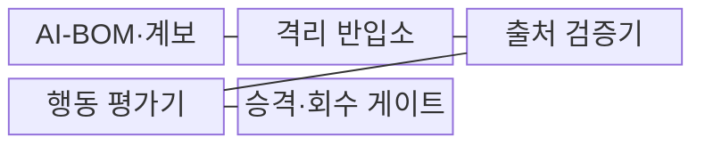
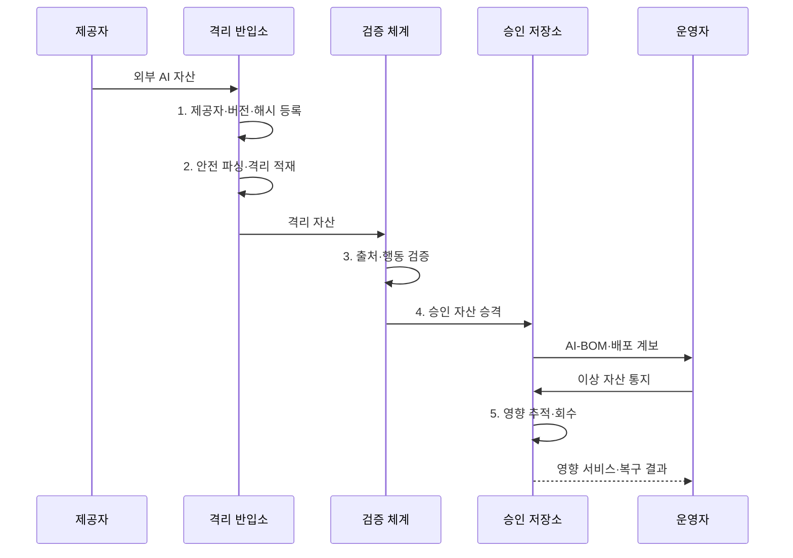

---
sidebar:
  order: 93
  label: "093. AI 공급망 보안 (AI Supply Chain Security)"
  badge:
    text: "기출 · 70%"
    variant: note
title: "AI 공급망 보안 (AI Supply Chain Security)"
date: "2026-07-31T02:08:22+09:00"
tags:
  - "notes-security"
weight: 93
extra:
  question_no: "093"
  source_status: "기출"
  source_history: "138회"
  priority: 70
  priority_note: "138회 기출이며 모델·데이터·도구 공급망으로 확장됨"
---

## 미리 알고가기

- **AI 공급망(AI Supply Chain)**: 데이터·모델·코드·인프라가 수집·학습·배포되는 전체 연결이다.
- **AI 자재명세서(AI Bill of Materials, AI-BOM)**: 모델·데이터·프레임워크·의존성의 구성과 출처 관계를 기록한 명세서이다.
- **소프트웨어 자재명세서(Software Bill of Materials, SBOM)**: 소프트웨어 패키지·버전·의존성·출처를 기록한 명세서이다.
- **모델 아티팩트(Model Artifact)**: 배포용 가중치·설정·코드를 묶은 산출물이다.
- **모델 직렬화(Model Serialization)**: 모델 구조·가중치·객체를 파일로 저장하고 복원하는 처리이다.
- **계보(Lineage)**: 데이터·모델·코드가 거친 원천과 변환을 연결한 이력이다.
- **샌드박스(Sandbox)**: 외부 자산 실행이 실제 시스템에 미치는 영향을 제한하는 격리 환경이다.
- **파인튜닝(Fine-Tuning)**: 기존 모델을 특정 데이터와 업무에 맞게 추가 학습하는 과정이다.
- **NIST SP 800-218A**: 생성형 AI·이중용도 기반모델 개발을 위한 SSDF 공식 커뮤니티 프로파일이다.
- **OWASP LLM03:2025 Supply Chain**: 데이터·모델·배포 플랫폼의 공급망 위험을 분류한 공식 항목이다.
- **NIST AI 100-2e2025**: AI 데이터·모델의 오염·회피·프라이버시 공격을 체계화한 공식 보고서이다.

## Ⅰ. 개요

- 정의/개념: AI 자산의 **출처·반입·학습·배포 통제**
- 배경/필요성: 서명·SBOM의 **오염·백도어 판정 불가**

### 쉽게 이해하기 (학습용)

- 재료인 데이터와 부품인 모델·라이브러리와 조립 공정인 학습·배포의 이력을 하나의 계보로 연결한다.

## Ⅱ. 특징

- AI-BOM·계보의 **영향 자산 추적**
- 격리 적재·안전 파싱의 **실행 위험 제한**
- 행동·오염 평가의 **숨은 위험 검증**

### 쉽게 이해하기 (학습용)

- 전자서명은 출처와 변조 여부를 보여 주지만 원래부터 백도어가 들어 있었는지는 별도 행동 평가로 확인해야 한다.

## Ⅲ. 구조 및 구성요소

| 구성요소 | 책임 |
|:---|:---|
| AI-BOM·계보 | **AI-BOM·SBOM·자산 관계** 기록 |
| 격리 반입소 | **외부 자산·실행 환경** 분리 |
| 출처 검증기 | **해시·서명·라이선스** 확인 |
| 행동 평가기 | **오염·취약점·백도어** 분석 |
| 승격·회수 게이트 | **학습·배포 승인·영향 회수** |

### 쉽게 이해하기 (학습용)

- 외부 모델을 격리하여 파일 형식과 출처 및 실제 행동을 검사한 뒤 승인 저장소에만 승격한다.

## Ⅳ. 흐름도

**동작 원리**

1. **제공자·버전·해시 등록**: 자산 식별·책임 기록
2. **안전 파싱·격리 적재**: 직렬화 코드 실행 제한
3. **출처·행동 검증**: 서명·취약점·백도어 평가
4. **승인 자산 승격**: 통과 자산만 승인 저장소로 이동
5. **영향 추적·회수**: 계보 기반 모델 중단·교체·재학습

### 쉽게 이해하기 (학습용)

- 자산 등록부터 이상 발견 뒤 회수까지 같은 AI-BOM과 계보로 연결해 영향받은 모델과 서비스를 빠르게 찾는다.

## Ⅴ. 종류 및 비교

| AI 공급망 자산 | 데이터셋 | 모델 아티팩트 | 소프트웨어 패키지 |
|:---|:---|:---|:---|
| 적용 기준 | **출처·라벨·분포** | **격리 적재·행동** | **취약점·빌드 재현** |
| 핵심 특징 | **학습 표본·라벨** | **가중치·설정·코드** | **라이브러리·의존성** |
| 한계 | **오염·편향·라이선스** | **백도어·직렬화 실행** | **취약점·빌드 오염** |

### 쉽게 이해하기 (학습용)

- 데이터는 오염과 권리, 모델은 숨은 행동과 직렬화, 패키지는 취약점과 빌드 출처를 중점 검사한다.

## Ⅵ. 실무 고려사항 및 대책

| 고려사항 | 대책 | 효과 |
|:---|:---|:---|
| **AI 안전개발 관행 누락** | **NIST SP 800-218A 적용** | **모델 SDLC 공급망 통제** |
| **LLM 외부 자산 위험** | **OWASP LLM03:2025 적용** | **모델·데이터·플랫폼 점검** |
| **서명된 악성 행동** | **격리 파싱·백도어·오염 평가** | **신뢰 출처의 숨은 위험 차단** |

### 쉽게 이해하기 (학습용)

- 모델 허브의 외부 자산은 격리 환경에서 출처·해시·직렬화·백도어 행동을 검증한 뒤 승인 저장소로 승격한다.

## Ⅶ. 결론

- 출처·행동 검증 통과만 **승격**, 이상 자산은 계보로 **회수**

### 쉽게 이해하기 (학습용)

- AI 공급망 보안은 명세서 보유에 그치지 않고 외부 자산의 실제 행동을 검증하고 이상 시 영향 모델을 회수하는 체계이다.
