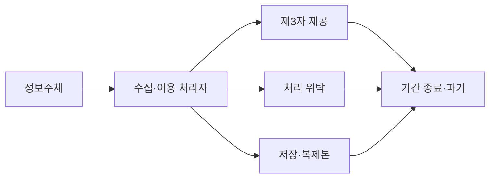
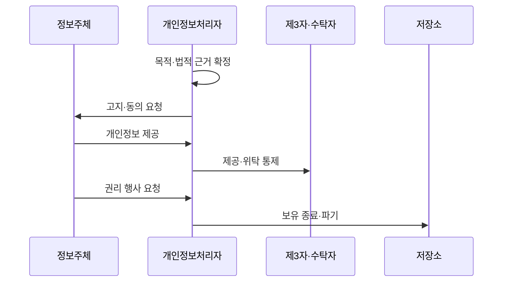

---
sidebar:
  order: 94
  label: "094. 개인정보보호법 — 수집·이용·제공·파기 (Personal Data Protection Act)"
  badge:
    text: "기출 · 70%"
    variant: note
title: "개인정보보호법 — 수집·이용·제공·파기 (Personal Data Protection Act)"
date: "2026-07-27T23:59:59+09:00"
tags:
  - "notes-security"
weight: 94
extra:
  question_no: "094"
  source_status: "기출"
  source_history: "137회"
  priority: 70
  priority_note: "137회 기출이며 개인정보 처리 전주기의 기본 법축임"
---

## 미리 알고가기

- **정보주체**: 자신의 개인정보 처리에 권리를 행사함
- **개인정보처리자**: 목적·항목·방법을 결정하고 의무를 부담함
- **수탁자**: 처리자 지시에 따라 위탁 업무를 수행함
- **데이터베이스(Database, DB)**: '디비'로 읽고 영문 머리글자로 개인정보 원본·복제본을 구조화해 저장하는 저장소를 표시
- **제3자 제공**: 제공받는 자가 자신의 목적에 개인정보를 사용하도록 이전하는 처리
- **처리 위탁**: 개인정보처리자의 업무 목적을 수탁자가 대신 수행하도록 맡기는 처리
- **안전조치**: 접근 통제·암호화·접속기록 등 개인정보 유출·변조를 줄이는 보호조치
- **보유기간**: 처리 목적이나 법적 의무에 따라 개인정보를 보관할 수 있는 기간

## Ⅰ. 개요

- 정의/개념: 개인정보 처리 전 과정의 **근거·책임·정보주체 권리를 규율하는 일반법**
- **배경/필요성**: 수집 시점만 관리하면 발생하는 **제공·위탁·복제·파기 통제 공백 방지**

### 쉽게 이해하기 (학습용)
- 개인정보를 왜 처리하고 누구에게 이전하며 언제 지울지 전 과정에서 통제함

## Ⅱ. 특징

- **목적·법적 근거·최소 수집·보유기간**을 처리 전에 확정한다.
- **제3자 제공·처리 위탁**의 목적·책임·감독을 구분한다.
- **안전조치·권리 처리·파기 증적**을 원본·복제본까지 관리한다.

### 쉽게 이해하기 (학습용)

- 처리 목적과 근거를 정하고 필요한 정보만 받아 단계마다 책임을 나눔

## Ⅲ. 아키텍처 및 구성요소

| 설계 요소 | 설명 |
|:---|:---|
| 목적·근거 관리 | **목적·항목·근거·기간 연결** |
| 수집 단계 | **필수·선택 항목 고지·동의** |
| 이전 통제 | **제공·위탁 근거·책임 검사** |
| 안전조치 | **접근통제·암호화·접속기록** |
| 파기 단계 | **기간 만료 원본·복제본 삭제** |

> 요약: 처리 목적·근거를 원본과 복제본까지 통제한다

### 쉽게 이해하기 (학습용)

- 수집한 정보가 제공·위탁·복제되는 모든 경로에 같은 목적과 기간을 연결함

## Ⅳ. 원리 및 절차 흐름도

| 절차 | 설명 |
|:---|:---|
| 목적·법적 근거 확정 | 처리 목적·항목·기간 확정 |
| 고지·동의 요청 | 법정 사항 고지 후 동의 요청 |
| 개인정보 제공 | 필요한 개인정보만 수집 |
| 제공·위탁 통제 | 이전 근거·책임·감독 확인 |
| 권리 행사 요청 | 열람·정정·삭제 요구 처리 |
| 보유 종료·파기 | 법정 보존분 제외 후 삭제 |

> 요약: 근거 확정 뒤 단계별 통제와 파기를 수행한다

### 쉽게 이해하기 (학습용)

- 먼저 처리 근거를 정한 뒤 이용·이전·보호·파기를 순서대로 확인함

## Ⅴ. 종류 및 비교

| 개인정보 처리 관계 | 수집·이용 | 제3자 제공 | 처리 위탁 |
|:---|:---|:---|:---|
| 적용 기준 | 처리자의 업무 목적 | 수령자의 독립 목적 | 처리자의 업무 대행 |
| 핵심 특징 | 최소 수집·목적 내 이용 | 제공 근거·고지 관리 | 계약·공개·수탁자 감독 |
| 한계 | 목적 외 이용·과다 보유 | 재제공·이력 통제 필요 | 재위탁·과도 권한 위험 |

> 요약: 처리 관계별 근거를 확인하고 책임을 분리한다

### 쉽게 이해하기 (학습용)

- 직접 이용·제3자 제공·위탁은 목적과 책임 주체가 서로 다름

## Ⅵ. 실무 사례

1. 회원 정보의 **목적별 항목·보유기간·파기 상태 관리**

### 쉽게 이해하기 (학습용)

- 회원정보는 수집 목적별 항목과 보유기간을 등록하고 탈퇴·법정 보존 사유에 따라 파기 또는 분리 보관 상태를 추적한다.

## Ⅶ. 결론

- 개인정보의 무단 처리와 권리 침해를 막기 위해 처리 목적·법적 근거·제공·위탁·보유기간을 검토하여, 전 수명주기에 개인정보 보호법의 최소 처리와 책임 원칙을 적용해야 한다.

### 쉽게 이해하기 (학습용)

- 수집 화면뿐 아니라 제공·위탁·복제·파기까지 같은 목적과 근거를 추적해야 함
