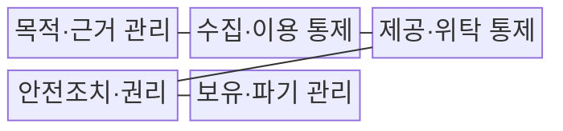
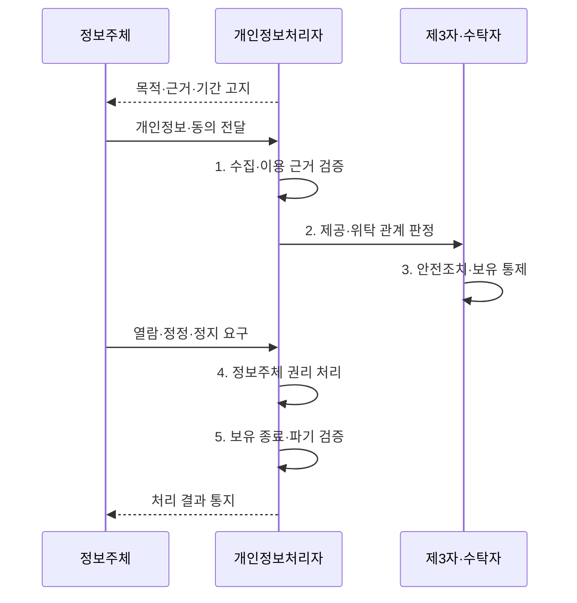

---
sidebar:
  order: 94
  label: "094. 개인정보보호법 — 수집·이용·제공·파기 (Personal Data Protection Act)"
  badge:
    text: "기출 · 70%"
    variant: note
title: "개인정보보호법 — 수집·이용·제공·파기 (Personal Data Protection Act)"
date: "2026-08-02T13:06:00+09:00"
tags:
  - "notes-security"
weight: 94
extra:
  question_no: "094"
  source_status: "기출"
  source_history: "137회"
  priority: 70
  priority_note: "137회 기출이며 개인정보 처리 전주기의 기본 법축임"
---

## Ⅰ. 개요

핵심 용어

- **개인정보 보호법**: 개인정보 처리 원칙, 정보주체의 권리, 개인정보처리자의 책임을 수집부터 파기까지 규율하는 일반법이다.
- **정보주체·처리자**: 정보주체는 자신의 정보에 관한 권리를 행사하는 개인이고 처리자는 업무 목적으로 개인정보파일을 운용하는 주체이다.

- 정의/개념: **개인정보 보호법** 은 개인정보의 수집·이용·제공·보관·파기 전 과정에 대한 처리 근거와 처리자 책임·정보주체 권리를 규율하는 일반법
- 배경/필요성: 수집 중심 관리의 **이전·복제·파기 공백**

#### 한줄 요약

- 개인정보를 왜 처리하고 누구에게 어떤 책임으로 이전하며 언제 모든 복제본을 지울지를 전 과정에서 통제한다.

## Ⅱ. 특징

핵심 용어

- **처리 정당성·목적 제한**: 적법한 근거와 명확한 목적에 필요한 최소 정보만 처리하고 다른 목적으로 임의 이용하지 않는 원칙이다.
- **안전조치·보유기간**: 유출·변조·훼손 방지 조치를 적용하고 처리 목적이나 법적 의무가 허용한 기간까지만 보관한다.

- 목적·근거·최소수집의 **처리 정당성**
- 제공·위탁 구분의 **책임 경계**
- 안전조치·권리·파기의 **수명주기 증적**

#### 한줄 요약

- 같은 외부 이전이라도 제3자가 자기 목적으로 쓰는 제공과 원래 처리자의 업무를 대신하는 위탁은 근거와 책임이 다르다.

## Ⅲ. 구조 및 구성요소

핵심 용어

- **제3자 제공·처리 위탁**: 제공은 수령자가 독립 목적에 쓰는 이전이고 위탁은 처리자의 업무 목적을 수탁자가 대신 수행하는 관계이다.
- **원본·복제본 파기**: 보유 목적이 끝나면 법정 보존분을 제외하고 운영·백업·로그 등 모든 개인정보 사본을 추적해 삭제하는 처리이다.

| 구성요소 | 책임 |
|:---|:---|
| **목적·근거 관리** | 목적·항목·근거·기간 **연결** |
| **수집·이용 통제** | **최소 수집**, 목적 내 이용 |
| **제공·위탁 통제** | 이전 근거·계약·감독 **구분** |
| **안전조치·권리** | **접근통제·기록**, 요구 처리 |
| **보유·파기 관리** | 원본·복제본·**법정보존 추적** |

#### 한줄 요약

- 수집한 정보가 이용·제공·위탁·복제되는 모든 경로에 같은 목적·근거·보유기간과 책임자를 연결한다.

## Ⅳ. 흐름도

핵심 용어

- **정보주체 권리**: 처리되는 개인정보의 열람·정정·삭제·처리정지를 요구하고 결과를 통지받을 수 있는 권리이다.
- **파기 증적**: 보유 종료·예외 근거·파기 대상·방법·시점·결과를 기록하여 수명주기 종료를 입증하는 자료이다.

**동작 원리**

1. **수집·이용 근거 검증**: 목적별 적법 근거와 최소 범위 확인
2. **제공·위탁 관계 판정**: 이전 목적과 책임 구조에 따라 구분
3. **안전조치·보유 통제**: 접근 권한과 보유기간을 단계별 적용
4. **정보주체 권리 처리**: 열람·정정·정지 요구를 기한 내 이행
5. **보유 종료·파기 검증**: 파기 결과와 예외 보유 근거 기록

#### 한줄 요약

- 처리 전에 근거를 정하고 단계별 책임을 확인하며 목적과 보유기간이 끝나면 법정 보존분을 제외하고 삭제한다.

## Ⅴ. 종류 및 비교

핵심 용어

- **수집·이용·제공·위탁**: 직접 업무 처리, 수령자의 독립 목적, 처리자의 업무 대행에 따라 근거·고지·계약·감독 책임이 달라진다.

| 개인정보 처리 관계 | 수집·이용 | 제3자 제공 | 처리 위탁 |
|:---|:---|:---|:---|
| **적용 기준** | 처리자의 **업무 목적** | 수령자의 **독립 목적** | 처리자의 **업무 대행** |
| 핵심 특징 | **최소 수집·목적 제한** | **제공 근거·고지** | **계약·공개·감독** |
| **한계** | **목적 외 이용·과다 보유** | **재제공·이력 통제** | **재위탁·과도 권한** |

#### 한줄 요약

- 직접 이용·제3자 제공·위탁은 개인정보가 이동하는 모습이 비슷해도 목적과 책임 주체가 서로 다르다.

## Ⅵ. 실무 고려사항 및 대책

핵심 용어

- **보호법 제15조·제17조·제26조**: 수집·이용, 제3자 제공, 처리 위탁의 법적 근거와 고지·문서화·감독 의무를 규정한다.
- **보호법 제21조·제29조**: 개인정보의 파기와 유출·변조·훼손을 막기 위한 안전성 확보조치 의무를 규정한다.

| 문제 | 대책 | 효과 |
|:---|:---|:---|
| **수집·제공 법적 근거** | **보호법 제15조·제17조 매핑** | **목적 외·무근거 처리** 방지 |
| **업무위탁 책임** | **보호법 제26조 계약·감독** | **수탁자·재위탁** 통제 |
| **안전조치·보유 종료** | **보호법 제29조·제21조 적용** | **유출 방지·파기 증명** |

#### 한줄 요약

- 회원정보는 목적별 항목과 보유기간을 등록하고 탈퇴·법정 보존 사유에 따라 원본과 복제본의 파기 또는 보존 상태를 추적한다.

## Ⅶ. 결론

핵심 용어

- **개인정보 전주기 추적**: 수집 근거·이용 목적·이전 관계·복제 위치·보유기간·파기 결과를 하나의 책임 체계로 연결하는 원칙이다.

- 처리 근거·책임·보유기간이 확인된 범위만 **수집·제공·위탁**

#### 한줄 요약

- 개인정보 보호는 동의 화면만 관리하는 일이 아니라 제공·위탁·복제·파기까지 같은 목적과 근거를 추적하는 일이다.
