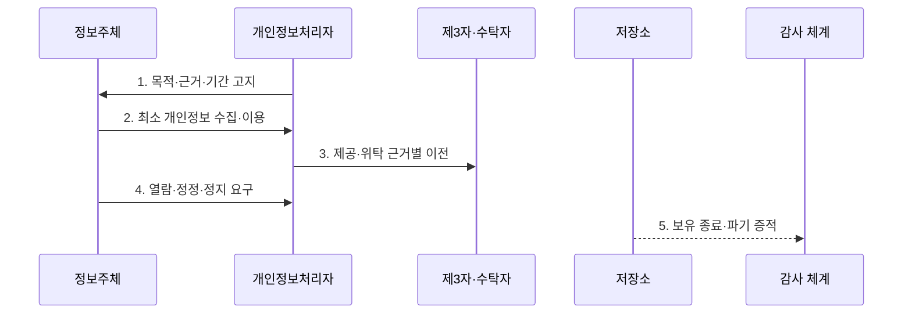

---
sidebar:
  order: 94
  label: "094. 개인정보보호법 — 수집·이용·제공·파기 (Personal Data Protection Act)"
  badge:
    text: "기출 · 70%"
    variant: note
title: "개인정보보호법 — 수집·이용·제공·파기 (Personal Data Protection Act)"
date: "2026-07-27T23:59:59+09:00"
tags:
  - "notes-security"
weight: 94
extra:
  question_no: "094"
  source_status: "기출"
  source_history: "137회"
  priority: 70
  priority_note: "137회 기출이며 개인정보 처리 전주기의 기본 법축임"
---

## 미리 알고가기

- **개인정보 보호법(Personal Information Protection Act, PIPA)**: 개인정보 처리 원칙과 정보주체의 권리 및 처리자의 책임을 규율하는 일반법이다.
- **정보주체(Data Subject)**: 처리되는 정보로 알아볼 수 있는 사람으로서 자신의 개인정보에 관한 권리를 행사한다.
- **개인정보처리자(Personal Information Controller)**: 업무 목적상 개인정보파일을 운용하기 위해 개인정보를 처리하는 주체이다.
- **수탁자(Processor)**: 개인정보처리자의 위탁 업무를 수행하며 법정 의무와 감독을 받는 자이다.
- **제3자 제공(Third-Party Provision)**: 제공받는 자가 자신의 목적에 개인정보를 이용하도록 이전하는 처리이다.
- **처리 위탁(Processing Entrustment)**: 처리자의 업무 목적을 수탁자가 대신 수행하도록 맡기는 처리이다.
- **안전성 확보조치(Security Safeguards)**: 유출·변조·훼손 방지를 위한 기술적·관리적·물리적 조치이다.
- **보유기간(Retention Period)**: 처리 목적이나 법적 의무에 따라 개인정보를 보관할 수 있는 기간이다.
- **개인정보 보호법 제15조**: 개인정보의 수집·이용에 필요한 법적 근거를 규정한다.
- **개인정보 보호법 제17조**: 개인정보의 제3자 제공 근거와 고지사항을 규정한다.
- **개인정보 보호법 제26조**: 업무위탁의 문서화·공개·감독 의무를 규정한다.
- **개인정보 보호법 제21조·제29조**: 개인정보의 파기와 안전조치 의무를 각각 규정한다.

## Ⅰ. 개요

- 정의: 개인정보 전 과정의 **근거·책임·권리 규율**
- 기존 한계: 수집 중심 관리의 **이전·복제·파기 공백**

### 쉽게 이해하기 (학습)

- 개인정보를 왜 처리하고 누구에게 어떤 책임으로 이전하며 언제 모든 복제본을 지울지를 전 과정에서 통제한다.

## Ⅱ. 특징

- 목적·근거·최소수집의 **처리 정당성**
- 제공·위탁 구분의 **책임 경계**
- 안전조치·권리·파기의 **수명주기 증적**

### 쉽게 이해하기 (학습)

- 같은 외부 이전이라도 제3자가 자기 목적으로 쓰는 제공과 원래 처리자의 업무를 대신하는 위탁은 근거와 책임이 다르다.

## Ⅲ. 구조 및 구성요소

| 설계 요소 | 설명 |
|:---|:---|
| 목적·근거 관리 | 목적·항목·근거·기간 연결 |
| 수집·이용 통제 | 최소 수집·목적 내 이용 |
| 제공·위탁 통제 | 이전 근거·계약·감독 구분 |
| 안전조치·권리 | 접근통제·기록·요구 처리 |
| 보유·파기 관리 | 원본·복제본·법정보존 추적 |

### 쉽게 이해하기 (학습)

- 수집한 정보가 이용·제공·위탁·복제되는 모든 경로에 같은 목적·근거·보유기간과 책임자를 연결한다.

## Ⅳ. 흐름도

| 절차 | 설명 |
|:---|:---|
| 목적·근거·기간 고지 | 처리 전 법적 근거 확정 |
| 최소 개인정보 수집·이용 | 필요 항목만 목적 내 처리 |
| 제공·위탁 근거별 이전 | 고지·계약·수탁자 감독 |
| 열람·정정·정지 요구 | 본인 확인·예외·결과 통지 |
| 보유 종료·파기 증적 | 법정보존 외 원본·복제 삭제 |

> 요약: 법적 근거에 따라 처리하고 종료 시 파기한다.

### 쉽게 이해하기 (학습)

- 처리 전에 근거를 정하고 단계별 책임을 확인하며 목적과 보유기간이 끝나면 법정 보존분을 제외하고 삭제한다.

## Ⅴ. 종류 및 비교

| 개인정보 처리 관계 | 수집·이용 | 제3자 제공 | 처리 위탁 |
|:---|:---|:---|:---|
| 적용 기준 | 처리자의 업무 목적 | 수령자의 독립 목적 | 처리자의 업무 대행 |
| 핵심 특징 | **최소 수집·목적 제한** | **제공 근거·고지** | **계약·공개·감독** |
| 한계 | 목적 외 이용·과다 보유 | 재제공·이력 통제 | 재위탁·과도 권한 |

### 쉽게 이해하기 (학습)

- 직접 이용·제3자 제공·위탁은 개인정보가 이동하는 모습이 비슷해도 목적과 책임 주체가 서로 다르다.

## Ⅵ. 실무 고려사항 및 대책

| 고려사항 | 대책 | 효과 |
|:---|:---|:---|
| 수집·제공 법적 근거 | **보호법 제15조·제17조 매핑** | 목적 외·무근거 처리 방지 |
| 업무위탁 책임 | **보호법 제26조 계약·감독** | 수탁자·재위탁 통제 |
| 안전조치·보유 종료 | **보호법 제29조·제21조 적용** | 유출 방지·파기 증명 |

### 쉽게 이해하기 (학습)

- 회원정보는 목적별 항목과 보유기간을 등록하고 탈퇴·법정 보존 사유에 따라 원본과 복제본의 파기 또는 보존 상태를 추적한다.

## Ⅶ. 결론

- **처리근거·책임주체·보유기간**으로 개인정보 처리를 결정한다.

### 쉽게 이해하기 (학습)

- 개인정보 보호는 동의 화면만 관리하는 일이 아니라 제공·위탁·복제·파기까지 같은 목적과 근거를 추적하는 일이다.
