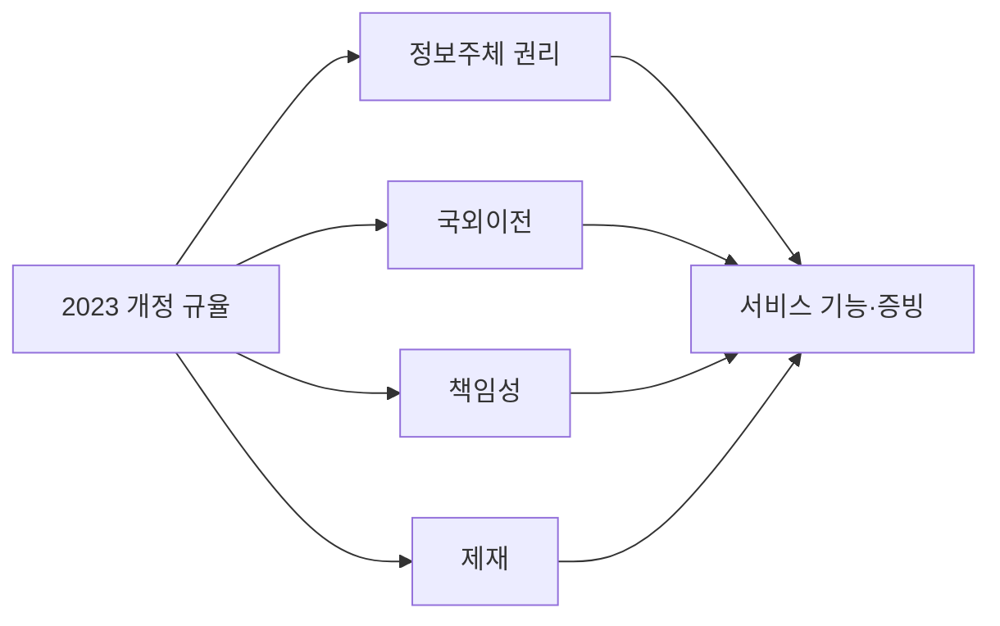
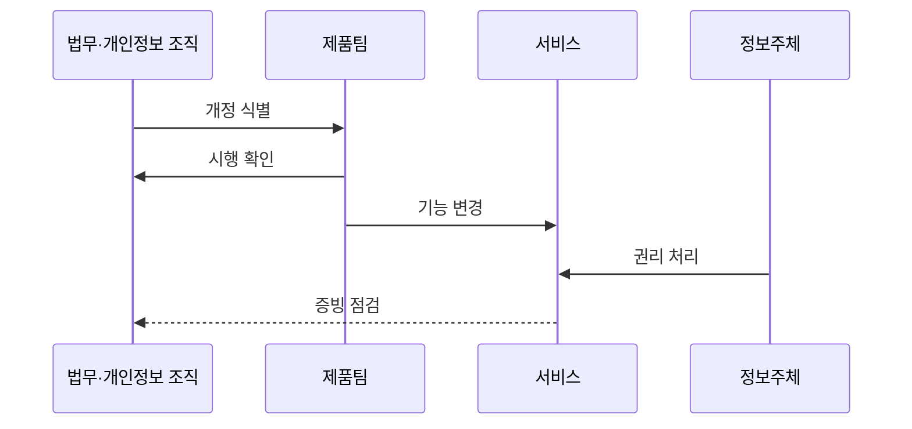

---
sidebar:
  order: 95
  label: "095. 개인정보보호법 2023 개정 — 마이데이터·과징금 (PIPA 2023 Amendment)"
  badge:
    text: "기출 · 50%"
    variant: note
title: "개인정보보호법 2023 개정 — 마이데이터·과징금 (PIPA 2023 Amendment)"
date: "2026-07-27T23:59:59+09:00"
tags:
  - "notes-security"
weight: 95
extra:
  question_no: "095"
  source_status: "기출"
  source_history: "137회"
  priority: 50
  priority_note: "137회 기출이나 개정 연도 단독 반복은 감점함"
---

## 미리 알고가기

- **개인정보 보호법(Personal Information Protection Act, PIPA)**: '피파'로 읽고 영문 머리글자로 개인정보 처리와 정보주체 권리를 규율하는 법률을 표시
- **개인정보 보호책임자(Chief Privacy Officer, CPO)**: '시피오'로 읽고 영문 머리글자로 개인정보 보호 업무를 총괄하는 책임자를 표시
- **인공지능(Artificial Intelligence, AI)**: '에이아이'로 읽고 영문 머리글자로 자동화된 판단·생성 기술을 표시
- **응용 프로그래밍 인터페이스(Application Programming Interface, API)**: '에이피아이'로 읽고 영문 머리글자로 개인정보 요청·전송 연결 규칙을 표시
- **정보주체**: 자신의 개인정보 처리에 관해 열람·정정·삭제·전송·거부 등을 요구하는 개인
- **자동화된 결정**: 사람의 실질적 개입 없이 개인정보 처리 결과만으로 개인에게 영향을 주는 결정
- **전송요구권**: 정보주체가 법정 대상 개인정보를 본인이나 적격 수신자에게 전송하도록 요구하는 권리
- **국외이전**: 개인정보를 해외 수령자·서버·처리 환경으로 보내거나 접근 가능하게 하는 처리
- **과징금**: 법 위반의 경제적 이익 환수와 제재를 위해 부과하는 금전 제재

## Ⅰ. 개요

- **정의/개념**: 2023년 전면 개정으로 **규율 일원화·권리·책임·제재 강화**
- **배경/필요성**: 온라인·오프라인 이원 규율의 **보호 수준·제재 기준 차이 해소**

### 쉽게 이해하기 (학습용)
- 법은 2023년 공포됐으나 조항별 시행일과 하위 규정은 상이함

## Ⅱ. 특징

- **2023년 9월 15일** 처리 기준 일원화·국외이전·과징금 개편 시행.
- **2024년 3월 15일** 자동화된 결정 대응권·CPO 요건 시행.
- 전송요구권은 **2025년 3월 13일 시행 후 분야별 확대**한다.

### 쉽게 이해하기 (학습용)

- 개정은 권리 확대와 처리자 책임 강화가 언제 시행되는지를 함께 확인해야 함

## Ⅲ. 아키텍처 및 구성요소

| 설계 요소 | 설명 |
|:---|:---|
| 규율 일원화 | **온·오프라인 처리 기준 통합** |
| 정보주체 권리 | **전송요구·자동화 결정 대응** |
| 국외이전 | **이전 근거 확대·중지 명령** |
| 책임성 | **CPO 요건·안전조치 강화** |
| 제재 | **전체 매출 3% 상한·무관 매출 제외** |

> 요약: 개정 축별 시행일·대상·기준 확인

### 쉽게 이해하기 (학습용)

- 권리·국외이전·책임·제재를 실제 서비스 기능과 운영 증거에 연결함

## Ⅳ. 원리 및 절차 흐름도

| 절차 | 설명 |
|:---|:---|
| 개정 식별 | 권리·국외이전·책임·제재 매핑 |
| 시행 확인 | 법·시행령·고시의 적용 시점 확인 |
| 기능 변경 | 전송·설명·거부·이전 기능 구현 |
| 권리 처리 | 본인·예외·처리 결과·이의 확인 |
| 증빙 점검 | 요청·근거·조치 기록 검토 |

> 요약: 개정별 시행 시점을 확인해 권리 기능과 증빙을 반영함

### 쉽게 이해하기 (학습용)

- 개정 조항을 화면·API·기록 변경과 연결해 검증함.

## Ⅴ. 종류 및 비교

| 개인정보 보호법 | 이전 규정 | 2023 개정 이후 |
|:---|:---|:---|
| 적용 기준 | 채널별 분리 규정 | 조항별 시행일·하위 규정 |
| 핵심 특징 | 특례 분리·권리 제한 | 규율 일원화·권리 확대 |
| 한계 | 보호 수준·제재 차이 | 시행 시점 오인 위험 |

> 요약: 정보주체 권리 및 이전 근거와 책임 확대함

### 쉽게 이해하기 (학습용)

- 개정 전후를 비교할 때 새 권리와 적용 시점을 함께 구분함

## Ⅵ. 실무 사례

1. 자동화된 결정은 **거부·설명·인적 재처리 절차 구현**
2. 전송요구권은 **시행 분야·대상 정보·수신자 확인**

### 쉽게 이해하기 (학습용)

- 자동화 결정 서비스는 고지·거부·설명 요구와 예외·이의 처리 기록을 구현함
- 전송요구권은 시행 분야·정보전송자·대상 정보·수신자 기준을 확인한 뒤 API를 구현함

## Ⅶ. 결론

- 공포 연도보다 **조항별 시행일·시행령·고시**를 적용

### 쉽게 이해하기 (학습용)

- 2023년에 공포됐어도 조항별 시행일이 다르므로 최신 시행령·고시에 맞춰 화면·API·기록을 바꿔야 함
