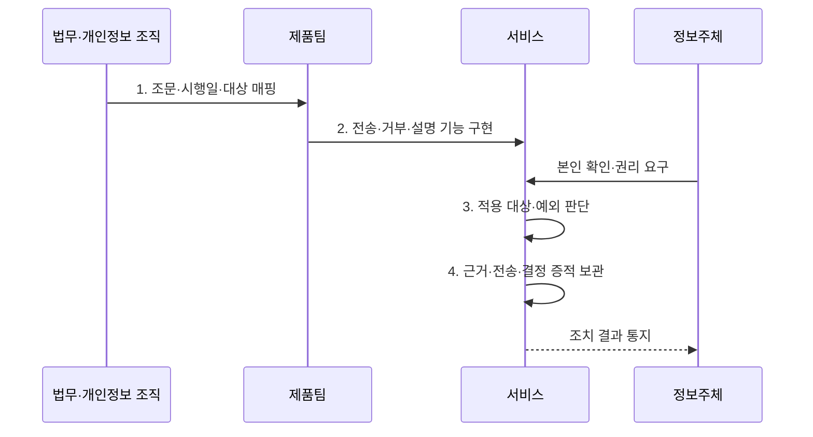

---
sidebar:
  order: 95
  label: "095. 개인정보보호법 2023 개정 — 마이데이터·과징금 (PIPA 2023 Amendment)"
  badge:
    text: "기출 · 50%"
    variant: note
title: "개인정보보호법 2023 개정 — 마이데이터·과징금 (PIPA 2023 Amendment)"
date: "2026-08-02T13:08:00+09:00"
tags:
  - "notes-security"
weight: 95
extra:
  question_no: "095"
  source_status: "기출"
  source_history: "137회"
  priority: 50
  priority_note: "137회 기출이나 개정 연도 단독 반복은 감점함"
---

## Ⅰ. 개요

핵심 용어

- **2023년 개인정보 보호법 개정**: 규율 일원화와 정보주체 권리·국외이전·책임·제재 체계를 개편하고 조항별로 단계 시행한 법률 개정이다.
- **조항별 시행일**: 같은 개정 법률에서도 권리와 의무가 실제 효력을 갖는 날짜가 달라 현행 시행령·고시와 함께 확인해야 하는 기준이다.

- 정의/개념: **개인정보 보호법 2023 개정**은 온·오프라인 규율을 통합하고 자동화된 결정 대응권·전송요구권·제재 체계를 강화한 법률 개정
- 배경/필요성: 온·오프라인의 **보호·제재 기준 이원화**

#### 한줄 요약

- 2023년에 공포된 하나의 개정 법률도 조항별 시행일이 다르므로 현재 시행 중인 법·시행령·고시를 함께 확인해야 한다.

## Ⅱ. 특징

핵심 용어

- **전송요구권·자동화 결정 권리**: 법정 정보를 본인·적격 수신자에게 보내게 하고 완전 자동화된 결정에 거부·설명·인적 검토를 요구하는 권리이다.
- **국외이전·과징금 개편**: 국외 제공·조회·위탁·보관의 근거와 중지 명령을 정비하고 전체 매출액 기준의 금전 제재 체계를 도입한 변화이다.

- 2023년 9월의 **규율·국외이전·제재 개편**
- 2024년 3월의 **자동화 결정 대응권 시행**
- 2025년 3월의 **전송요구권 본격 시행**

#### 한줄 요약

- 개정 취지를 외우는 데 그치지 않고 각 권리가 실제 서비스 화면·API·처리기록에 언제부터 적용되는지를 구분한다.

## Ⅲ. 구조 및 구성요소

핵심 용어

- **CPO(Chief Privacy Officer)·책임성**: 개인정보 보호책임자가 정책·통제·권리 대응·사고 관리를 총괄하고 수행 증적을 통해 책임을 입증하는 체계이다.
- **규율 일원화·시정조치**: 온·오프라인에 분리된 처리 기준을 통합하고 위반 시 중지·개선·과징금 조치를 적용하는 구조이다.

| 구성요소 | 책임 |
|:---|:---|
| **규율 일원화** | 온·오프라인 **처리 기준 통합** |
| **전송요구권** | 본인·적격 수신자에게 **정보 전송** |
| **자동화 결정 권리** | **거부·설명·인적 검토** |
| **국외이전·책임성** | 이전 근거·중지와 **CPO 강화** |
| **과징금·시정조치** | **전체 매출 기준** 제재 |

#### 한줄 요약

- 개정의 각 축을 전송 API·자동결정 안내·국외이전 관리·CPO 감독·과징금 산정 증거에 연결한다.

## Ⅳ. 흐름도

핵심 용어

- **조문·시행일·대상 매핑**: 제품 기능마다 적용 법조문, 시행 시점, 정보·사업자·업무 대상을 연결해 구현 범위를 확정하는 활동이다.
- **권리 처리 증적**: 전송·거부·설명 요구의 본인 확인, 적용·예외 판단, 조치 결과와 통지 이력을 보존한 자료이다.

**동작 원리**

1. **조문·시행일·대상 매핑**: 법·시행령·분야 고시 확인
2. **전송·거부·설명 기능 구현**: 화면·API·인적 검토 연결
3. **적용 대상·예외 판단**: 거절 근거와 인적 재처리 여부 결정
4. **근거·전송·결정 증적 보관**: 요청·판단·조치 이력 감사

#### 한줄 요약

- 법 조항을 단순 정책 문서가 아니라 사용자의 요청 화면과 처리 API 및 담당자의 검토·통지 기록으로 구현한다.

## Ⅴ. 종류 및 비교

핵심 용어

- **개정 전·후 규율**: 개정 전 채널별 특례와 제한된 권리를 규율 일원화·권리 확대·조항별 시행 체계로 바꾼 차이이다.

| 개인정보 보호법 시기 | 개정 전 | 2023 개정 이후 |
|:---|:---|:---|
| **적용 기준** | **채널별 분리 규율** | **조항별 시행일·하위 규정** |
| 핵심 특징 | **특례 분리·권리 제한** | **규율 일원화·권리 확대** |
| **한계** | **보호 수준·제재 차이** | **시행일·대상 분야 오인** |

#### 한줄 요약

- 개정 전후 비교에서는 새 권리의 이름뿐 아니라 적용 대상·예외·분야별 전송 정보와 시행 시점을 함께 적는다.

## Ⅵ. 실무 고려사항 및 대책

핵심 용어

- **보호법 제35조의2·제37조의2**: 개인정보 전송요구권과 자동화된 결정의 거부·설명·검토 요구 권리를 각각 규정한다.
- **보호법 제28조의8·제64조의2**: 국외이전 근거와 전체 매출액 기준 과징금 부과 체계를 각각 규정한다.
- **마이데이터**: 정보주체가 자신의 개인정보를 본인이나 적격 수신자에게 전송하도록 요구하고 이를 주도적으로 활용하는 체계이다.

| 문제 | 대책 | 효과 |
|:---|:---|:---|
| **전 분야 마이데이터** | **보호법 제35조의2·분야 고시 적용** | 대상 정보·수신자의 **적법성** |
| **자동화 결정 대응** | **보호법 제37조의2 절차 구현** | **거부·설명·인적 검토** 보장 |
| **국외이전·제재** | **제28조의8·제64조의2 매핑** | 이전 근거·**과징금 위험** 통제 |

#### 한줄 요약

- 자동화 결정 서비스는 적용 사실과 기준을 공개하고 정보주체의 거부·설명 요구 및 인적 재처리 결과를 기록해야 한다.

## Ⅶ. 결론

핵심 용어

- **현행 규정 기반 구현**: 공포 연도가 아니라 현재 시행 중인 법·시행령·분야 고시를 기준으로 전송·설명·검토·국외이전 기능을 운영하는 원칙이다.

- 시행일·적용 대상별 **전송·설명·인적 검토 기능** 우선 구현

#### 한줄 요약

- 2023년 개정의 실무 핵심은 공포 연도 암기가 아니라 현행 시행령·분야 고시에 맞춰 전송·설명·검토·국외이전 기능을 운영하는 것이다.
