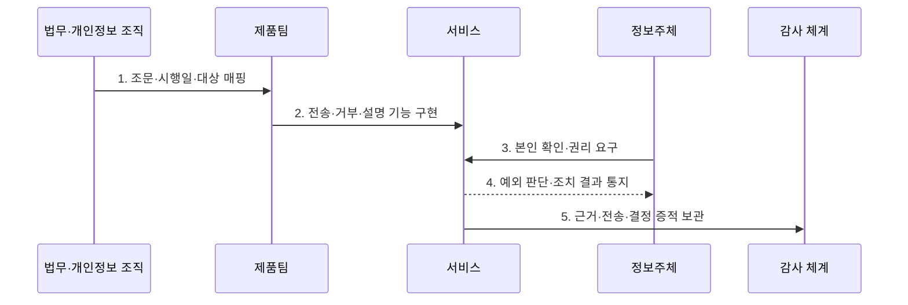

---
sidebar:
  order: 95
  label: "095. 개인정보보호법 2023 개정 — 마이데이터·과징금 (PIPA 2023 Amendment)"
  badge:
    text: "기출 · 50%"
    variant: note
title: "개인정보보호법 2023 개정 — 마이데이터·과징금 (PIPA 2023 Amendment)"
date: "2026-07-27T23:59:59+09:00"
tags:
  - "notes-security"
weight: 95
extra:
  question_no: "095"
  source_status: "기출"
  source_history: "137회"
  priority: 50
  priority_note: "137회 기출이나 개정 연도 단독 반복은 감점함"
---

## 미리 알고가기

- **2023년 개인정보 보호법 개정**: 2023년 3월 14일 공포되어 규율 일원화·정보주체 권리·국외이전·책임·제재를 개편한 법률이다.
- **정보주체(Data Subject)**: 자신의 개인정보에 대해 열람·정정·삭제·전송·거부 등을 요구할 수 있는 개인이다.
- **자동화된 결정(Automated Decision)**: 완전히 자동화된 시스템의 개인정보 처리로 이루어지는 결정이다.
- **개인정보 전송요구권(Right to Data Portability)**: 법정 대상 정보를 본인이나 적격 수신자에게 전송하도록 요구하는 권리이다.
- **국외이전(Cross-Border Transfer)**: 개인정보를 국외에 제공·조회·처리위탁·보관하는 처리이다.
- **개인정보 보호책임자(Chief Privacy Officer, CPO)**: 개인정보 보호 정책·통제·사고 대응을 총괄하는 책임자이다.
- **과징금(Administrative Surcharge)**: 법 위반의 경제적 이익 환수와 제재를 위해 부과하는 금전 제재이다.
- **개인정보 보호법 제35조의2**: 본인·제3자에 대한 개인정보 전송요구권을 규정한다.
- **개인정보 보호법 제37조의2**: 자동화된 결정의 거부·설명·검토 요구 권리를 규정한다.
- **개인정보 보호법 제28조의8·제28조의9**: 국외이전 근거와 국외이전 중지 명령을 규정한다.
- **개인정보 보호법 제64조의2**: 전체 매출액 3% 이하의 과징금 부과 체계를 규정한다.

## Ⅰ. 개요

- 정의: 2023 개정의 **권리·책임·제재 체계 강화**
- 기존 한계: 온·오프라인의 **보호·제재 기준 이원화**

### 쉽게 이해하기 (학습)

- 2023년에 공포된 하나의 개정 법률도 조항별 시행일이 다르므로 현재 시행 중인 법·시행령·고시를 함께 확인해야 한다.

## Ⅱ. 특징

- 2023년 9월의 **규율·국외이전·제재 개편**
- 2024년 3월의 **자동화 결정 대응권 시행**
- 2025년 3월의 **전송요구권 본격 시행**

### 쉽게 이해하기 (학습)

- 개정 취지를 외우는 데 그치지 않고 각 권리가 실제 서비스 화면·API·처리기록에 언제부터 적용되는지를 구분한다.

## Ⅲ. 구조 및 구성요소

| 설계 요소 | 설명 |
|:---|:---|
| 규율 일원화 | 온·오프라인 처리 기준 통합 |
| 전송요구권 | 본인·적격 수신자 전송 |
| 자동화 결정 권리 | 거부·설명·인적 검토 |
| 국외이전·책임성 | 이전 근거·중지·CPO 강화 |
| 과징금·시정조치 | 전체 매출 기준 제재 |

### 쉽게 이해하기 (학습)

- 개정의 각 축을 전송 API·자동결정 안내·국외이전 관리·CPO 감독·과징금 산정 증거에 연결한다.

## Ⅳ. 흐름도

| 절차 | 설명 |
|:---|:---|
| 조문·시행일·대상 매핑 | 법·시행령·분야 고시 확인 |
| 전송·거부·설명 기능 구현 | 화면·API·인적 검토 연결 |
| 본인 확인·권리 요구 | 목적·대상 정보·수신자 특정 |
| 예외 판단·조치 결과 통지 | 거절 근거·설명·재처리 제공 |
| 근거·전송·결정 증적 보관 | 요청·판단·조치 이력 감사 |

> 요약: 시행 조문을 권리 기능과 운영 증거에 연결한다.

### 쉽게 이해하기 (학습)

- 법 조항을 단순 정책 문서가 아니라 사용자의 요청 화면과 처리 API 및 담당자의 검토·통지 기록으로 구현한다.

## Ⅴ. 종류 및 비교

| 개인정보 보호법 시기 | 개정 전 | 2023 개정 이후 |
|:---|:---|:---|
| 적용 기준 | 채널별 분리 규율 | 조항별 시행일·하위 규정 |
| 핵심 특징 | **특례 분리·권리 제한** | **규율 일원화·권리 확대** |
| 한계 | 보호 수준·제재 차이 | 시행일·대상 분야 오인 |

### 쉽게 이해하기 (학습)

- 개정 전후 비교에서는 새 권리의 이름뿐 아니라 적용 대상·예외·분야별 전송 정보와 시행 시점을 함께 적는다.

## Ⅵ. 실무 고려사항 및 대책

| 고려사항 | 대책 | 효과 |
|:---|:---|:---|
| 전 분야 마이데이터 | **보호법 제35조의2·분야 고시 적용** | 대상 정보·수신자 적법성 |
| 자동화 결정 대응 | **보호법 제37조의2 절차 구현** | 거부·설명·인적 검토 보장 |
| 국외이전·제재 | **제28조의8·제64조의2 매핑** | 이전 근거·과징금 위험 통제 |

### 쉽게 이해하기 (학습)

- 자동화 결정 서비스는 적용 사실과 기준을 공개하고 정보주체의 거부·설명 요구 및 인적 재처리 결과를 기록해야 한다.

## Ⅶ. 결론

- **시행일·적용대상·권리영향**으로 개정 기능을 결정한다.

### 쉽게 이해하기 (학습)

- 2023년 개정의 실무 핵심은 공포 연도 암기가 아니라 현행 시행령·분야 고시에 맞춰 전송·설명·검토·국외이전 기능을 운영하는 것이다.
