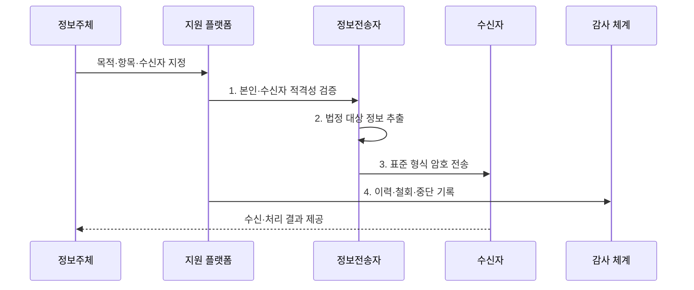

---
sidebar:
  order: 96
  label: "096. 전송 요구권·마이데이터 (Data Portability MyData)"
  badge:
    text: "기출 · 70%"
    variant: note
title: "전송 요구권·마이데이터 (Data Portability MyData)"
date: "2026-08-02T13:10:00+09:00"
tags:
  - "notes-security"
weight: 96
extra:
  question_no: "096"
  source_status: "기출"
  source_history: "137회"
  priority: 70
  priority_note: "137회 기출이며 전송권·마이데이터 설계에 활용됨"
---

## Ⅰ. 개요

핵심 용어

- **개인정보 전송요구권**: 정보주체가 법정 대상 정보를 본인이나 적격 수신자에게 보내도록 요구하는 권리이다.
- **마이데이터·스크래핑**: 마이데이터는 기관 간 표준 전송을 사용하고 스크래핑은 사용자 자격으로 화면 데이터를 수집해 자격 공유 위험이 크다.

- 정의/개념: **개인정보 전송요구권·마이데이터**는 정보주체가 법정 범위의 개인정보를 본인이나 지정한 수신자에게 표준 방식으로 전송하도록 요구하는 권리와 서비스 체계
- 배경/필요성: 스크래핑의 **자격 공유·비표준 수집 위험**

#### 한줄 요약

- 비밀번호를 다른 서비스에 맡기지 않고 이용자가 항목과 받을 곳을 지정하면 보유 기관이 표준 형식으로 직접 보낸다.

## Ⅱ. 특징

핵심 용어

- **자기결정권·철회**: 정보주체가 전송 목적·항목·수신자·주기·종료를 지정하고 이후 요구를 취소할 수 있는 권리이다.
- **기계 판독 형식·적격 수신자**: 프로그램이 자동 해석할 구조로 보내되 법정 시설·기술·업무 요건을 갖춘 기관만 제3자 수신을 허용한다.

- 정보주체 지정·철회의 **자기결정권**
- 표준 API·형식의 **상호운용성**
- 전송자·수신자의 **적격성·책임 분리**

#### 한줄 요약

- 이용자가 전송 목적·대상 정보·수신자·주기·종료 시점을 정하고 요구를 철회할 수 있어야 한다.

## Ⅲ. 구조 및 구성요소

핵심 용어

- **정보전송자·전문기관·일반수신자**: 전송자는 보유 정보를 보내고 전문기관은 대신 관리·활용하며 일반수신자는 고유 업무에서 진위 확인 등에 이용한다.
- **전송 지원 플랫폼**: 정보주체의 요청을 전송자와 수신자에 연계하고 기관 적격성·요구·철회·중단 현황을 관리하는 기반이다.

| 구성요소 | 책임 |
|:---|:---|
| **정보주체** | 목적·항목·수신자·주기 **지정** |
| **정보전송자** | 법정 대상 추출·**표준 전송** |
| **전송 지원 플랫폼** | 요청 연계·**기관 현황 관리** |
| **전문기관·일반수신자** | **적격성·목적 내 이용** |
| **보안·이력 통제** | 본인 인증·암호화·**철회 기록** |

#### 한줄 요약

- 정보주체의 지정이 전송자와 적격 수신자를 연결하고 지원 플랫폼과 이력 통제가 전송·철회를 추적한다.

## Ⅳ. 흐름도

핵심 용어

- **본인·수신자 적격성 검증**: 요청자가 실제 정보주체인지와 지정 수신자가 법정 자격·시설 기준을 갖췄는지 확인하는 절차이다.
- **전송 이력·철회 기록**: 요구 범위·전송 결과·거절·재시도·철회·종료 상태를 분쟁과 감사를 위해 보존한 자료이다.

**동작 원리**

1. **본인·수신자 적격성 검증**: 요청자·기관·시설 기준 확인
2. **법정 대상 정보 추출**: 요구 범위에서 전송 예외 제외
3. **표준 형식 암호 전송**: 기계 판독 형식으로 안전하게 전달
4. **이력·철회·중단 기록**: 요구·거절·종료 상태 감사

#### 한줄 요약

- 본인과 수신자를 확인하고 법정 대상 정보만 안전하게 보내며 재시도·철회·중단 결과를 기록한다.

## Ⅴ. 종류 및 비교

핵심 용어

- **열람·본인 전송·제3자 전송**: 사람이 보는 화면·파일, 본인 저장소의 구조화 이동, 적격 수신자 서비스로의 표준 전송이라는 차이가 있다.

| 개인정보 이동 유형 | 열람·파일 제공 | 본인 전송 | 제3자 전송 |
|:---|:---|:---|:---|
| **적용 기준** | 사람이 **직접 확인** | **본인 저장소** 이동 | **지정 수신자** 서비스 |
| 핵심 특징 | **화면·파일 제공** | **본인에게 구조화 전송** | **적격 제3자 표준 전송** |
| **한계** | **반복·재사용 제약** | **개인 저장소 보호** | **적격성·목적 통제** |

#### 한줄 요약

- 열람은 사람이 확인하는 데 중심이 있고 전송은 시스템이 다시 활용할 수 있는 구조화된 정보 이동이라는 차이가 있다.

## Ⅵ. 실무 고려사항 및 대책

핵심 용어

- **보호법 제35조의2·시행령 제42조의2~9**: 본인·제3자 전송요구권과 전송자·수신자·대상 정보·절차·거절·중계를 구체화한다.
- **멱등키**: 같은 전송 요청이 재시도되더라도 수신 측에 중복 반영되지 않고 동일한 결과를 유지하게 하는 고유 요청 식별자이다.

| 문제 | 대책 | 효과 |
|:---|:---|:---|
| **전송 대상·수신자** | **보호법 제35조의2 요건 검증** | **과다·부적격 전송** 방지 |
| **분야별 대상 정보** | **시행령·보호위 분야 고시 적용** | **현행 전송 범위** 일치 |
| **재시도·철회·감사** | **멱등키·암호화·전송이력 관리** | **중복·유출·분쟁** 방지 |

#### 한줄 요약

- 전송 API는 본인 확인과 법정 범위를 검증하고 표준 스키마와 멱등키를 사용해 재시도에도 중복 저장되지 않게 한다.

## Ⅶ. 결론

핵심 용어

- **전송 최소성·추적성**: 정보주체가 지정한 법정 범위만 적격 수신자에게 보내고 요구부터 철회·종료까지 결과를 추적하는 원칙이다.

- 범위·수신자 적격성·철회 상태 충족 시에만 **표준 전송 허용**

#### 한줄 요약

- 마이데이터의 핵심은 데이터를 많이 모으는 것이 아니라 정보주체가 지정한 법정 범위만 안전하고 추적 가능하게 이동하는 것이다.
