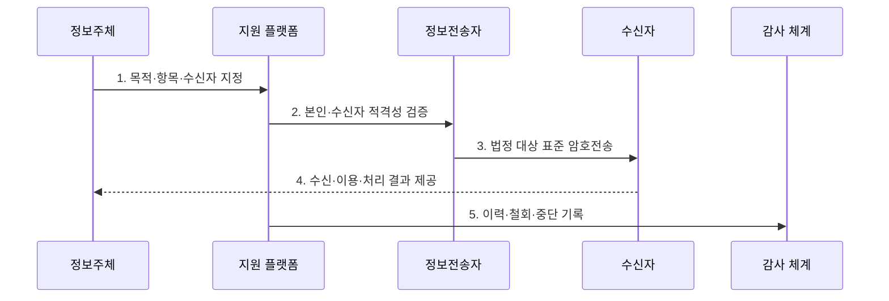

---
sidebar:
  order: 96
  label: "096. 전송 요구권·마이데이터 (Data Portability MyData)"
  badge:
    text: "기출 · 70%"
    variant: note
title: "전송 요구권·마이데이터 (Data Portability MyData)"
date: "2026-07-27T23:59:59+09:00"
tags:
  - "notes-security"
weight: 96
extra:
  question_no: "096"
  source_status: "기출"
  source_history: "137회"
  priority: 70
  priority_note: "137회 기출이며 전송권·마이데이터 설계에 활용됨"
---

## 미리 알고가기

- **개인정보 전송요구권(Right to Data Portability)**: 정보주체가 법정 대상 정보를 본인이나 적격 수신자에게 보내도록 요구하는 권리이다.
- **마이데이터(MyData)**: 정보주체 요구에 따라 여러 기관의 본인정보를 안전하게 전송·통합하는 서비스 체계이다.
- **정보전송자(Data Holder)**: 법령에 따라 개인정보를 보유하고 전송 요구를 이행하는 기관·사업자이다.
- **개인정보관리 전문기관**: 전송받은 정보를 정보주체 대신 안전하게 관리·활용하도록 지정된 기관이다.
- **일반수신자**: 고유 업무 중 정보의 진위 확인 등을 위해 법정 시설·기술 기준을 갖춘 수신자이다.
- **중계전문기관**: 정보전송자와 수신자 사이의 전송을 안전하게 중계하도록 지정된 기관이다.
- **기계 판독 형식(Machine-Readable Format)**: 프로그램이 필드와 값을 자동 해석할 수 있는 구조화 형식이다.
- **멱등성(Idempotency)**: 같은 요청이 반복되어도 중복 반영 없이 같은 결과가 유지되는 성질이다.
- **스크래핑(Screen Scraping)**: 사용자 자격증명으로 화면에 접속해 표시 데이터를 자동 수집하는 방식이다.
- **개인정보 보호법 제35조의2**: 본인전송·제3자전송의 요구권과 대상 요건을 규정한다.
- **개인정보 보호법 제35조의3·제35조의4**: 전문기관과 전송 관리·지원 체계를 규정한다.
- **개인정보 보호법 시행령 제42조의2~제42조의9**: 전송자·수신자·정보·절차·거절·중계를 구체화한다.

## Ⅰ. 개요

- 정의: 법정 개인정보의 **본인·지정 수신자 전송권**
- 기존 한계: 스크래핑의 **자격 공유·비표준 수집 위험**

### 쉽게 이해하기 (학습)

- 비밀번호를 다른 서비스에 맡기지 않고 이용자가 항목과 받을 곳을 지정하면 보유 기관이 표준 형식으로 직접 보낸다.

## Ⅱ. 특징

- 정보주체 지정·철회의 **자기결정권**
- 표준 API·형식의 **상호운용성**
- 전송자·수신자의 **적격성·책임 분리**

### 쉽게 이해하기 (학습)

- 이용자가 전송 목적·대상 정보·수신자·주기·종료 시점을 정하고 요구를 철회할 수 있어야 한다.

## Ⅲ. 구조 및 구성요소

| 설계 요소 | 설명 |
|:---|:---|
| 정보주체 | 목적·항목·수신자·주기 지정 |
| 정보전송자 | 법정 대상 추출·표준 전송 |
| 전송 지원 플랫폼 | 요청 연계·기관 현황 관리 |
| 전문기관·일반수신자 | 적격성·목적 내 이용 |
| 보안·이력 통제 | 본인 인증·암호화·철회 기록 |

### 쉽게 이해하기 (학습)

- 정보주체의 지정이 전송자와 적격 수신자를 연결하고 지원 플랫폼과 이력 통제가 전송·철회를 추적한다.

## Ⅳ. 흐름도

| 절차 | 설명 |
|:---|:---|
| 목적·항목·수신자 지정 | 전송 범위·주기·종료 설정 |
| 본인·수신자 적격성 검증 | 요청자·기관·시설 기준 확인 |
| 법정 대상 표준 암호전송 | 예외 제외·기계 판독 전달 |
| 수신·이용·처리 결과 제공 | 목적 내 이용·결과 통지 |
| 이력·철회·중단 기록 | 전송 요구·거절·종료 감사 |

> 요약: 본인 지정 범위만 적격 수신자에게 전송한다.

### 쉽게 이해하기 (학습)

- 본인과 수신자를 확인하고 법정 대상 정보만 안전하게 보내며 재시도·철회·중단 결과를 기록한다.

## Ⅴ. 종류 및 비교

| 개인정보 이동 유형 | 열람·파일 제공 | 본인 전송 | 제3자 전송 |
|:---|:---|:---|:---|
| 적용 기준 | 사람이 직접 확인 | 본인 저장소 이동 | 지정 수신자 서비스 |
| 핵심 특징 | **화면·파일 제공** | **본인에게 구조화 전송** | **적격 제3자 표준 전송** |
| 한계 | 반복·재사용 제약 | 개인 저장소 보호 | 적격성·목적 통제 |

### 쉽게 이해하기 (학습)

- 열람은 사람이 확인하는 데 중심이 있고 전송은 시스템이 다시 활용할 수 있는 구조화된 정보 이동이라는 차이가 있다.

## Ⅵ. 실무 고려사항 및 대책

| 고려사항 | 대책 | 효과 |
|:---|:---|:---|
| 전송 대상·수신자 | **보호법 제35조의2 요건 검증** | 과다·부적격 전송 방지 |
| 분야별 대상 정보 | **시행령·보호위 분야 고시 적용** | 현행 전송 범위 일치 |
| 재시도·철회·감사 | **멱등키·암호화·전송이력 관리** | 중복·유출·분쟁 방지 |

### 쉽게 이해하기 (학습)

- 전송 API는 본인 확인과 법정 범위를 검증하고 표준 스키마와 멱등키를 사용해 재시도에도 중복 저장되지 않게 한다.

## Ⅶ. 결론

- **전송범위·수신자적격성·철회상태**로 전송을 결정한다.

### 쉽게 이해하기 (학습)

- 마이데이터의 핵심은 데이터를 많이 모으는 것이 아니라 정보주체가 지정한 법정 범위만 안전하고 추적 가능하게 이동하는 것이다.
