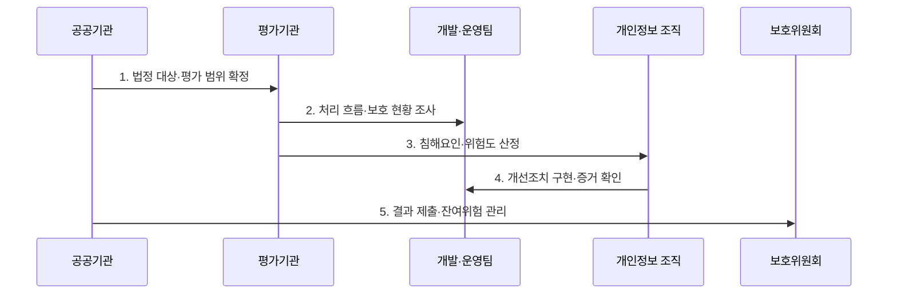

---
sidebar:
  order: 97
  label: "097. 개인정보 영향평가 PIA (Privacy Impact Assessment)"
  badge:
    text: "미출제 · 50%"
    variant: note
title: "개인정보 영향평가 PIA (Privacy Impact Assessment)"
date: "2026-07-25T01:05:00+09:00"
tags:
  - "notes-security"
weight: 97
extra:
  question_no: "097"
  source_status: "미출제"
  source_history: ""
  priority: 50
  priority_note: "법정 고위험 처리의 사전 영향평가 절차가 독립적임"
---

## 미리 알고가기

- **개인정보 영향평가(Privacy Impact Assessment, PIA)**: 개인정보파일 운용의 침해 위험을 사전 분석하고 개선사항을 도출하는 평가이다.
- **개인정보 흐름도(Data Flow Diagram)**: 개인정보의 수집·저장·이용·제공·파기 경로를 나타낸 도식이다.
- **개인정보파일(Personal Information File)**: 일정 규칙에 따라 배열되어 개인별로 검색할 수 있는 개인정보 집합이다.
- **민감정보(Sensitive Information)**: 사상·신념·건강 등 노출 시 사생활 침해 위험이 큰 개인정보이다.
- **고유식별정보(Unique Identifying Information)**: 주민등록번호·여권번호 등 개인을 고유하게 구별하는 정보이다.
- **개선조치(Remediation)**: 평가 결과에 따라 시스템 설계와 운영 절차를 변경하는 조치이다.
- **잔여 위험(Residual Risk)**: 개선조치 적용 뒤에도 남아 승인·감시해야 하는 위험이다.
- **개인정보 보호법 제33조**: 공공기관의 법정 영향평가 실시·제출·평가기관 의뢰를 규정한다.
- **개인정보 보호법 시행령 제35조**: 법정 영향평가 대상 개인정보파일의 규모·유형·변경 기준을 규정한다.

## Ⅰ. 개요

- 정의: 개인정보 침해 위험의 **사전 분석·개선 평가**
- 기존 한계: 구축 후 변경의 **흐름·구조 개선 비용 증가**

### 쉽게 이해하기 (학습)

- 시스템을 만들기 전에 개인정보가 흐르는 모든 길을 찾아 위험한 경로와 설계를 먼저 바꾼다.

## Ⅱ. 특징

- 처리 목적·흐름의 **전 범위 분석**
- 위험·조치·담당자의 **추적 가능성**
- 운용체계 변경의 **재평가**

### 쉽게 이해하기 (학습)

- 보고서 작성에 그치지 않고 어느 데이터의 어떤 위험을 누가 언제 고치고 무엇으로 완료를 확인할지 연결한다.

## Ⅲ. 구조 및 구성요소

| 설계 요소 | 설명 |
|:---|:---|
| 대상·법적 근거 | 파일·시스템·연계 범위 확정 |
| 처리 흐름·구조 | 수집·복제·제공·파기 표시 |
| 침해요인·위험도 | 위협·취약점·영향 산정 |
| 개선계획 | 통제·책임자·기한·기준 설정 |
| 이행·잔여위험 확인 | 증거 검증·잔여 위험 승인 |

### 쉽게 이해하기 (학습)

- 데이터베이스뿐 아니라 백업·로그·외부 API의 개인정보 흐름도 포함해 위험과 보호조치를 연결한다.

## Ⅳ. 흐름도

| 절차 | 설명 |
|:---|:---|
| 법정 대상·평가 범위 확정 | 파일 규모·유형·연계 확인 |
| 처리 흐름·보호 현황 조사 | 목적·근거·복제 경로 분석 |
| 침해요인·위험도 산정 | 가능성·영향·기존 통제 평가 |
| 개선조치 구현·증거 확인 | 담당·기한·완료 기준 검증 |
| 결과 제출·잔여위험 관리 | 보호위 제출·변경 재평가 |

> 요약: 흐름의 위험을 산정하고 개선 이행을 증명한다.

### 쉽게 이해하기 (학습)

- 범위와 흐름을 정한 뒤 위험을 계산하고 개선 결과가 설계·코드·운영 기록에 반영됐는지를 증거로 확인한다.

## Ⅴ. 종류 및 비교

| 법정 PIA 대상 | 민감·고유식별 | 파일 연계 | 대규모·운용 변경 |
|:---|:---|:---|:---|
| 적용 기준 | 5만명 이상 | 연계 결과 50만명 이상 | 100만명 이상·체계 변경 |
| 핵심 특징 | **고위험 속성 처리** | **결합 식별성 증가** | **대량 침해·변경 위험** |
| 한계 | 유출·오남용 피해 | 목적 외 결합 위험 | 권리·파기·복구 부담 |

### 쉽게 이해하기 (학습)

- 공공기관은 민감성·연계 규모·전체 규모·기존 평가 후 운용체계 변경 중 해당 기준으로 법정 평가 대상을 판단한다.

## Ⅵ. 실무 고려사항 및 대책

| 고려사항 | 대책 | 효과 |
|:---|:---|:---|
| 법정 평가 의무 | **보호법 제33조 대상·절차 준수** | 평가·제출 적법성 확보 |
| 파일 규모·변경 | **시행령 제35조 기준 대조** | 평가 누락·범위 오류 방지 |
| 형식적 개선계획 | **통제·담당·기한·증거 연결** | 실제 설계 반영·잔여위험 관리 |

### 쉽게 이해하기 (학습)

- 공공 시스템에 외부 AI API를 추가하면 새 제공·복제 경로가 운용체계 변경에 해당하는지 확인하고 영향 범위와 잔여 위험을 재평가한다.

## Ⅶ. 결론

- **정보민감도·처리규모·잔여위험**으로 PIA 범위를 결정한다.

### 쉽게 이해하기 (학습)

- 영향평가는 보고서 제출이 끝이 아니라 개선 항목이 실제 설계와 운영에 반영되고 변경 뒤에도 위험이 관리되는지 확인하는 절차이다.
