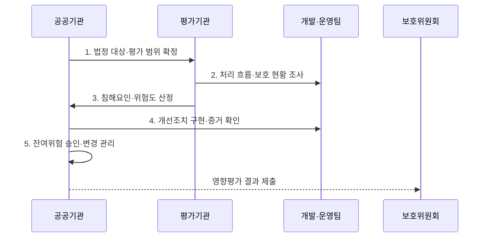

---
sidebar:
  order: 97
  label: "097. 개인정보 영향평가 PIA (Privacy Impact Assessment)"
  badge:
    text: "미출제 · 50%"
    variant: note
title: "개인정보 영향평가 PIA (Privacy Impact Assessment)"
date: "2026-08-02T13:12:00+09:00"
tags:
  - "notes-security"
weight: 97
extra:
  question_no: "097"
  source_status: "미출제"
  source_history: ""
  priority: 50
  priority_note: "법정 고위험 처리의 사전 영향평가 절차가 독립적임"
---

## Ⅰ. 개요

핵심 용어

- **개인정보 영향평가(PIA)**: 개인정보파일을 구축·변경하기 전에 처리 흐름의 침해 위험을 분석하고 설계·운영 개선사항을 도출하는 평가이다.
- **사전 평가**: 시스템 완성 후가 아니라 개인정보 흐름과 구조를 바꿀 수 있는 시점에 위험을 찾아 개선 비용을 줄이는 원칙이다.

- 정의/개념: **개인정보 영향평가**는 개인정보 처리 시스템을 구축·변경하기 전에 처리 흐름과 침해 위험을 분석하고 보호 조치와 잔여 위험을 평가하는 사전 통제 절차
- 배경/필요성: 구축 후에는 개인정보 흐름·구조의 **개선 비용 증가**

#### 한줄 요약

- 시스템을 만들기 전에 개인정보가 흐르는 모든 길을 찾아 위험한 경로와 설계를 먼저 바꾼다.

## Ⅱ. 특징

핵심 용어

- **개인정보 흐름도**: 개인정보의 수집·저장·이용·제공·백업·로그·파기 경로와 책임 주체를 나타낸 도식이다.
- **개선조치·잔여 위험**: 통제·담당·기한·완료 증거를 연결하고 조치 뒤에도 남은 위험은 승인·감시한다.

- **개인정보 흐름도**를 통한 처리 목적·복제 경로의 전 범위 분석
- 위험·조치·담당자의 **추적 가능성**
- **운용체계 변경 재평가**로 기존 범위와 잔여 위험 갱신

#### 한줄 요약

- 보고서 작성에 그치지 않고 어느 데이터의 어떤 위험을 누가 언제 고치고 무엇으로 완료를 확인할지 연결한다.

## Ⅲ. 구조 및 구성요소

핵심 용어

- **평가 범위·침해요인**: 개인정보파일·시스템·외부 연계와 복제 경로를 확정하고 위협·취약점·영향을 분석한다.
- **이행 증거**: 개선 항목이 정책 문서뿐 아니라 설계·코드·설정·운영 절차에 실제 반영됐음을 입증하는 자료이다.

| 구성요소 | 책임 |
|:---|:---|
| **대상·법적 근거** | 파일·시스템·연계 **범위 확정** |
| **처리 흐름·구조** | **수집·복제·제공·파기** 표시 |
| **침해요인·위험도** | 위협·취약점·**영향 산정** |
| **개선계획** | 통제·책임자·기한·**완료 기준** 설정 |
| **이행·잔여위험 확인** | 증거 검증·**잔여 위험 승인** |

#### 한줄 요약

- 데이터베이스뿐 아니라 백업·로그·외부 API의 개인정보 흐름도 포함해 위험과 보호조치를 연결한다.

## Ⅳ. 흐름도

핵심 용어

- **위험도 산정**: 침해 가능성·영향·기존 통제를 함께 평가하여 개선 우선순위와 수용 여부를 정하는 과정이다.
- **변경 재평가**: 외부 API·처리 목적·연계·파일 규모 등 운용체계가 바뀔 때 기존 영향평가의 범위와 위험을 다시 확인하는 절차이다.

**동작 원리**

1. **법정 대상·평가 범위 확정**: 파일 규모·유형·연계 확인
2. **처리 흐름·보호 현황 조사**: 목적·근거·복제 경로 분석
3. **침해요인·위험도 산정**: 가능성·영향·기존 통제 평가
4. **개선조치 구현·증거 확인**: 담당·기한·완료 기준 검증
5. **잔여위험 승인·변경 관리**: 승인 기록과 변경 시 재평가

#### 한줄 요약

- 범위와 흐름을 정한 뒤 위험을 계산하고 개선 결과가 설계·코드·운영 기록에 반영됐는지를 증거로 확인한다.

## Ⅴ. 종류 및 비교

핵심 용어

- **민감·고유식별·연계·대규모 파일**: 노출 피해와 결합 식별성, 처리 인원, 운용체계 변경이 법정 PIA 대상 판단의 핵심 기준이다.

| 법정 PIA 대상 | 민감·고유식별 | 파일 연계 | 대규모·운용 변경 |
|:---|:---|:---|:---|
| **적용 기준** | **5만명 이상** | 연계 결과 **50만명 이상** | **100만명 이상·체계 변경** |
| 핵심 특징 | **고위험 속성 처리** | **결합 식별성 증가** | **대량 침해·변경 위험** |
| **한계** | **유출·오남용 피해** | **목적 외 결합 위험** | **권리·파기·복구 부담** |

#### 한줄 요약

- 공공기관은 민감성·연계 규모·전체 규모·기존 평가 후 운용체계 변경 중 해당 기준으로 법정 평가 대상을 판단한다.

## Ⅵ. 실무 고려사항 및 대책

핵심 용어

- **보호법 제33조**: 공공기관의 법정 영향평가 실시·제출과 평가기관 의뢰 절차를 규정한다.
- **시행령 제35조**: 영향평가 대상 개인정보파일의 민감성·규모·연계·운용체계 변경 기준을 규정한다.

| 문제 | 대책 | 효과 |
|:---|:---|:---|
| **법정 평가 의무** | **보호법 제33조 대상·절차 준수** | 평가·제출의 **적법성** 확보 |
| **파일 규모·변경** | **시행령 제35조 기준 대조** | **평가 누락·범위 오류** 방지 |
| **형식적 개선계획** | **통제·담당·기한·증거 연결** | 설계 반영·**잔여위험 관리** |

#### 한줄 요약

- 공공 시스템에 외부 AI API를 추가하면 새 제공·복제 경로가 운용체계 변경에 해당하는지 확인하고 영향 범위와 잔여 위험을 재평가한다.

## Ⅶ. 결론

핵심 용어

- **PIA 완료 조건**: 보고서 제출이 아니라 개선 항목의 실제 구현과 증거 검증, 잔여 위험 승인, 변경 시 재평가 체계까지 갖춘 상태이다.

- 민감도·규모가 법정 기준이면 전 범위 **PIA**, 잔여 위험은 개선 후 승인

#### 한줄 요약

- 영향평가는 보고서 제출이 끝이 아니라 개선 항목이 실제 설계와 운영에 반영되고 변경 뒤에도 위험이 관리되는지 확인하는 절차이다.
