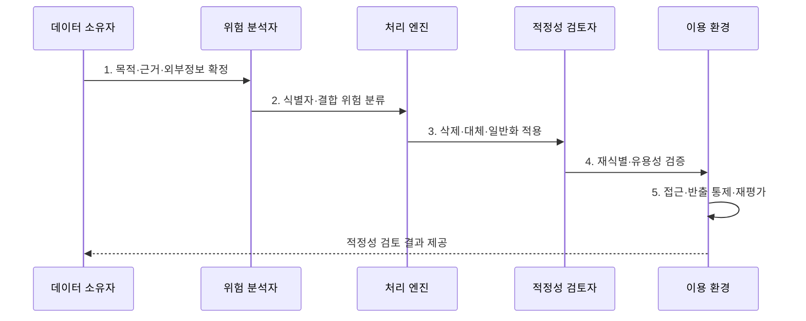

---
sidebar:
  order: 98
  label: "098. 개인정보 비식별 처리·가명화·익명화 (De-identification)"
  badge:
    text: "기출 · 50%"
    variant: note
title: "개인정보 비식별 처리·가명화·익명화 (De-identification)"
date: 2026-07-31T02:11:57+09:00
tags:
  - "notes-security"
weight: 98
extra:
  question_no: "098"
  source_status: "기출"
  source_history: "131회"
  priority: 50
  priority_note: "131회 기출이며 가명화·익명화 선택 판단이 재사용됨"
---

## 미리 알고가기

- **직접 식별자(Direct Identifier)**: 이름·주민등록번호처럼 그 자체로 개인을 알아보게 하는 정보이다.
- **준식별자(Quasi-Identifier)**: 나이·지역·직업처럼 결합하면 개인을 알아볼 수 있는 정보이다.
- **민감 속성(Sensitive Attribute)**: 질병·소득처럼 노출 시 개인에게 큰 피해를 줄 수 있는 정보이다.
- **가명처리(Pseudonymization)**: 추가정보 없이는 특정 개인을 알아볼 수 없도록 개인정보를 처리하는 것이다.
- **추가정보(Additional Information)**: 가명정보를 원래 개인과 연결할 수 있는 매핑표·복호화 키 등이다.
- **익명처리(Anonymization)**: 합리적으로 예상되는 수단으로도 개인을 알아볼 수 없도록 처리하는 것이다.
- **마스킹(Masking)**: 값 일부를 가려 화면·문서의 불필요한 노출을 줄이는 기법이다.
- **일반화(Generalization)**: 정확한 값을 연령대·지역처럼 더 넓은 범주로 바꾸는 기법이다.
- **억제(Suppression)**: 식별 위험이 큰 값이나 레코드를 삭제·비공개하는 기법이다.
- **k-익명성(k-Anonymity)**: 같은 준식별자 조합을 가진 사람이 최소 k명 존재하게 하는 기준이다.
- **l-다양성(l-Diversity)**: 같은 집단 안에 민감 속성이 최소 l개 존재하게 하는 기준이다.
- **t-근접성(t-Closeness)**: 집단의 민감 속성 분포가 전체 분포와 크게 다르지 않게 하는 기준이다.
- **개인정보 보호법 제28조의2~제28조의5**: 가명정보의 처리·결합·안전조치·재식별 금지를 규정한다.
- **개인정보 보호법 제58조의2**: 합리적 수단으로 개인을 알아볼 수 없는 정보의 적용 제외를 규정한다.
- **ISO/IEC 27559:2022**: 비식별 데이터 수명주기의 재식별 위험 관리 프레임워크를 제시한다.

## Ⅰ. 개요

- 정의/개념: 이용 목적에 맞춘 **재식별 위험 축소 처리**
- 배경/필요성: 직접 식별자 삭제의 **외부 결합 재식별**

### 쉽게 이해하기 (학습용)

- 이름을 지운 뒤에도 나이·지역·직업을 외부 정보와 합쳐 개인을 다시 알아볼 수 있는지를 확인한다.

## Ⅱ. 특징

- 가명정보의 **개인정보 지위 유지**
- 익명정보의 **합리적 식별 불가능성**
- 재식별 위험·유용성의 **반복 평가**

### 쉽게 이해하기 (학습용)

- 가명화는 재연결 열쇠를 따로 보호하는 방식이고 익명화는 현실적으로 다시 개인을 찾을 수 없게 만드는 방식이다.

## Ⅲ. 구조 및 구성요소

| 구성요소 | 책임 |
|:---|:---|
| **목적·법적 근거** | 이용·제공 범위와 **근거 확정** |
| **식별 위험 분석** | 식별자·**외부 결합 가능성** 평가 |
| **비식별 처리 규칙** | 삭제·일반화와 **k-익명성·l-다양성** |
| **추가정보·이용 통제** | 매핑키 분리·**접근·반출 제한** |
| **적정성·재평가** | **t-근접성**, 재식별 위험·유용성 검증 |

### 쉽게 이해하기 (학습용)

- 처리 기법만 적용하지 않고 누가 어떤 외부 정보와 어떤 환경에서 다시 개인을 알아볼 수 있는지를 평가한다.

## Ⅳ. 흐름도

**동작 원리**

1. **목적·근거·외부정보 확정**: 분석·제공·공개 범위 설정
2. **식별자·결합 위험 분류**: 직접·준식별·민감 속성 평가
3. **삭제·대체·일반화 적용**: 목적 수준까지 위험 감소
4. **재식별·유용성 검증**: 공격 가능성·분석 가치 측정
5. **접근·반출 통제·재평가**: 환경 변화·외부 자료 반영

### 쉽게 이해하기 (학습용)

- 개인 단위 분석이 필요하면 통제 환경의 가명정보를 쓰고 식별이 필요 없는 공개는 더 강한 익명 처리를 적용한다.

## Ⅴ. 종류 및 비교

| 식별 위험 처리 유형 | 가명처리 | 익명처리 | 마스킹 |
|:---|:---|:---|:---|
| **적용 기준** | **개인 단위 분석** 필요 | **개인 식별 불필요** | **표시 값 노출 제한** |
| 핵심 특징 | **추가정보 없이는 식별 곤란** | **합리적 수단으로 식별 불가** | **값 일부 표시 차단** |
| **한계** | **결합 재식별 위험** | **환경 변화 재평가** | **원본·복원 가능성** |

### 쉽게 이해하기 (학습용)

- 가명·익명·마스킹은 재연결 가능성과 법적 지위 및 필요한 이용 환경이 서로 다르다.

## Ⅵ. 실무 고려사항 및 대책

| 고려사항 | 대책 | 효과 |
|:---|:---|:---|
| **가명정보 처리·결합** | **보호법 제28조의2~5 준수** | 추가정보 분리·**재식별 금지** |
| **익명정보 판단** | **보호법 제58조의2 기준 적용** | 성급한 **법 적용 제외** 방지 |
| **재식별 위험 수명주기** | **ISO/IEC 27559:2022 적용** | 환경·**외부정보 변화** 반영 |

### 쉽게 이해하기 (학습용)

- 의료 연구는 가명정보와 재결합 열쇠를 별도 시스템과 권한으로 분리하고 반출 전 외부 정보 결합에 따른 재식별 위험을 다시 평가한다.

## Ⅶ. 결론

- 개인 단위 분석은 **가명처리**, 공개는 결합 위험을 낮춘 **익명처리**

### 쉽게 이해하기 (학습용)

- 비식별 처리의 핵심은 기법 이름이 아니라 현재와 예상 환경에서 개인을 다시 알아볼 가능성을 목적에 맞게 줄이는 것이다.
