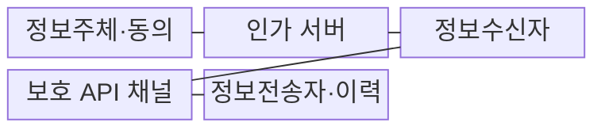
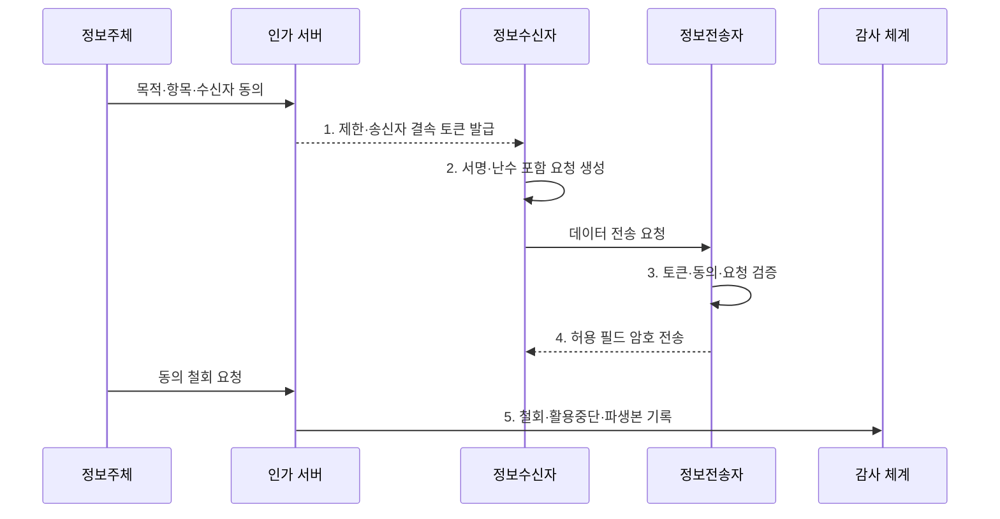

---
sidebar:
  order: 99
  label: "099. 마이데이터 서비스 보안"
  badge: { text: "기출 · 50%", variant: note }
title: "마이데이터 서비스 보안"
date: 2026-07-31T02:12:20+09:00
tags: ["notes-security"]
weight: 99
extra:
  question_no: "099"
  source_status: "기출"
  source_history: "126회"
  priority: 50
  priority_note: "126회 출제"
---

## 미리 알고가기

- **마이데이터(MyData)**: 정보주체 요구에 따라 본인정보를 다른 기관으로 전송해 통합 조회·활용하는 서비스이다.
- **동의 관리(Consent Management)**: 목적·항목·수신자·기간에 대한 동의의 생성·변경·철회를 관리하는 기능이다.
- **접근 토큰(Access Token)**: 허용된 주체·대상·범위·기간을 나타내는 인가 자격이다.
- **송신자 제한 토큰(Sender-Constrained Token)**: 발급받은 특정 클라이언트만 사용할 수 있게 결속한 토큰이다.
- **일회성 난수(Nonce)**: 요청의 신규성과 재사용 여부를 확인하는 임시 값이다.
- **정보전송자(Data Holder)**: 법정 대상 개인정보를 보유하고 전송 요구를 이행하는 기관이다.
- **정보수신자(Data Recipient)**: 전송받은 정보를 정보주체가 지정한 목적에 이용하는 기관이다.
- **파생 데이터(Derived Data)**: 전송받은 원본을 분석·가공해 새로 만든 결과 데이터이다.
- **개인정보 보호법 제35조의2**: 개인정보의 본인·제3자 전송요구권과 대상 요건을 규정한다.
- **IETF RFC 9700·BCP 240**: OAuth 2.0의 최신 보안 모범사례와 토큰 탈취·재사용 방어를 규정한다.
- **OpenID FAPI 2.0 Security Profile**: 고보안 API의 OAuth 기반 인가·상호운용 요구사항을 규정한다.

## Ⅰ. 개요

- 정의/개념: 정보주체 동의 기반의 **전송·활용 전 과정 보호**
- 배경/필요성: 범용 베어러 토큰 탈취 시 **재사용 전송 가능**

### 쉽게 이해하기 (학습용)

- 정보주체가 허락한 정보만 정한 기관에 정한 기간 동안 보내고 철회 시 이후 전송과 이용 근거를 함께 종료한다.

## Ⅱ. 특징

- 목적·항목·수신자의 **동의 범위 결속**
- 대상·범위·만료의 **최소 권한 토큰**
- 기관 인증·서명의 **API 무결성**

### 쉽게 이해하기 (학습용)

- 동의 정보와 접근 토큰과 실제 응답 필드가 항상 일치해야 하며 동의가 바뀌면 보유 데이터의 이용 근거도 다시 판단한다.

## Ⅲ. 구조 및 구성요소

| 구성요소 | 책임 |
|:---|:---|
| **정보주체·동의** | 목적·항목·수신자·기간 **관리** |
| **인가 서버** | 범위·대상·만료 **토큰 발급** |
| **정보수신자** | **동의 목적 내** 데이터 활용 |
| **보호 API 채널** | 기관 인증·**전송 무결성** |
| **정보전송자·이력** | 토큰 검증·필드 전송·**감사** |

### 쉽게 이해하기 (학습용)

- 동의 관리기가 정한 범위를 인가 서버의 토큰과 정보전송자의 실제 응답 필드에 끝까지 연결한다.

## Ⅳ. 흐름도

**동작 원리**

1. **제한·송신자 결속 토큰 발급**: 주체·대상·범위·만료 결속
2. **서명·난수 포함 요청 생성**: 기관 인증·재전송 방지
3. **토큰·동의·요청 검증**: 정보주체·수신자·필드 대조
4. **허용 필드 암호 전송**: 검증된 범위만 기밀 전송
5. **철회·활용중단·파생본 기록**: 보유 근거·삭제·증적 관리

### 쉽게 이해하기 (학습용)

- 철회하면 새 전송을 막고 기존 원본과 파생 데이터의 보유·이용 근거를 다시 판단하여 결과를 기록한다.

## Ⅴ. 종류 및 비교

| 마이데이터 보호 단계 | 동의·인가 | API 전송 | 저장·철회 |
|:---|:---|:---|:---|
| **적용 기준** | **권한 생성·변경** | 기관 간 **데이터 이동** | 수신 후 **활용·종료** |
| 핵심 특징 | **범위 제한 토큰** | **기관 인증·요청 검증** | **목적 격리·철회 반영** |
| **한계** | **계정 탈취·과다 동의** | **토큰 탈취·재전송** | **목적 외 이용·잔존본** |

### 쉽게 이해하기 (학습용)

- 허락·이동·보관 단계의 위험은 다르지만 하나의 정보주체 동의 범위가 세 단계를 지배해야 한다.

## Ⅵ. 실무 고려사항 및 대책

| 고려사항 | 대책 | 효과 |
|:---|:---|:---|
| **법정 전송 범위** | **보호법 제35조의2 필드 대조** | **미동의·타인 정보** 차단 |
| **OAuth 토큰 공격** | **IETF RFC 9700·BCP 240 적용** | **탈취·재사용·과권한** 방지 |
| **고보안 기관 API** | **OpenID FAPI 2.0 프로파일** | 인증·인가 **상호운용** 강화 |

### 쉽게 이해하기 (학습용)

- 마이데이터 사업자는 토큰의 정보주체·수신자·동의 범위와 응답 필드를 대조하고 송신자 결속으로 탈취 토큰 재사용을 막는다.

## Ⅶ. 결론

- 동의·토큰 주체·보유 근거 일치 시만 **전송·이용**, 철회 시 중단

### 쉽게 이해하기 (학습용)

- 마이데이터 보안의 핵심은 동의가 토큰 발급부터 전송 필드와 원본·파생 데이터의 보유 종료까지 지배하게 하는 것이다.
